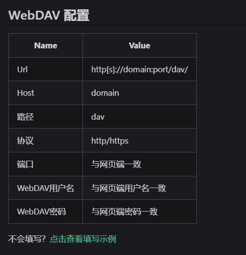

在日常使用中,我们经常需要在不同设备之间同步和备份数据。Alist 作为一个强大的文件列表程序,结合 Webdav 协议,可以为我们提供一个便捷的数据同步解决方案。本文将详细介绍如何配置和使用 Alist + Webdav 来实现数据同步。

## 参考资源

在开始配置之前,这里提供一些有用的参考资源:

- Alist 官方的 Webdav 配置指南: https://alist.nn.ci/zh/guide/webdav.html
- 视频教程参考推荐: https://www.bilibili.com/video/BV16g4y1d7kM/?spm_id_from=333.337.search-card.all.click&vd_source=e03b7988550b29e55118b7d8e6cab3c

官方文档中提供了详细的配置说明:

## 配置步骤

### 1. 创建专用账户

首先,我们需要在 Alist 管理界面创建一个专门用于 Webdav 管理的用户账户:

### 2. 设置用户权限

创建专用账户后，我们需要进行详细的权限配置。这一步对于确保数据安全和使用便利性都很重要。

#### 基础配置
1. 设置用户名和密码
   - 请使用安全性较高的密码
   - 这里设置的用户名和密码将用于 Webdav 登录

2. 配置挂载路径
   - 挂载路径决定了用户可访问的范围
   - 例如：设置为 `/sync` 则用户只能访问该目录及其子目录
   - 建议：根据实际需求设置独立的同步目录，避免暴露其他文件

#### 权限详细说明

基础访问权限：
- 隐藏：允许查看隐藏的文件夹
- 无需密码访问：可以直接访问设置了密码的文件夹

文件操作权限：
- 创建目录或上传：允许新建文件夹和上传文件
- 重命名：允许重命名文件和文件夹
- 移动：允许移动文件位置
- 复制：允许复制文件
- 删除：允许删除文件

高级功能权限：
- 添加离线下载任务：允许创建离线下载任务
- Webdav 读取/管理：允许通过 Webdav 协议读取/管理文件
- FTP 读取/管理：允许通过 FTP 协议读取/管理文件

#### 权限配置建议

1. 个人使用场景：
   - 建议开启所有文件操作权限
   - Webdav 读取和管理权限必须开启
   - 其他权限可按需开启

2. 共享使用场景：
   - 建议限制删除和移动权限
   - 可以开启创建目录和上传权限
   - 根据需求限制重命名权限

3. 安全性建议：
   - 定期检查和更新权限设置
   - 对重要数据所在目录进行单独权限控制
   - 建议只开启必要的协议权限（如只用 Webdav 就无需开启 FTP）

### 3. 客户端配置与使用

完成 Alist 端的配置后，我们就可以在各类支持 Webdav 协议的软件中进行配置使用了。这里以常见的文件管理器为例：

1. 在客户端中添加网络位置或远程存储：

2. 填写连接信息：
- 服务器地址：`http(s)://your-alist-domain/dav/`
- 用户名：之前创建的专用账户用户名
- 密码：对应的账户密码

3. 连接成功后，你就可以像使用本地文件夹一样操作 Alist 网盘了：

提示：
- 确保服务器地址使用完整的 URL，包含 http/https 前缀
- 地址末尾的 `/dav/` 不要遗漏
- 如果连接失败，请检查用户权限是否正确设置

## 总结与进阶使用

至此，我们已经完成了 Alist + Webdav 的基础配置。这套方案不仅完全免费，而且具有以下优势：

- 支持 Windows、Mac、Linux 等各类平台
- 可以挂载为本地磁盘，使用体验流畅
- 支持多用户管理，权限可细粒度控制
- 可配合第三方软件实现自动备份

对于想要搭建私有云盘又不想花钱的朋友来说，这绝对是一个值得尝试的解决方案。只要按照本文的步骤配置，很快就能享受到便捷的跨设备数据同步服务了。
