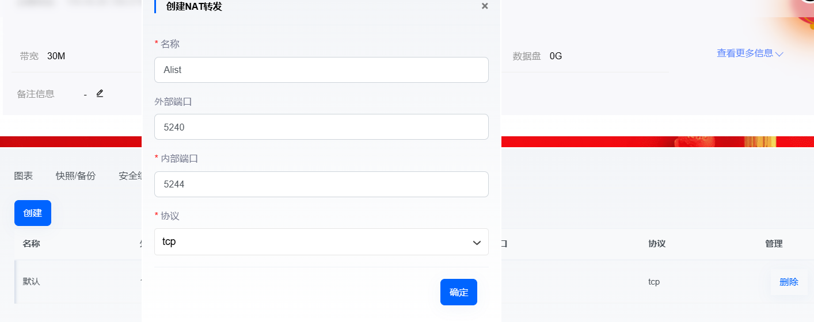
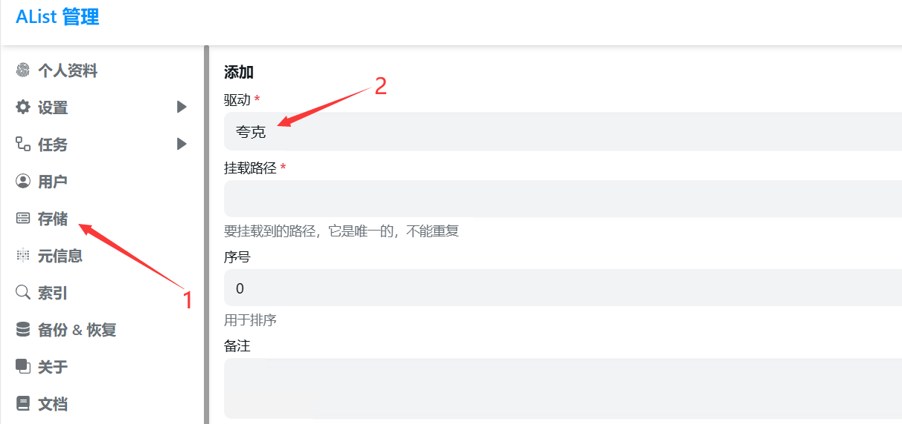
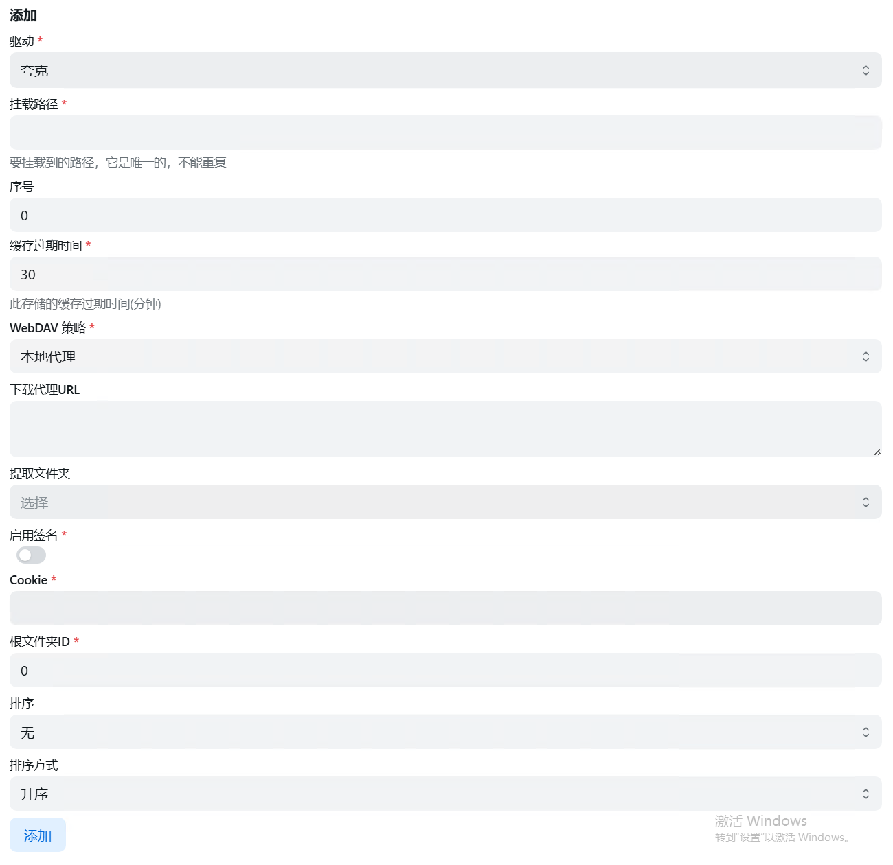
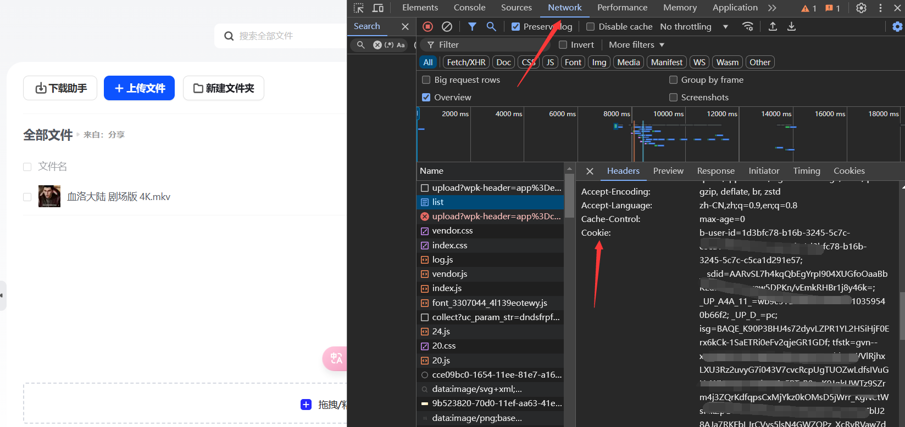
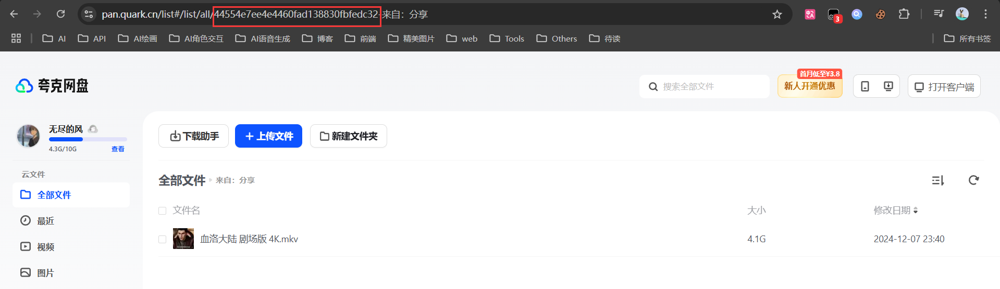
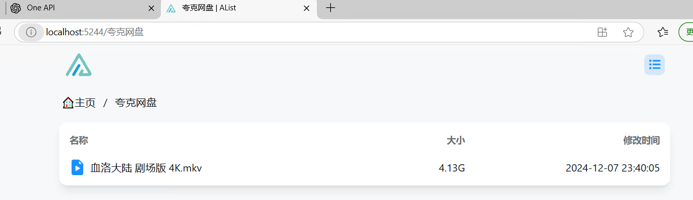

# Alist 网盘挂载教程：打造你的云端文件管理系统

## 前期准备
- 一台可以访问公网的服务器或云电脑（Windows/Linux 均可）
- 需要挂载的网盘账号信息（支持多种网盘类型）

## 快速开始

### 1. 获取 Alist
1. 访问 [Alist 官方仓库](https://github.com/AlistGo/alist)
::github{repo="AlistGo/alist"}
2. 在 [Releases](https://github.com/AlistGo/alist/releases/tag/v3.41.0) 页面下载最新版本
3. 选择适合你系统的安装包
   > 💡 小贴士：Windows 用户选择 `alist-windows-amd64.zip`，解压后即可使用

### 2. 启动 Alist
1. 解压下载的安装包
2. 在文件夹地址栏输入 `powershell` 并回车
3. 执行启动命令：
   ```bash
   ./alist.exe server
   ```
   > ⚠️ 重要提示：首次启动时系统会自动生成管理员账号和密码，请务必保存好

### 3. 开始使用
1. 浏览器访问 `http://localhost:5244`
2. 使用生成的管理员账号登录
   > 🔑 默认管理员用户名：admin

### 4. 配置外部访问
如果需要外网访问，需要在服务器控制面板开放端口：


配置说明：
- 内部端口：填写 5244（Alist 默认端口）
- 外部端口：可以保持相同，或设置其他未被占用的端口，这会开启一个外网访问的端口，这个端口用于访问Alist
之后访问地址就是`http://ip:外部端口`就可以访问到Alist了

## 添加网盘存储

### 基础配置
1. 进入后台的"存储管理"
2. 点击右上角的"添加"按钮
3. 选择要挂载的网盘类型
4. 填写配置信息



### 配置项说明
> 🔍 重要参数解释：
> - 驱动：选择网盘类型
> - 挂载路径：网盘在 Alist 中的访问路径
> - 序号：决定网盘显示顺序
> - 缓存过期时间：文件列表的缓存时间
> - WebDAV 策略：WebDAV 访问方式
> - 下载代理URL：用于加速下载
> - 启用签名：文件防盗链保护
> - Cookie：网盘登录凭证
> - 根目录ID：网盘根目录标识

### 夸克网盘配置实例
1. 选择"夸克网盘"驱动
2. 填写关键信息：
   - 挂载路径：`/夸克网盘`（可自定义）
   - Cookie：从网页版获取
   
   - 根目录 ID：可选配置
   

> 💡 获取 Cookie 技巧：
> 1. 登录夸克网盘网页版
> 2. 按 F12 打开开发者工具
> 3. 切换到 Network 标签页
> 4. 刷新页面，在请求中找到 Cookie 信息

配置完成后，可以在主页看到挂载的网盘：


### PikPak 网盘配置实例

> 🔍 PikPak 网盘的配置虽然和夸克网盘类似，但在获取登录凭证时有些特别之处。

#### 基础配置
1. 选择"PikPak 网盘"驱动
2. 填写基本信息：
   - 挂载路径：`/PikPak`（可自定义）
   - 其他带 * 号的必填项

#### 获取 refresh_token
由于 PikPak 最新的登录机制变更，我们需要特别的方式来获取 refresh_token：

1. 简单方法：
   > 💡 推荐使用在线工具获取：[PikPak Token 获取工具](https://pik.bilivo.top/login)
   - 访问工具网站
   - 输入账号密码
   - 直接获取 refresh_token


参考详细教程：[PikPak登录接口，配合 Alist 使用](https://linux.do/t/topic/185003)
 

> ⚠️ 注意事项：
> - refresh_token 有效期较长，但不是永久的
> - 建议保存好获取到的 token
> - 如果挂载失败，优先检查 token 是否过期

配置完成后，就可以像使用其他网盘一样访问你的 PikPak 文件了。

## 进阶功能配置
- 访问密码保护
- 自定义访问端口
- WebDAV 服务配置
- 文件在线预览
- 离线下载功能

## 常见问题解决
1. 服务无法启动
   - 检查端口占用情况
   - 确认管理员权限
   - 查看运行日志

2. 网盘连接失败
   - 验证配置信息准确性
   - 检查 Cookie 有效期
   - 确认网络连接状态

## 使用小贴士
1. 定期备份系统配置
2. 及时更新到最新版本
3. 妥善保存管理凭据
4. 合理设置缓存时间

## 更多帮助
- [官方使用文档](https://alist.nn.ci/zh/guide/)
- [问题反馈渠道](https://github.com/AlistGo/alist/issues)
- [用户交流社区](https://github.com/AlistGo/alist/discussions)

> 🌟 进阶建议：定期关注官方更新，及时了解新功能和安全补丁

