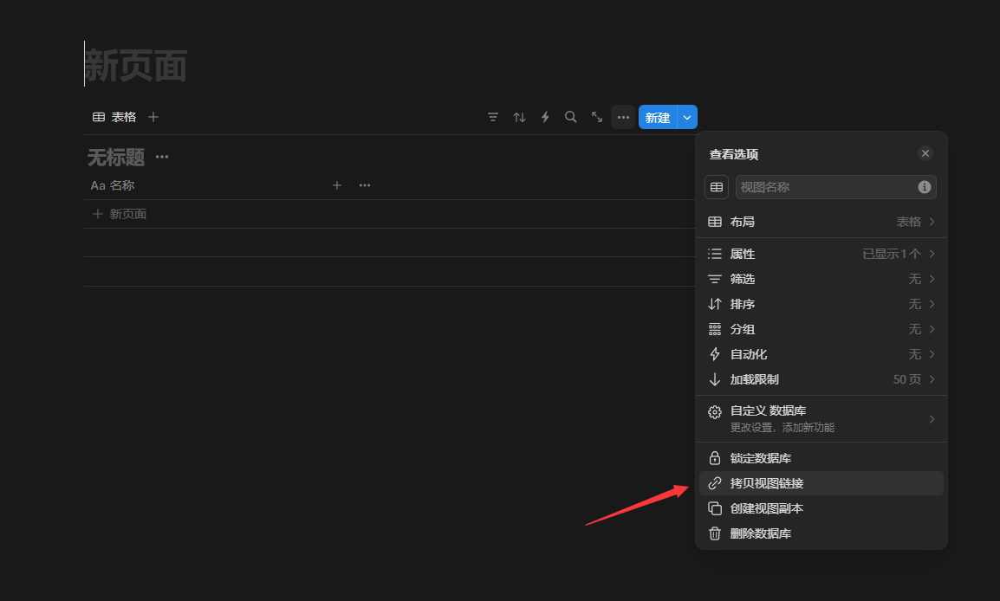

本文将详细介绍如何将 CherryStudio 中的话题导出到 Notion 数据库。整个过程分为 Notion 端的准备工作和 CherryStudio 的配置两个部分，让我们一步步来完成这个设置。

## Notion 端准备工作

### 第一步：创建 Notion 数据库
首先，我们需要在 Notion 中新建一个数据库，用于存储导出的话题：

### 第二步：获取数据库 ID
创建数据库后，我们需要获取数据库 ID。点击右上角的"分享"按钮，然后点击"拷贝视图链接"：

复制的链接格式类似：https://www.notion.so/1ab97cff34xxxx6cf2960491ccb3?v=1ab97cffxxxxc7000cbf2a3c2d&pvs=4

其中问号前面的字符串 `1ab97cff34xxxx6cf2960491ccb3` 就是我们需要的数据库 ID。

### 第三步：创建和配置 Integration
接下来，我们需要创建一个 Notion Integration 并获取密钥：

1. 进入 Notion 的集成管理界面：

2. 设置相应的权限（使用默认权限即可）：

在这里，你会看到 Internal Integration Secret，这就是我们后面需要填入 CherryStudio 的 Notion 密钥。

### 第四步：连接数据库与 Integration
这一步非常重要 —— 我们需要将刚创建的 Integration 与数据库关联起来：

## CherryStudio 配置

现在我们已经完成了 Notion 端的准备工作，接下来配置 CherryStudio：

1. 在 CherryStudio 中填入以下 Notion 配置信息：

2. 确认页面标题字段名与 Notion 数据库中的字段对应：

## 测试连接

完成配置后，我们可以检查连接是否成功：

如果显示连接成功，就可以开始导出话题到 Notion 了：

最后，我们可以在 Notion 中查看导出的内容：

至此，我们就完成了 CherryStudio 导出话题至 Notion 的全部配置过程。你现在可以方便地将 CherryStudio 中的话题同步到 Notion 数据库中了。
