# Cloudflare R2 + PicGo搭建免费图床教程

## 为什么选择Cloudflare R2作为图床？

Cloudflare R2是一个对象存储服务，类似于阿里云OSS或AWS S3，但它提供了更慷慨的免费额度：
- 每月10GB免费存储空间
- 每月100万次免费请求
- 无限制的出站流量
- 全球CDN加速

配合PicGo这款优秀的图片上传工具，我们可以搭建一个稳定、高速且完全免费的图床服务。

## 前期准备

在开始搭建之前，我们需要准备以下几个必要条件：

1. Cloudflare账号：访问 https://dash.cloudflare.com/ 注册
2. PayPal账号：用于验证身份并开通Cloudflare R2服务，访问 https://www.paypal.com/ 注册
3. PicGo软件：图片上传管理工具，从 https://github.com/molunerfinn/picgo/releases下载
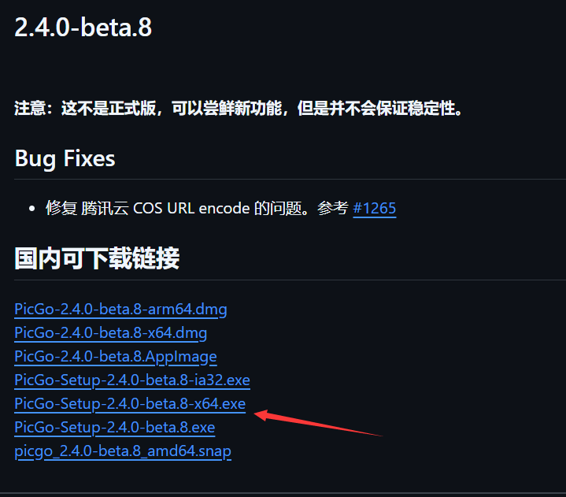
根据你的系统自行选择下载，这里我下载的是这个版本的。

## PayPal账号设置详解

由于Cloudflare R2需要PayPal验证，这里详细说明PayPal账号的注册和验证流程。

### 1. 基础账号注册
- 使用常用邮箱（支持国内邮箱如QQ邮箱）
- 填写手机号码（支持国内手机号）
- 填写个人信息和地址（建议与身份证信息保持一致）

### 2. 绑定银行卡
1. 按照页面提示填写卡片信息
2. 关于安全码（CVV）：
   - 如果你的卡片没有安全码，可以不填或填写任意3位数字
   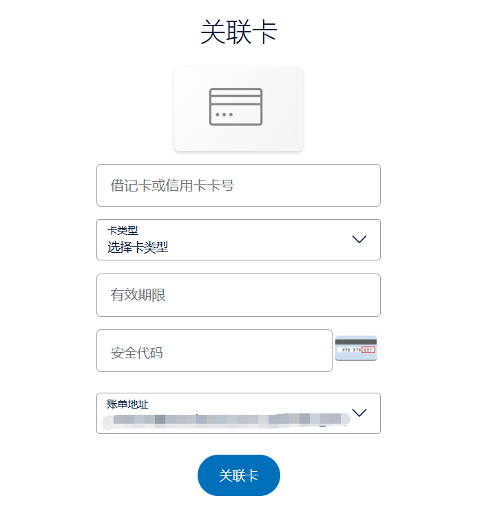
3. 完成卡片激活流程（支持银联兼容的Visa卡）

### 3. 关联银行账户
这一步可能会遇到地址验证错误，参考以下解决方案：https://tieba.baidu.com/p/7226505581?pid=137908119220&cid=0#137908119220

填写银行信息时注意以下格式：
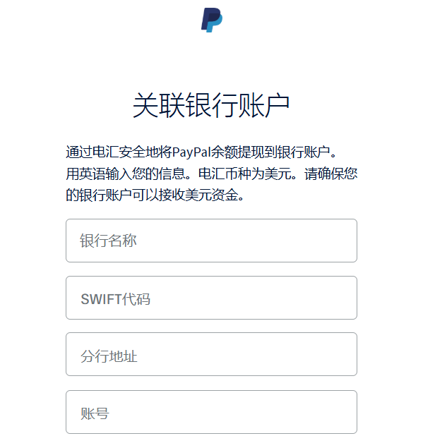

- 银行名称：使用英文全称，如建设银行填写"CHINA CONSTRUCTION BANK CORPORATION"
- SWIFT代码：使用分行代码，如深圳建设银行使用"PCBCCNBJSZX"
- 地址：可以留空
- 账号：填写银行卡号（去掉空格）

## 开通Cloudflare R2服务

完成PayPal验证后，就可以开通Cloudflare R2服务了。注意事项：

1. 必须使用PayPal支付方式（选择左上角的PayPal选项）
2. 如果开通失败导致账户被限制：
   - 需要上传身份证正反面照片
   - 提供身份证上的地址信息（可以直接将地址部分截图框起来提供）

至此，所有准备工作就完成了。接下来我们就可以开始配置R2存储桶和PicGo工具，打造自己的免费图床服务了。

## 配置Cloudflare R2服务

这部分的配置过程，我是参考了这篇[Cloudflare R2 + PicGo 免费图床教程](https://linux.do/t/topic/193442)。不过我还是决定把自己的配置过程记录下来，一方面是给自己留个备忘，另一方面也是记录下我踩过的一些坑，希望能帮到遇到类似问题的朋友。

### 1. 创建R2存储桶
首先，我们需要创建一个R2存储桶来存储图片：
1. 进入Cloudflare控制面板的R2服务
2. 创建新的存储桶（注意：存储桶名称必须使用小写字母）
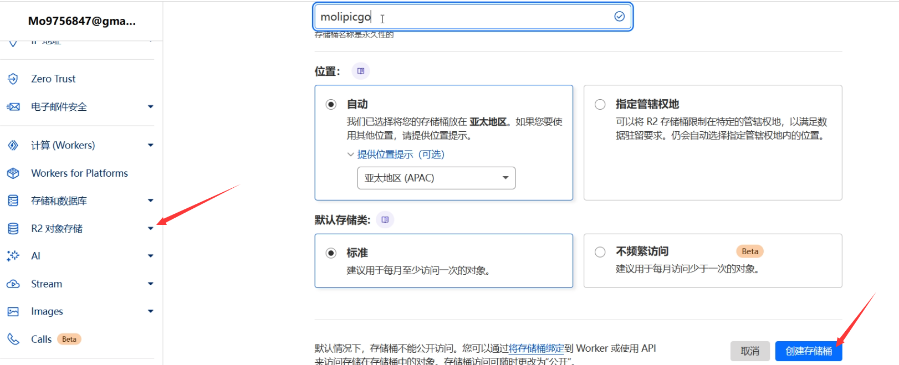

### 2. 配置自定义域名
为了更好地管理和访问图片，我们需要配置自定义域名：

1. 在R2控制面板中添加自定义域名
2. 输入已注册的域名或子域名
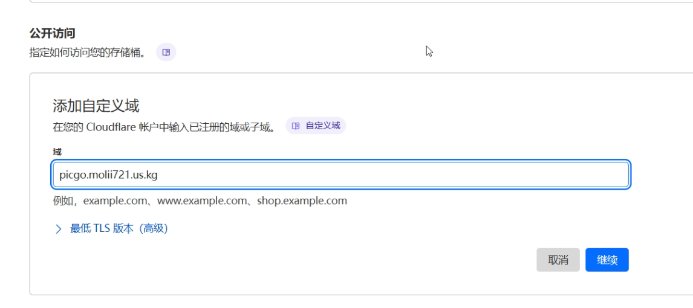
在本例中，我使用了`picgo`作为子域名，因为这个图床主要用于PicGo服务。选择子域名时，你可以根据实际需求进行命名，只需遵循以下规则：

> 使用子域名时，通常没有严格的限制，可以根据需求使用任意的英文、数字组合。常见的子域名类型包括：
> 
> 1. **www**：这是最常见的子域名，通常用于指向网站的主页面。例如：`www.molii722.us.kg`。
> 2. **blog**：用于博客或文章发布的子域名。例如：`blog.molii722.us.kg`。
> 3. **shop**：通常用于电商网站的子域名。例如：`shop.molii722.us.kg`。
> 4. **mail**：用于邮件服务的子域名。例如：`mail.molii722.us.kg`。
> 5. **support**：用于客户支持页面的子域名。例如：`support.molii722.us.kg`。
> 6. **api**：用于 API 服务的子域名。例如：`api.molii722.us.kg`。
> 7. **admin**：用于管理后台的子域名。例如：`admin.molii722.us.kg`。
> 
> 理论上，您可以创建任意子域名，只要符合以下规则：
> 
> - 长度通常限制在 1 到 63 个字符之间。
> - 只能包含字母、数字和连字符（`-`），但不能以连字符开头或结尾。
> - 只能使用 ASCII 字符集。
> 
>可以根据网站的功能和组织结构自由选择子域名的命名。

配置完成后，你会看到域名状态显示为"活动"：
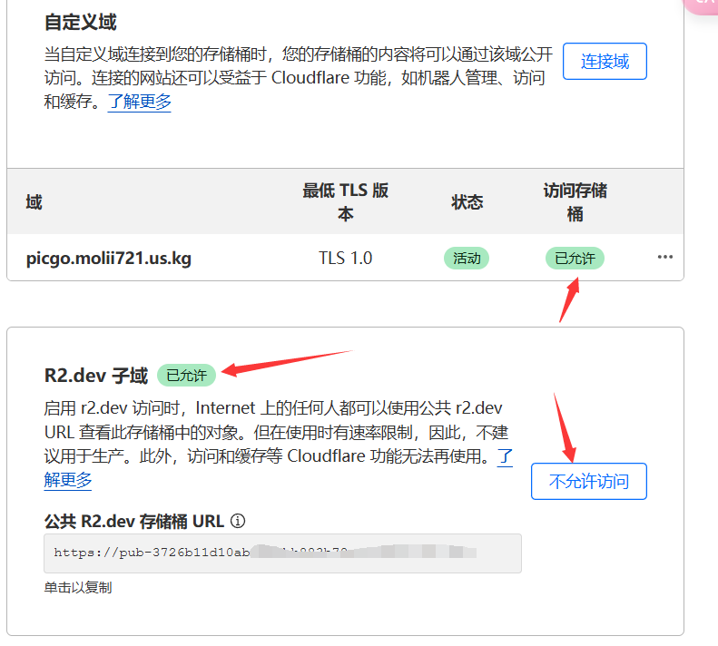

此时，你的图片可以通过自定义域名和R2.dev域名两种方式访问。你可以通过面板直接上传图片测试：
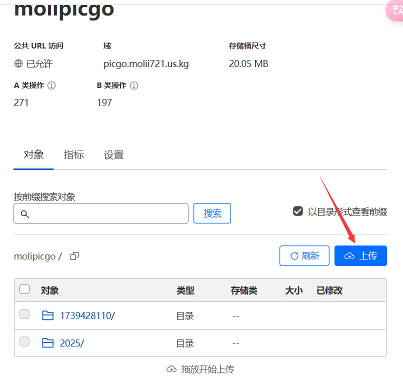

至此，作为简单图床已经能正常使用了，但是需要在 CF 面板上传和查看链接，比较麻烦，可以使用 R2 API 结合 PicGo 来进行上传和管理图片，还能快捷复制图片链接。

### 3. 配置PicGo上传工具

虽然可以直接通过Cloudflare面板上传图片，但使用PicGo可以让上传过程更加便捷。让我们来配置PicGo：

1. 首先创建API令牌：
   - 进入API令牌管理页面
   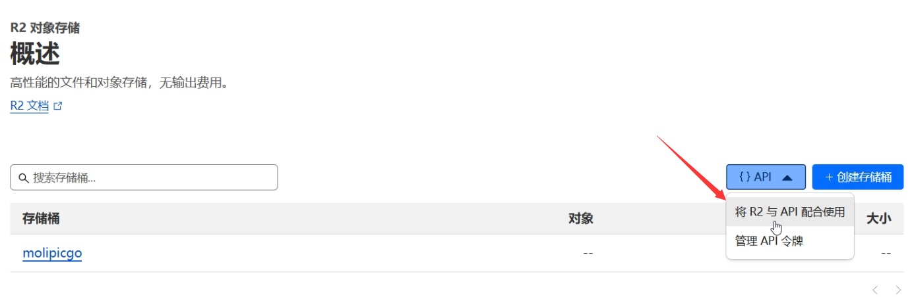
   - 点击"创建API令牌"
   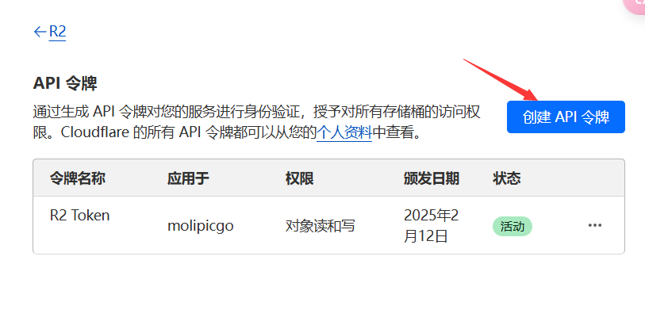
   - 按照图示配置权限
   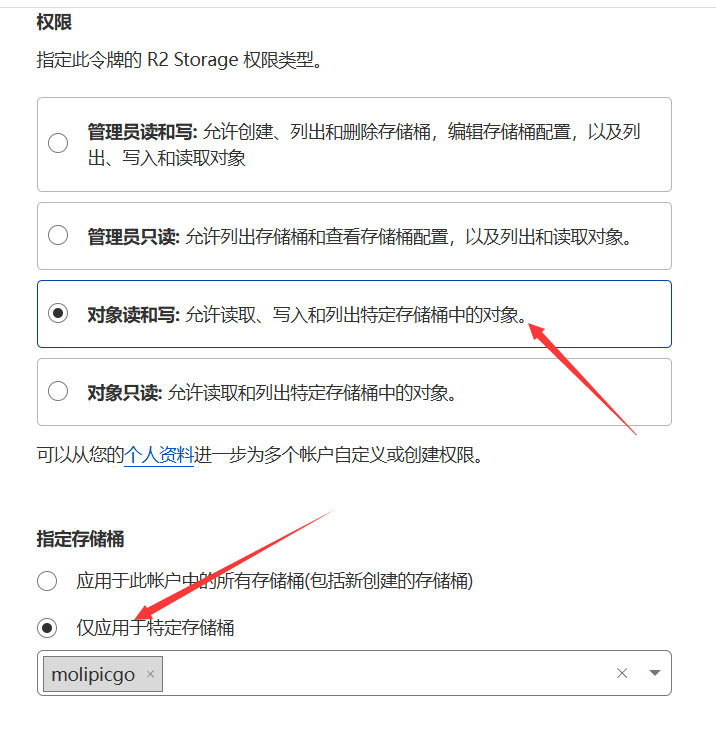

2. 配置PicGo：
   - 在PicGo中安装S3插件
   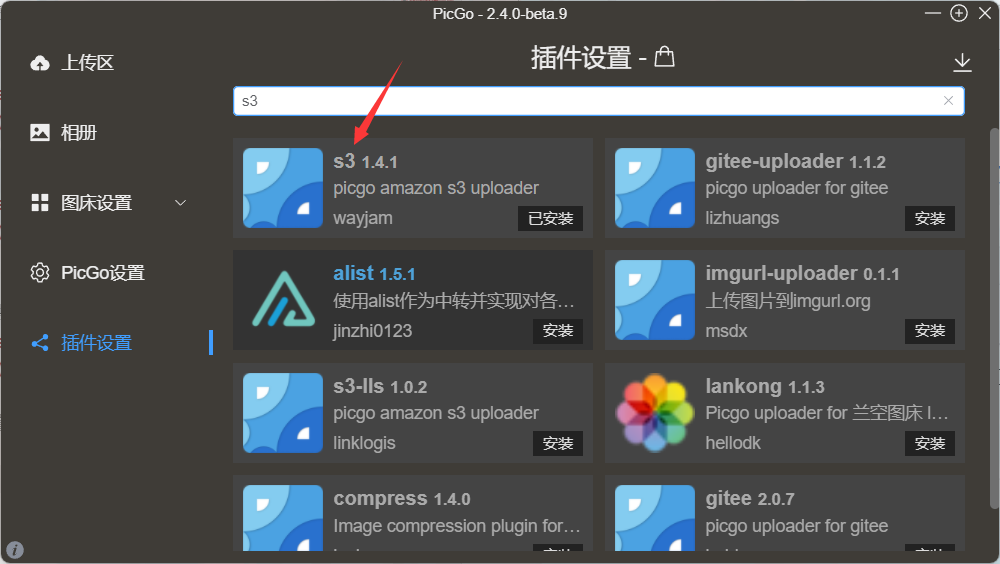
   - 将R2配置信息填入Amazon S3设置中
   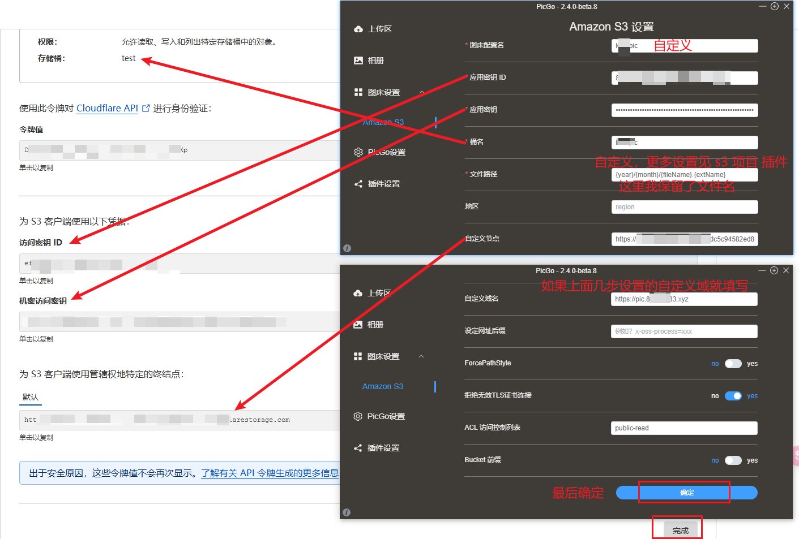

配置完成后，你就可以通过PicGo轻松上传图片了：
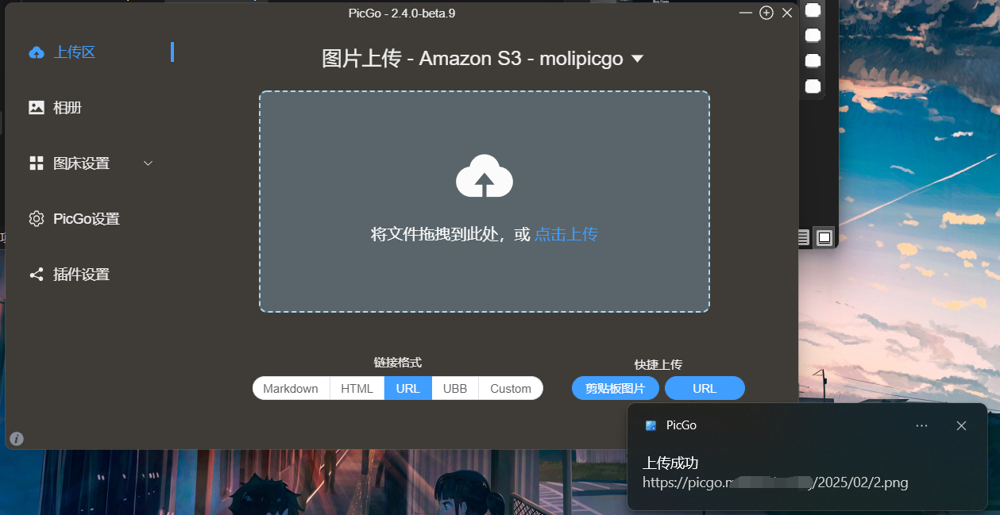

## 安全性
我们可以配置相关规则来确保只有来自授权网站的请求可以访问资源。

1. 配置WAF规则限制访问：
   - 进入WAF配置页面
   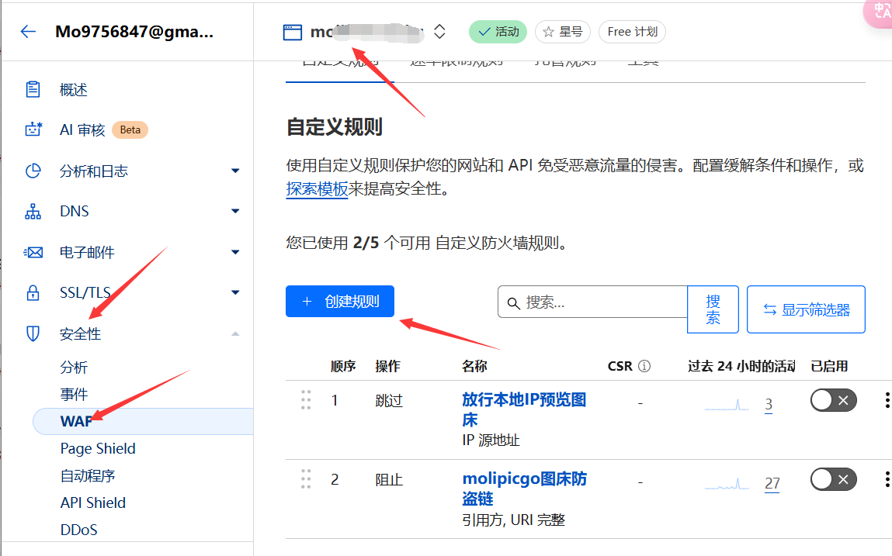
   - 创建规则，限制只允许特定域名访问
   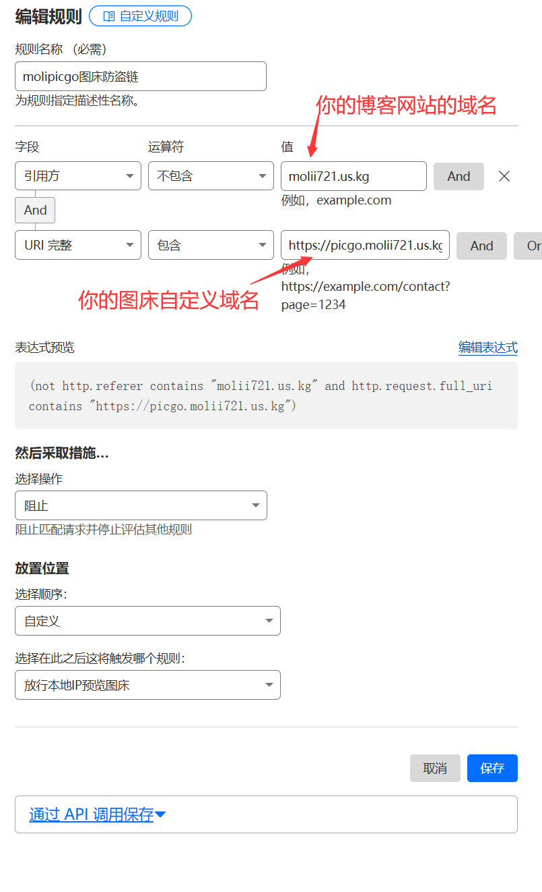

2. 配置本地访问白名单：
   - 添加本地IP到白名单
   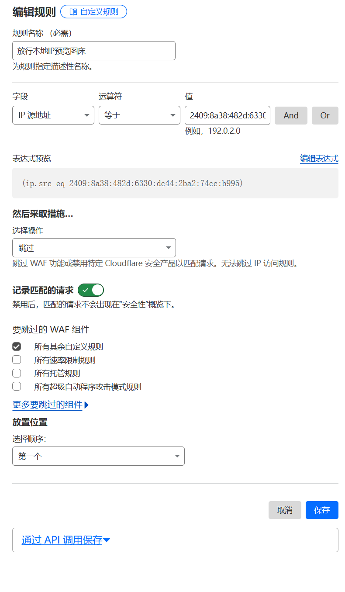
   - 可以通过CMD运行`ipconfig`查看本地IP
   IP填写你本地的IP，可以打开CMD，输入ipconfig查看，如果不行，可以点击之前设置的规则，看看有哪些IP被阻止了。
   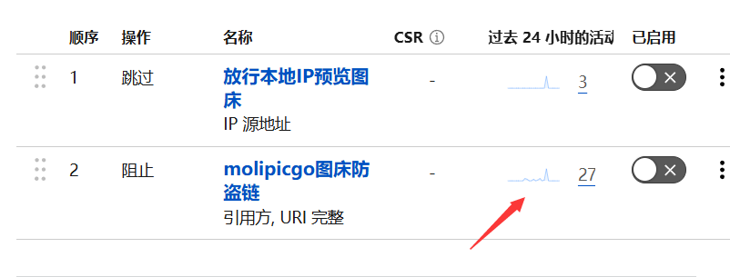
   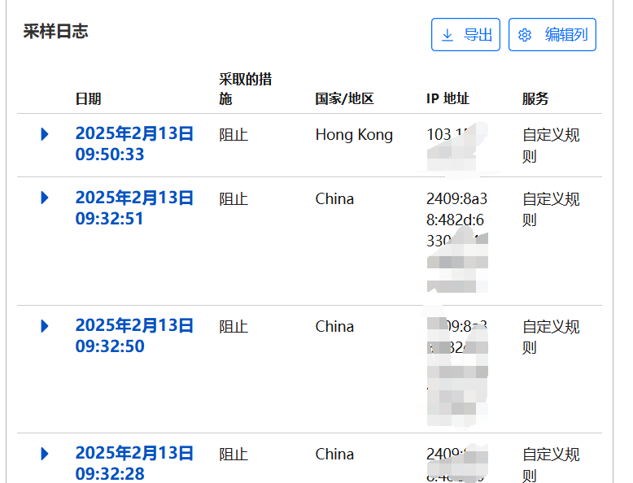

## 扩展功能与使用技巧

### 1. 编辑器集成
#### Typora配置
1. 点击"文件" -> "偏好设置" -> "图像"
2. 按照下图配置PicGo设置：
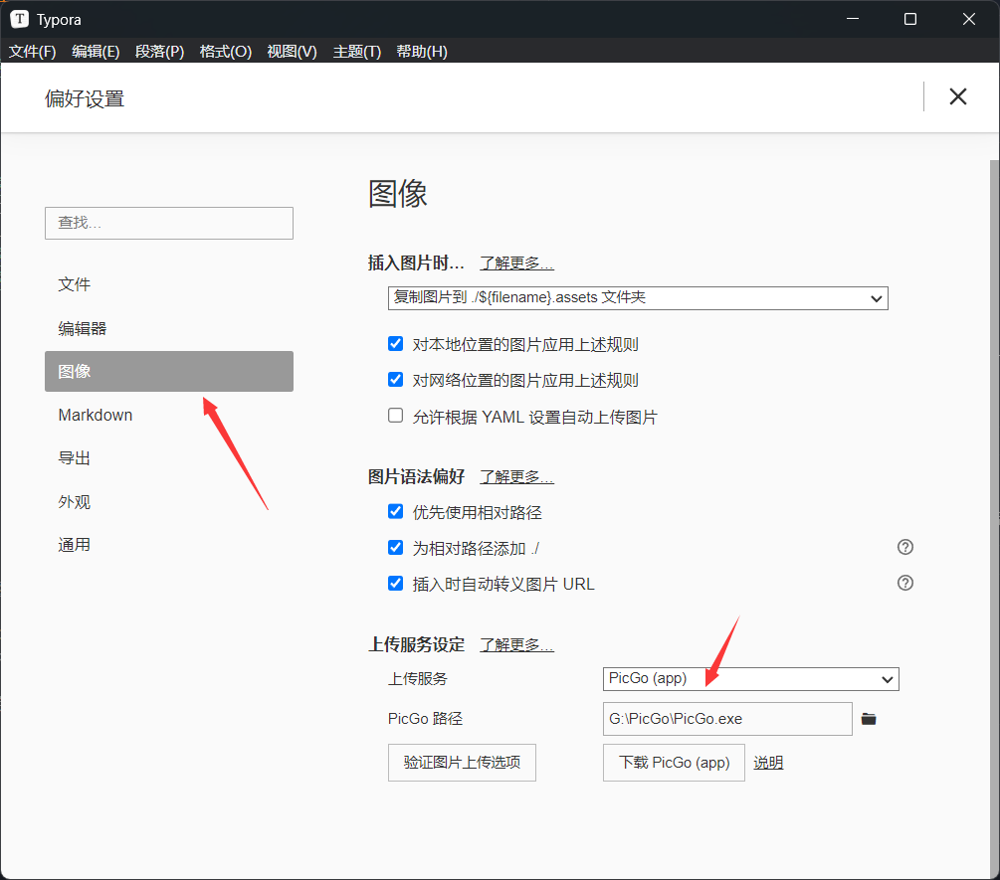

#### YankNote配置
1. 点击左下角的"设置" -> "图片"
2. 按照下图配置：
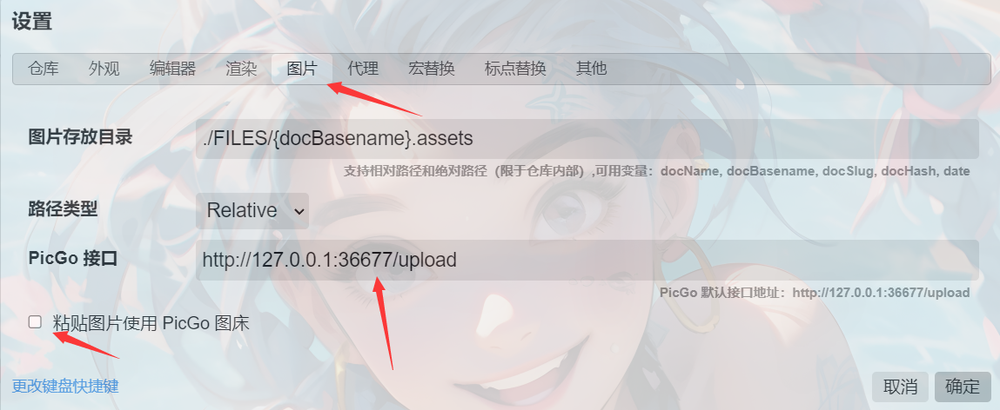
配置完成后，当你从粘贴板粘贴图片到YankNote时，图片会自动上传到图床。

### 2. 常见问题解决方案

#### 图片上传速度慢
**解决方案**：在PicGo的Amazon S3插件中配置代理
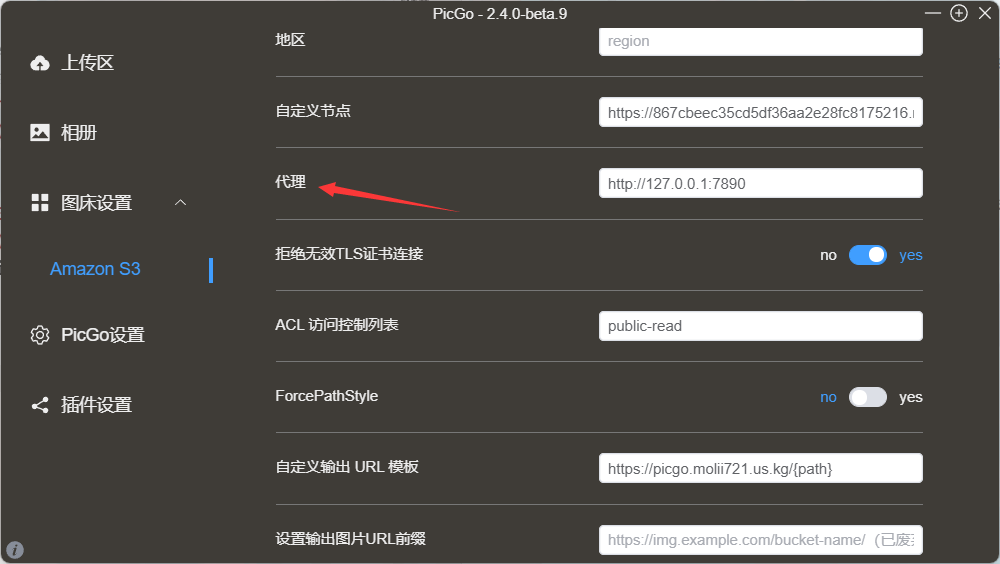
详细说明请参考：[cloudflare r2 +picgo 上传图片经常失败](https://linux.do/t/topic/424229/4)

#### 图片显示异常
**问题**：在笔记软件中上传图片后不显示，复制markdown到网页显示"This XML file does not appear to have any style information associated with it"

**解决方案**：配置自定义输出URL模板
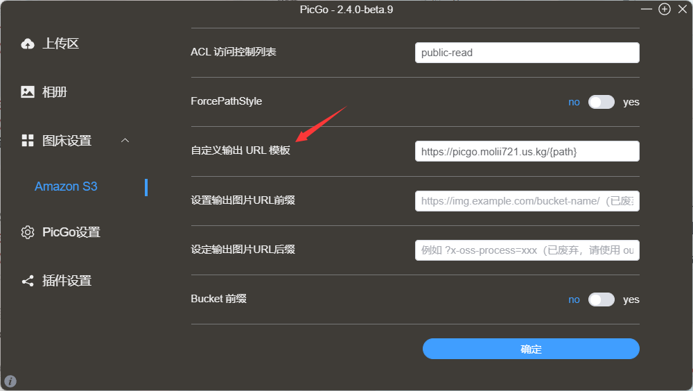
详细说明：[【求助】关于在笔记软件中上传 Picgo 图床的问题](https://linux.do/t/topic/426523/6?u=moli721)

### 3. PicGo进阶使用技巧

#### 自定义上传路径
配置格式：`{year}/{month}/{fileName}.{extName}`
- 支持的变量：year、month、fileName、extName等
- 注意：{fileName}.{extName}等同于{fullName}
- 详细配置说明：https://github.com/wayjam/picgo-plugin-s3?tab=readme-ov-file#%E8%87%AA%E5%AE%9A%E4%B9%89%E8%BE%93%E5%87%BA-url-%E6%A8%A1%E6%9D%BFoutputurlpattern

#### 批量图片迁移
##### Typora批量迁移
1. 点击"格式" -> "图像" -> "上传所有本地图片"
2. 等待上传完成

##### YankNote批量迁移
1. 点击左下角的"工具"
2. 选择"上传所有图片"（注意：仅会上传当前文档中的图片）
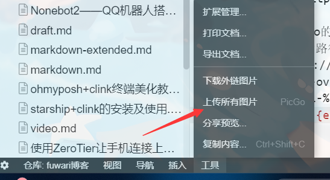
