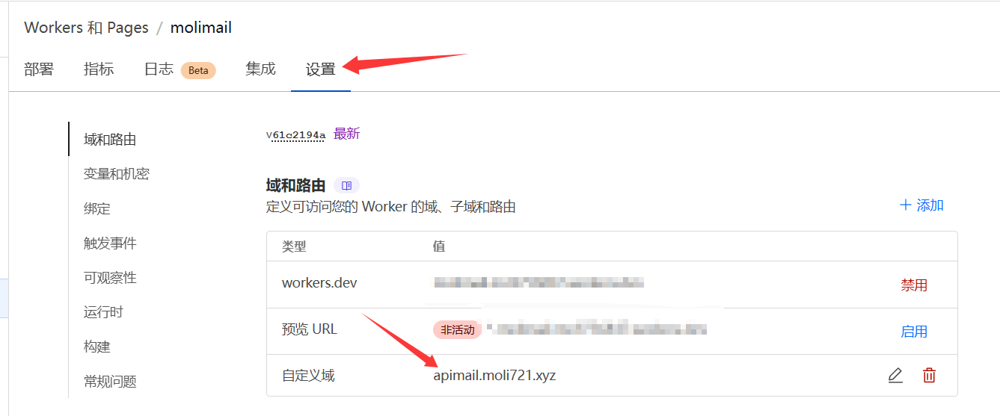
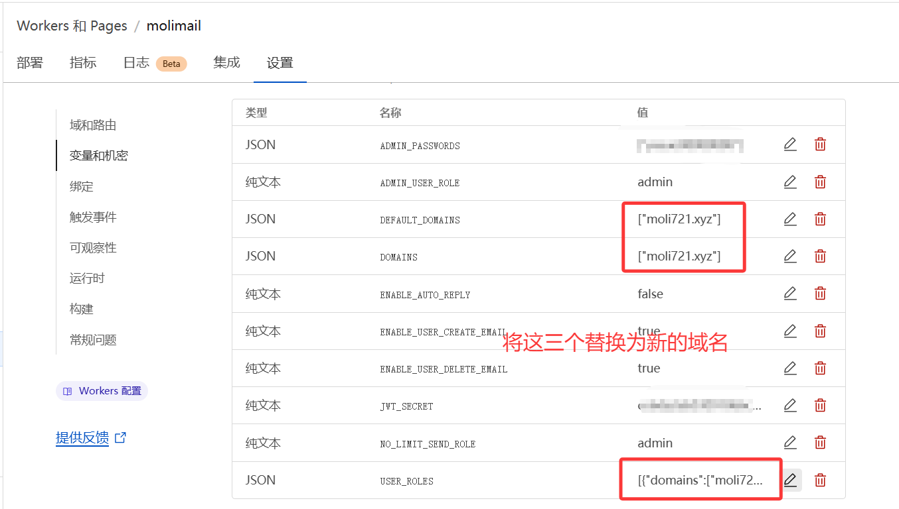
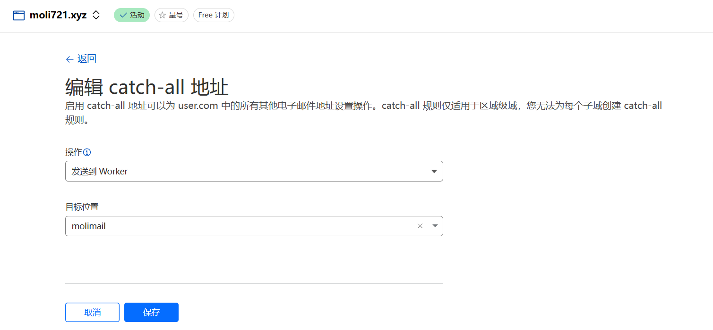
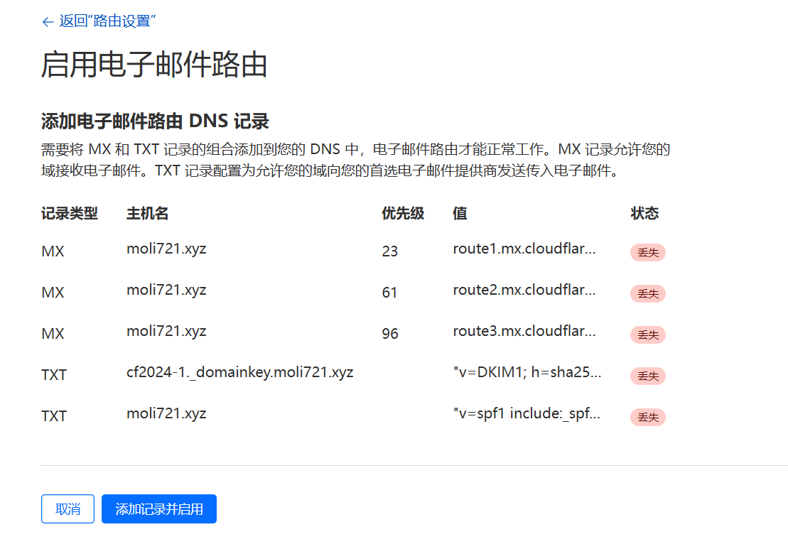
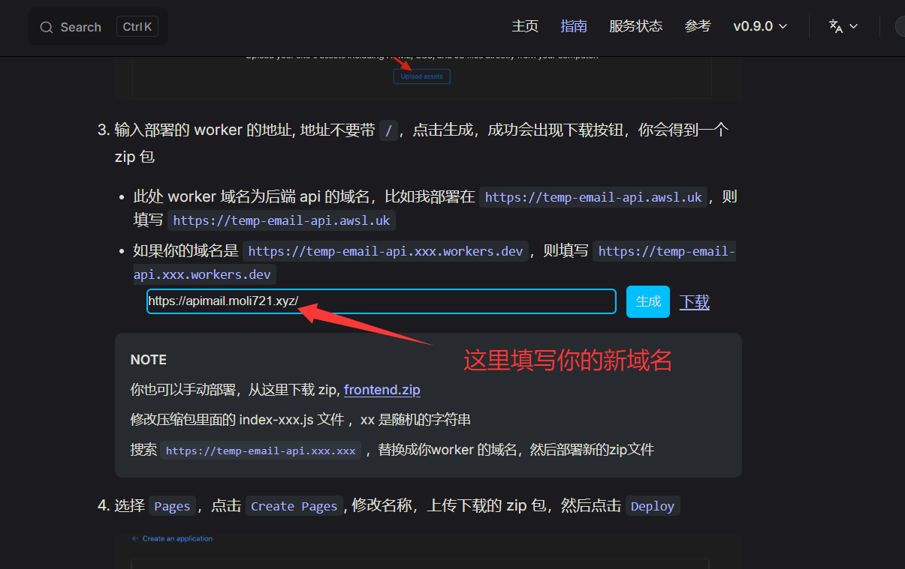
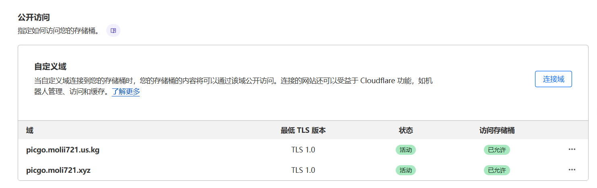
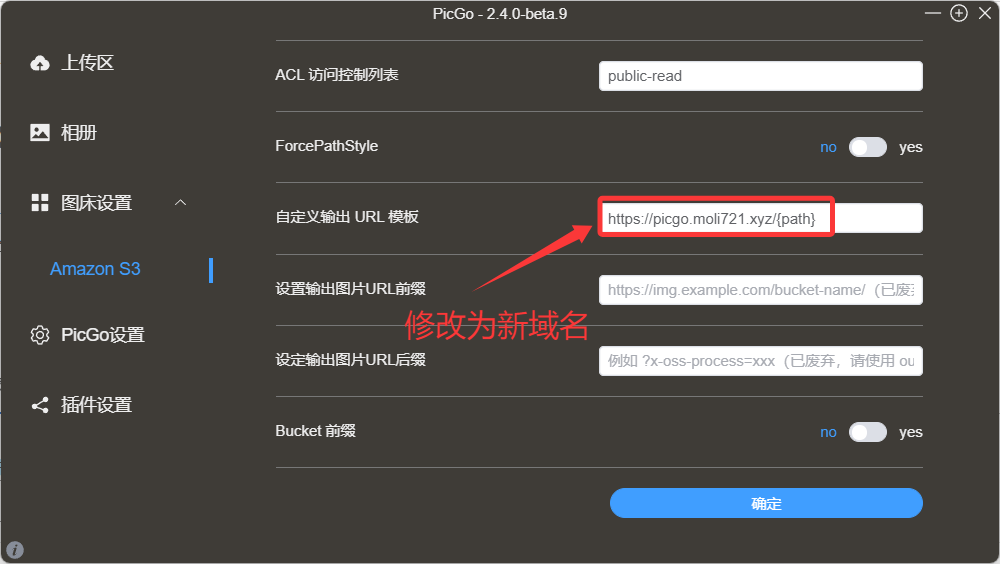

## 适用范围说明

本文主要面向已经在 Cloudflare 上成功搭建了服务（如临时邮箱、图床等）的用户，重点讲解如何将这些现有服务从一个域名迁移到另一个域名。文章不涉及服务的初始搭建和配置过程，而是专注于域名变更时的迁移操作。如果你正在寻找如何从零开始搭建这些服务的教程，可能需要参考其他资料。

## 背景介绍

:loudspeaker: **重要通知**：US.KG 暂停服务及迁移至 DPDNS.ORG

最近我使用的免费 us.kg 域名突然宣布暂停服务，导致我在 Cloudflare 上搭建的临时邮箱和 PicGo 图床都不能用了。作为学生，我不想放弃已经搭建好的服务，所以决定研究如何将所有 Cloudflare 相关服务（DNS 解析、页面规则、WAF 配置等）迁移到新购买的 .xyz 域名上，同时尽量保证服务的连续性。

Cloudflare 的架构设计比较合理，使得这种迁移操作相对简单。下面我将分享我的迁移经验，希望能帮助遇到类似情况的朋友们。

## Cloudflare Workers 与域名的关系

首先需要明确一点：**Cloudflare 中的 Worker 是独立于域名管理的**。这意味着即使域名失效，你的 Worker 代码和配置仍然存在。你可以通过【域和路由】功能直接添加或删除域名，而不必担心域名变更会导致 Worker 丢失。

这一特性为我们的迁移工作提供了便利，接下来让我们分别看看如何迁移临时邮箱服务和 PicGo 图床。

## 临时邮箱服务迁移

临时邮箱服务通常分为前端和后端两部分，我们需要分别处理。

### 1. 后端迁移

首先，访问 Cloudflare Workers 后端设置，将服务地址替换为新域名：

同时，需要更新相关环境变量，确保它们指向新域名：

完成上述更改后，还有一个关键步骤：配置邮箱转发功能。这对于临时邮箱服务的正常运行至关重要：

然后确保启用电子邮箱路由：

**注意**：如果不启用电子邮箱路由，临时邮箱将无法接收邮件，这是服务正常运行的必要条件。

### 2. 前端迁移

前端修改不了，因为前端代码通常会硬编码后端 API 的域名。以我的情况为例，原前端固定调用 `https://apimail.molii721.us.kg/` 作为后端接口。

由于无法直接修改已部署前端的 API 请求地址，我们需要重新生成并部署前端代码：

1. 访问临时邮箱文档网站：https://temp-mail-docs.awsl.uk/zh/guide/ui/pages
2. 根据新域名重新生成前端代码：

3. 生成代码后，前往 Cloudflare 的 Workers 和 Pages 面板，创建新的 Pages 项目并部署前端代码。

完成这些步骤后，临时邮箱服务就成功迁移到新域名了。

## PicGo 图床迁移

相比临时邮箱，PicGo 图床的迁移要简单得多，因为它主要依赖于 Cloudflare R2 存储桶，而 R2 存储桶是独立于域名的服务。

迁移步骤如下：

1. 前往 Cloudflare R2 存储桶设置，为存储桶添加新域名的自定义域：

2. 修改 PicGo 客户端中的相关设置，将域名更新为新域名：

由于其他配置（如访问密钥、存储桶名称等）保持不变，只需更新这两处即可完成 PicGo 图床的迁移。

## 总结

通过以上步骤，我成功将临时邮箱和 PicGo 图床从 us.kg 域名迁移到了新的 .xyz 域名。整个过程比预想的顺利，主要是因为 Cloudflare 服务的模块化设计。

一开始看到域名失效的通知时有些担心，但实际操作后发现，只要理清各个服务组件之间的关系，迁移过程并不复杂。希望这篇经验分享能帮助到其他遇到类似情况的朋友们。