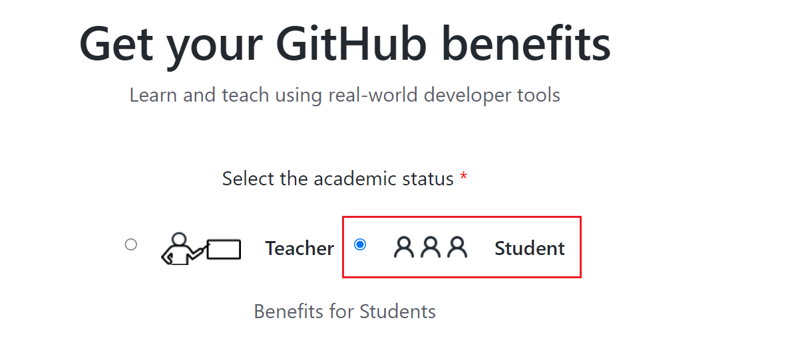
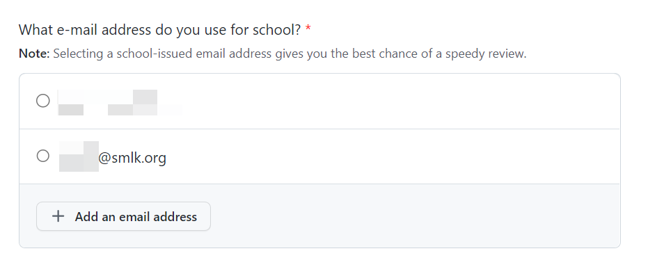
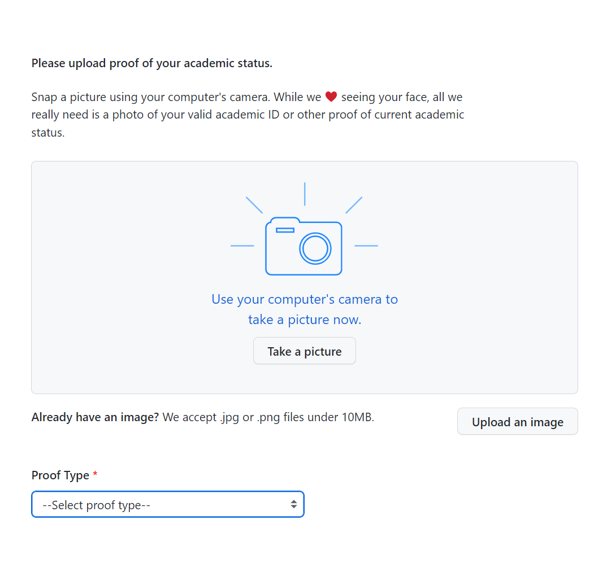
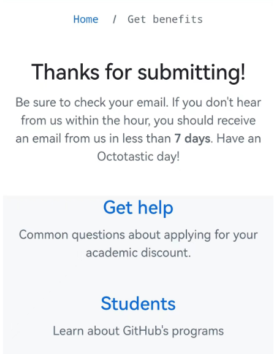
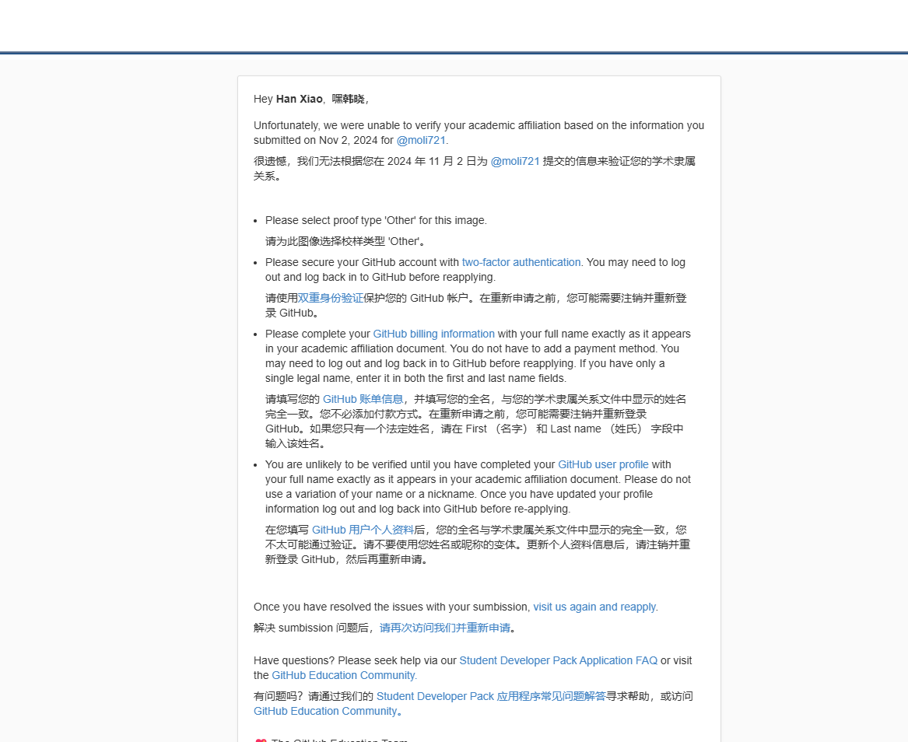
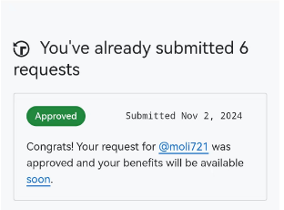
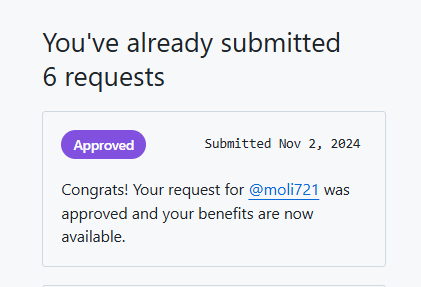

# Copilot学生包白嫖教程

## 白嫖前提
1. 前提是在校学生，且有学校邮箱，当然也得有Github账户
2. 前往学信网下载 教育部学籍在线验证报告
3. 将报告转换成英文版本，这是我使用的是插件沉浸式翻译中的一个功能

## 具体流程
**设置Github个人信息**
来到 https://github.com/settings/profile 界面补充个人信息
主要填写 Name(和报告英文版本一致)、Bio，最后Update profile

**获取教育邮箱**
一般直接去网上搜索学校名字+邮箱系统即可，具体账号密码学校应该会提示你，登录进去之后是管理界面，之后copilot会发送邮件通知你

**准备教育部学籍在线验证报告**
前往[学信网](https://www.chsi.com.cn/)登录之后，选择在线验证报告之后即可免费下载，接着将**PDF导入沉浸式翻译**，修改元素为英文的即可

**申请GitHub Student Developer Pack**
[申请地址](https://education.github.com/discount_requests/application)

首先勾选 学校邮箱 .edu.cn 后会自动填写 the name of school，然后写一段理由，Continue

接着来到上传图片界面，上传刚才翻译好的英文学籍报告即可，这一步要关闭代理，同时要同意验证地理位置

上传好之后，正常就会出现这个界面

接着学校邮箱就会收到通过的邮件，如图

根据信息一个一个修改即可，比如第二个双重信息验证，[可以去Google下一个插件](https://chromewebstore.google.com/detail/%E8%BA%AB%E4%BB%BD%E9%AA%8C%E8%AF%81%E5%99%A8/bhghoamapcdpbohphigoooaddinpkbai?utm_source=ext_app_menu)
完成之后，继续发送，成功之后会显示

这个时候权益还没到账，我这里过了五天，权益到账了，Approve会变成蓝色

说明权益到账了，现在就可以去插件市场下载Copilot插件免费使用了

