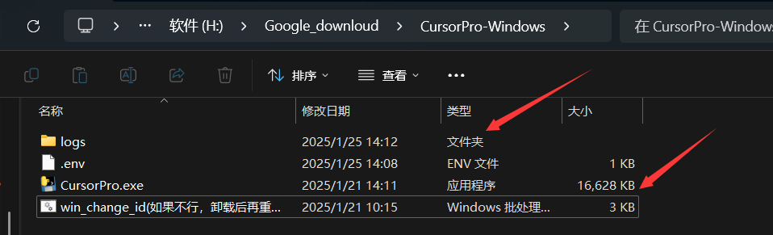
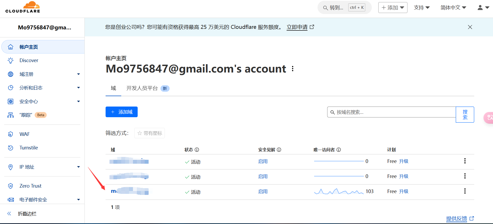
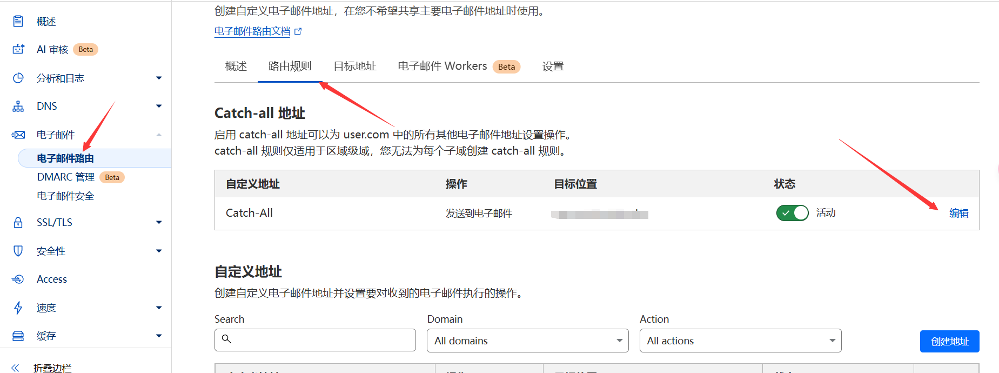
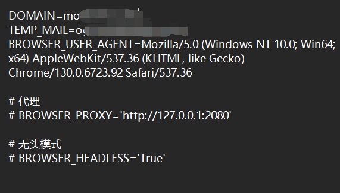
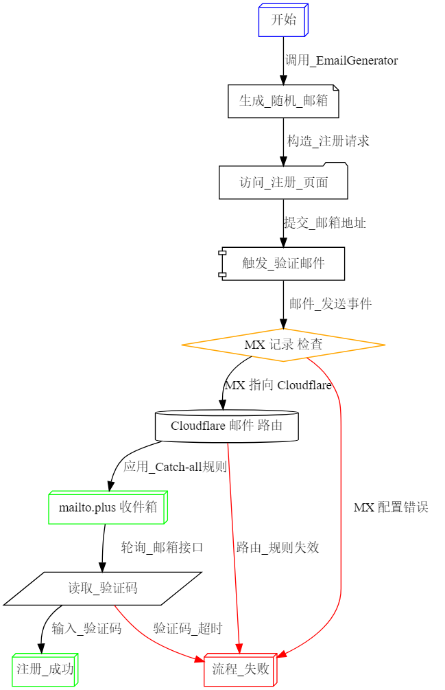

## 前言
Cursor Pro是一款强大的自动化工具，本文将详细介绍其安装配置流程以及使用过程中的一些重要概念。通过本教程，你将能够快速上手并充分利用这个工具。

## 准备工作
在开始配置之前，我们需要准备以下内容：
1. CloudFlare账号及已配置的域名
2. 一个可用的接收邮箱
3. Cursor Pro安装包

## 安装配置步骤

### 1. 下载安装
首先访问[Relases](https://github.com/chengazhen/cursor-auto-free/releases)页面，根据你的操作系统下载对应的安装包。解压后你会看到两个主要文件：
- logs文件夹
- CursorPro.exe

### 2. 环境配置
1. 从[cursor-auto-free](https://github.com/chengazhen/cursor-auto-free)项目下载`.env.example`文件
2. 打开CloudFlare控制面板，进入你的域名管理界面

3. 按照下图所示配置Catch-all地址

4. 将`.env.example`重命名为`.env`，并按照下图示例填写配置信息

### 3. 启动运行
完成配置后，右键点击CursorPro.exe，选择"以管理员身份运行"即可启动程序。

## 工作原理解析
### Catch-all邮件地址机制
Catch-all地址（通配符邮箱）是CloudFlare提供的一项强大功能，它的工作流程如下：
1. 配置包含两个关键选项：
   - 操作：发送电子邮件
   - 目标位置：实际接收邮件的地址
2. 所有发送到`xxx@你的域名`的邮件都会：
   - 首先经过CloudFlare邮箱服务器
   - 然后转发到你设置的目标邮箱
3. 这样可以有效隐藏你的实际邮箱地址，外部只能看到CloudFlare的邮箱服务

工作流程图示：

## 常见问题解决
如果你遇到machine_id限制的问题，可以通过以下步骤解决：
1. 关闭Cursor程序
2. 使用[cursor_machine_id](https://github.com/fly8888/cursor_machine_id)工具修改机器码
3. 如果问题仍然存在，可以尝试卸载Cursor后重新执行脚本

## 参考资料
详细教程请参考：https://cursor-auto-free-doc.vercel.app/