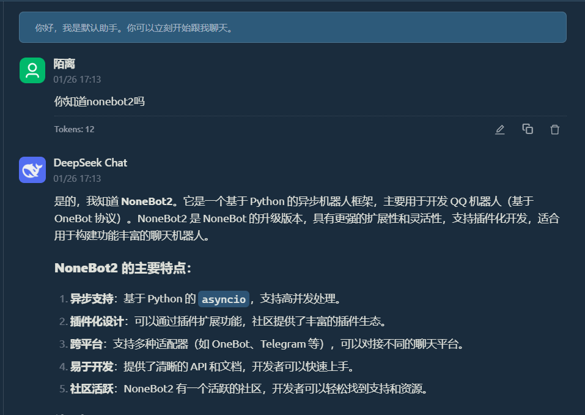

现在是构建强大 AI 的最佳时机！

Deepseek V3 正式发布，不仅成本低，效果还超棒！
V3 模型在训练时融入了 R1 的推理能力，虽然它本身不是专门的推理模型，但在执行 CoT（Chain-of-Thought）任务时表现非常出色。
更厉害的是，Deepseek 还支持 Prompt 缓存功能，即使 CoT 的系统提示词很长，缓存后实际消耗的成本也不会太高，性价比直接拉满！

与此同时，Cherry Studio 也推出了基于 RAG（Retrieval-Augmented Generation）的知识库，实用性直接升级，简直是 AI 开发者的福音！

话不多说，赶紧动手开干吧！

### 第一步：注册 Deepseek API 和 Siliconflow
1. **注册 Deepseek API**
   访问 [Deepseek 平台](https://platform.deepseek.com)，注册账号并获取 API 密钥。
   Deepseek-V3 模型成本低、效果好，是构建 AI 的首选工具！
    


2. **注册 Siliconflow**
   访问 [Siliconflow 登录页面](https://account.siliconflow.cn)，使用统一登录系统注册账号。
   Siliconflow 提供的 Embedding 模型（如 Pro/BAAI/bge-m3）效果非常棒，适合用于知识库构建。
    

---

### 第二步：下载并配置 Cherry Studio
1. **下载 Cherry Studio**
   前往 [Cherry Studio GitHub 页面](https://github.com/CherryHQ/cherry-studio/releases)，下载最新版本。

2. **导入对话模型**
   打开 Cherry Studio，点击"设置"，选择"导入模型"。
   官方示例中已经提供了 Deepseek 模型的配置，直接导入即可。
   

1. **导入 Embedding 模型**
   在 Cherry Studio 中，选择"知识库"功能，导入 Siliconflow 提供的 Embedding 模型（如 Pro/BAAI/bge-m3）。
   知识库功能是 0.9.1 版本的新亮点，实用性超强！
     
    也可点击管理添加模型
    

---

### 第三步：配置 CoT Prompt
1. **新建助理**
   在 Cherry Studio 中，点击"新建助理"，进入配置页面。

2. **添加 CoT Prompt**
   在助理的 Prompt 设置中，粘贴你的 CoT（Chain-of-Thought）提示词。
   Deepseek 支持 Prompt 缓存，即使提示词较长，也不会增加太多成本，性价比超高！
    

我们可以对比一下有思维链和没有思维链的回复。
有思维链：
没有思维链：
可以看到思维链会展示思考过程同时更加针对性的进行回复

---

### 第四步：知识库教程

在 Cherry Studio 中，知识库功能是 0.9.1 版本的重要更新之一。通过知识库，你可以将外部数据（如文档、API 文档等）与 AI 模型结合，提升问答和推理的准确性。以下是配置知识库的详细步骤：

---

#### 1. **导入 Embedding 模型**
在 Cherry Studio 中，点击"知识库"功能，选择"导入模型"。推荐使用 Siliconflow 提供的 Embedding 模型（如 Pro/BAAI/bge-m3），效果非常出色。


---

#### 2. **配置知识库数据源**
将你的文档或数据文件（如 Markdown、JSON 等）上传到知识库中。Cherry Studio 支持多种文件格式，确保数据源的多样性和实用性。
- **操作步骤**：
  1. 点击"知识库"功能，选择"上传数据"。
  2. 选择文件并上传，系统会自动解析文件内容并生成索引。

---

#### 3. **优化知识库检索**
通过调整 Embedding 模型的参数和检索策略，可以进一步提升知识库的检索效果。例如，设置合适的相似度阈值，确保返回的结果既准确又相关。
- **建议**：
  - 调整相似度阈值：根据实际需求，设置一个合理的阈值，避免返回过多无关结果。
  - 优化检索策略：结合上下文信息，提升检索的精准度。

---

#### 4. **测试知识库功能**
在 Cherry Studio 中新建一个助理，配置其使用知识库功能。通过输入问题，测试知识库的检索和回答能力，确保其满足你的需求。


- **调整模型温度**：
  - 温度越低，模型的逻辑和数学能力越强，适合需要精确回答的场景。
  - 温度越高，模型的创造力和艺术能力越强，适合需要创意输出的场景。
  - **注意**：温度设置并非越低越好，过低可能导致模型对基本知识的理解不足。

- **本地部署模型**：
  如果你希望本地部署模型，可以使用 `ollama`。下载后运行以下命令即可：
  ```bash
  ollama pull momic-embed-text
  ```
  其他配置与前面步骤一致。

---

#### 5. **持续更新知识库**
知识库的效果依赖于数据的质量和时效性。定期更新知识库中的数据源，确保其始终与最新信息同步。
- **建议**：
  - 定期检查数据源，删除过时或无效的内容。
  - 添加新的数据源，确保知识库的覆盖范围不断扩大。

---

#### 6. **启用知识库的效果**
启用知识库后，AI 能够引用知识库中的内容，大大增强其注意力和检索能力。


---


### 小贴士
- **知识库教程**：如果对知识库配置有疑问，可以参考 [Cherry Studio 官方教程](https://cherry-ai.com)。
- **模型选择**：Deepseek-V3 和 Siliconflow 的 Embedding 模型搭配使用，效果非常出色，强烈推荐！

话不多说，赶紧动手试试吧！

### 参考资源

1. **[长期更新] Cherry Studio 使用指南与讨论汇总**
   [https://linux.do/t/topic/327630](https://linux.do/t/topic/327630)
   - 汇集了关于 Cherry Studio 的最新教程、使用技巧和社区讨论，适合想要深入学习的朋友。

2. **Deepseek-V3 + CoT 思维链 + RAG 知识库：打造超强 AI 问答系统**
   [https://linux.do/t/topic/316186](https://linux.do/t/topic/316186)
   - 详细介绍了如何结合 Deepseek-V3、CoT 思维链和 RAG 知识库，构建一个高效、精准的 AI 问答系统，适合进阶用户参考。