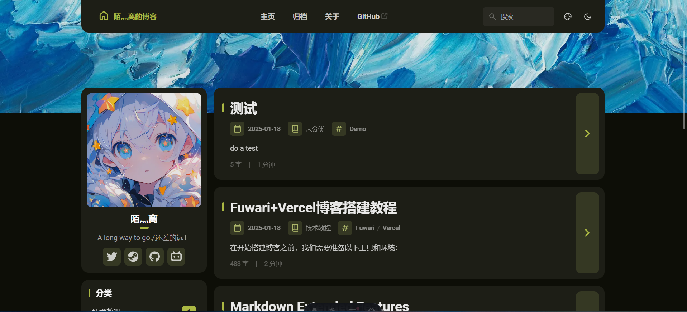
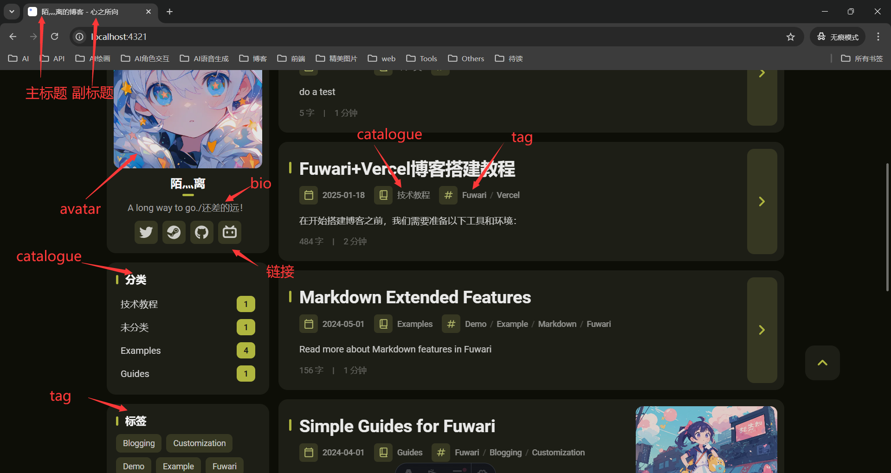
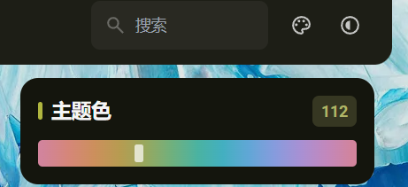
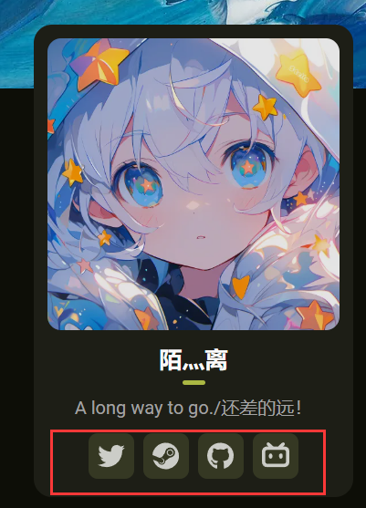
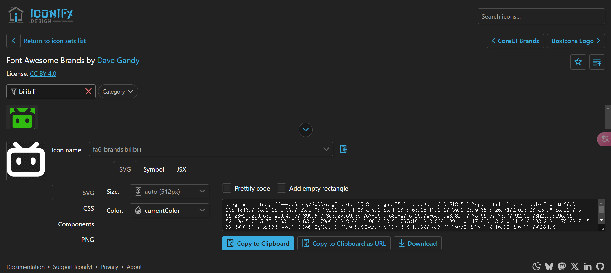
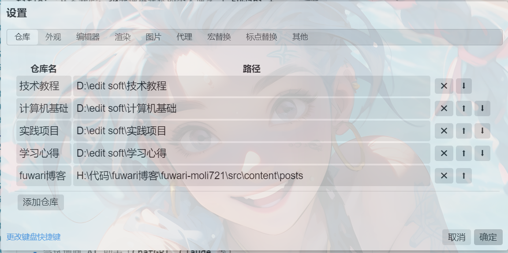
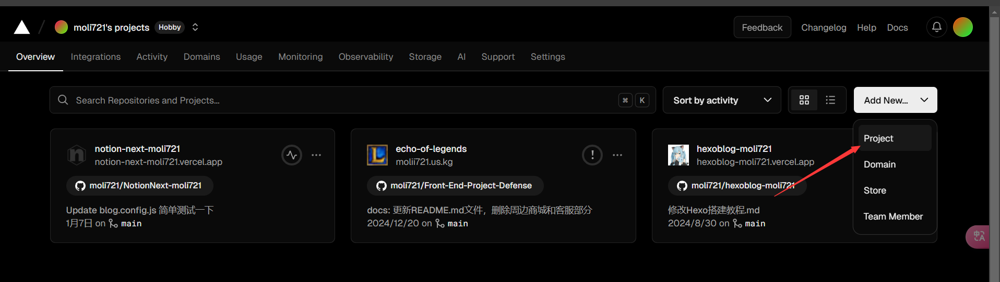
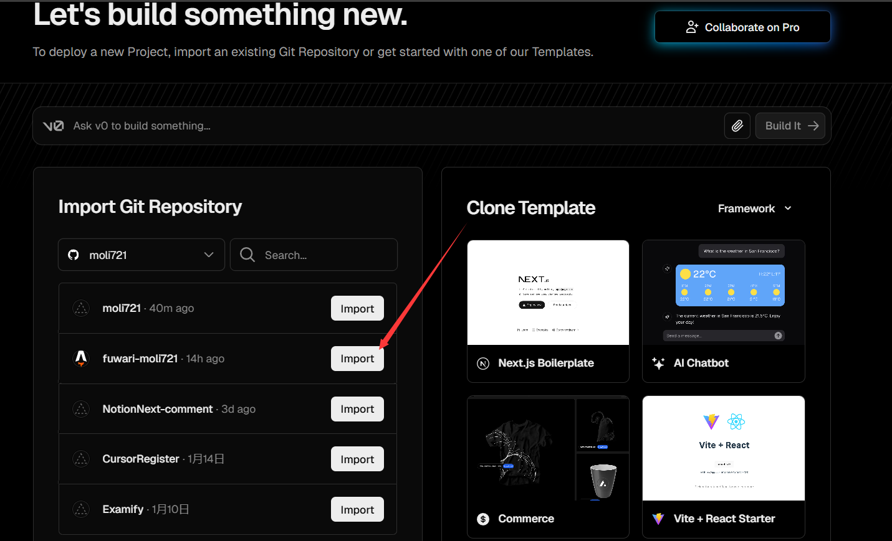
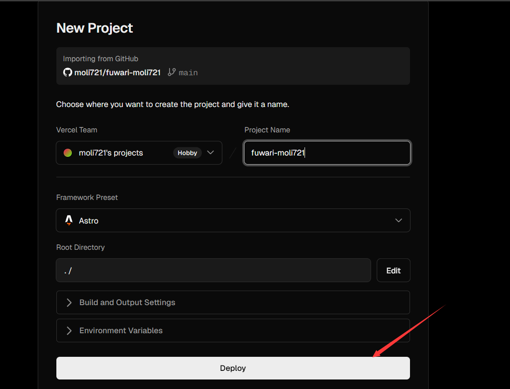

# Fuwari+Vercel博客搭建教程
## 搭建前准备

在开始搭建博客之前，我们需要准备以下工具和环境：

1. **基本思维能力**：遇到问题时，建议按照以下顺序解决h:\\代码\\fuwari博客\\fuwari-moli721\\src\\content\\spec\\about.md$0：
   - 先自己思考分析问题
   - 善用搜索引擎（Google、必应等）
   - 尝试询问 AI 助手（ChatGPT、Claude 等）
   - 实在解决不了再去论坛或社区提问

2. **Git**：版本控制工具，用于管理代码和与 GitHub 交互
   - 下载地址：[Git 官网](https://git-scm.com/downloads)
   - 新手也可以选择使用图形界面的 [GitHub Desktop](https://github.com/apps/desktop)，但个人建议还是学习使用命令行，长远来看更实用

3. **Node.js**：JavaScript 运行环境
   - 下载地址：[Node.js 官网](https://nodejs.org/en)
   - Fuwari 是基于 Node.js 开发的，所以这是必需品
   - 建议选择 LTS（长期支持）版本

4. **GitHub 账号**：
   - 用于存储博客源代码
   - 也方便进行版本管理和多设备同步

5. **Vercel 账号**：
   - 用于部署和托管博客
   - 提供免费的静态网站托管服务
   - 可以直接用 GitHub 账号登录

6. **Markdown 编辑器**：推荐使用 [YankNote](https://yanknote.com/)
   - 界面清爽，功能强大
   - 支持实时预览
   - 功能丰富，支持代码高亮、数学公式、流程图、思维导图等
   - 当然你也可以选择其他编辑器，如 Typora、VS Code 等

7. **Markdown 基础知识**：
   - Markdown 是一种轻量级标记语言
   - 用于编写结构化文档
   - 语法简单易学
   - 可以参考 [Markdown 官方教程](https://markdown.com.cn/basic-syntax/) 快速入门

有了这些准备，我们就可以开始搭建属于自己的博客了！

## 开始搭建

1. 打开[Fuwari](https://github.com/moli721/fuwari)，点击右上角的`fork`，然后点击`Create fork`，将Fuwari项目fork到自己的GitHub账号下

2. 在本地选择一个文件夹，使用Git，输入以下命令：

```bash
git clone https://github.com/你的GitHub账号/fuwari.git
```

3. 进入项目目录，首先，全局安装pnpm：`npm install -g pnpm`（如果npm国内拉取过慢，请尝试cnpm：`npm install -g cnpm`），然后安装依赖，输入以下命令：

```bash
pnpm install
pnpm add sharp
```

4. 安装完成后，输入以下命令：

```bash
pnpm dev
```

5. 在浏览器中打开`http://localhost:4321`，就可以看到博客的预览页面了


到这里，博客就已经搭建完成了，接下来，我们需要配置博客

## 基础配置修改

首先，我们需要打开 `src/config.ts` 文件来个性化你的博客。这个文件包含了博客的核心配置信息：



### 基本信息设置

- **博客标题设置**
  - `title`：设置你的博客主标题
  - `subtitle`：设置博客副标题（可选）。这两个会在首页组合显示为"主标题 - 副标题"的形式

- **界面设置**
  - `lang`：设置博客的显示语言
    - 支持的语言包括：英文(en)、简体中文(zh_CN)、繁体中文(zh_TW)、日语(ja)、韩语(ko)等
  - `themeColor`：设置博客的主题色
    - 你可以点击博客右上角的调色板图标，选择喜欢的颜色，然后填写对应的数值
    

### 图片和链接配置

- **网站装饰**
  - `banner.src`：设置网站顶部的横幅图片（支持 http/https 链接）
  - `favicon.src`：设置网站图标，就是浏览器标签页显示的小图标（支持 http/https 链接）
  - `links`：设置导航栏上的友情链接

- **个人信息**
  - `avatar`：设置你的头像
  - `name`：填写你的名字
  - `bio`：设置个性签名，会显示在头像和名字的下方

### 导航栏和社交链接

网站有两个主要的链接区域：
- `NavBarConfig`：配置导航栏的链接
- `ProfileConfig`：配置个人资料区域的社交媒体链接


### 图标设置

Fuwari 内置了多种图标库支持：`fa6-brands`、`fa6-regular`、`fa6-solid` 和 `material-symbols`。

设置图标的步骤：
1. 访问 [Iconify](https://icon-sets.iconify.design/fa6-brands/) 网站
2. 搜索你想要的图标（比如 "bilibili"）
3. 复制图标的完整名称（如 `fa6-brands:bilibili`）
4. 粘贴到配置文件的 `icon` 字段中



提示：图标库已通过 [@iconify-json/fa6-brands](https://www.npmjs.com/package/@iconify-json/fa6-brands) 预装，你可以直接使用，无需额外安装。

这里附上我的配置文件，供大家参考：

```ts
import type {
  LicenseConfig,
  NavBarConfig,
  ProfileConfig,
  SiteConfig,
} from './types/config'
import { LinkPreset } from './types/config'

export const siteConfig: SiteConfig = {
  title: '陌灬离的博客',
  subtitle: '心之所向',
  lang: 'zh_CN',         // 'en', 'zh_CN', 'zh_TW', 'ja', 'ko', 'es', 'th'
  themeColor: {
    hue: 112,         // Default hue for the theme color, from 0 to 360. e.g. red: 0, teal: 200, cyan: 250, pink: 345
    fixed: false,     // Hide the theme color picker for visitors
  },
  banner: {
    enable: true,
    src: 'assets/images/demo-banner.png',   // Relative to the /src directory. Relative to the /public directory if it starts with '/'
    position: 'center',      // Equivalent to object-position, only supports 'top', 'center', 'bottom'. 'center' by default
    credit: {
      enable: false,         // Display the credit text of the banner image
      text: '',              // Credit text to be displayed
      url: ''                // (Optional) URL link to the original artwork or artist's page
    }
  },
  toc: {
    enable: true,           // Display the table of contents on the right side of the post
    depth: 2                // Maximum heading depth to show in the table, from 1 to 3
  },
  favicon: [    // Leave this array empty to use the default favicon
    // {
    //   src: '/favicon/icon.png',    // Path of the favicon, relative to the /public directory
    //   theme: 'light',              // (Optional) Either 'light' or 'dark', set only if you have different favicons for light and dark mode
    //   sizes: '32x32',              // (Optional) Size of the favicon, set only if you have favicons of different sizes
    // }
  ]
}

export const navBarConfig: NavBarConfig = {
  links: [
    LinkPreset.Home,
    LinkPreset.Archive,
    LinkPreset.About,
    {
      name: 'GitHub',
      url: 'https://github.com/saicaca/fuwari',     // Internal links should not include the base path, as it is automatically added
      external: true,                               // Show an external link icon and will open in a new tab
    },
  ],
}

export const profileConfig: ProfileConfig = {
  avatar: 'assets/images/avatar.jpg',  // Relative to the /src directory. Relative to the /public directory if it starts with '/'
  name: '陌灬离',
  bio: 'A long way to go./还差的远！',
  links: [
    {
      name: 'Twitter',
      icon: 'fa6-brands:twitter',       // Visit https://icones.js.org/ for icon codes
      // You will need to install the corresponding icon set if it's not already included
      // `pnpm add @iconify-json/<icon-set-name>`
      url: 'https://twitter.com',
    },
    {
      name: 'Steam',
      icon: 'fa6-brands:steam',
      url: 'https://store.steampowered.com',
    },
    {
      name: 'GitHub',
      icon: 'fa6-brands:github',
      url: 'https://github.com/moli721',
    },
    {
      name: 'Bilibili',
      icon: 'fa6-brands:bilibili',
      url: 'https://space.bilibili.com/1920382429?spm_id_from=333.1007.0.0',
    },
  ],
}

export const licenseConfig: LicenseConfig = {
  enable: true,
  name: 'CC BY-NC-SA 4.0',
  url: 'https://creativecommons.org/licenses/by-nc-sa/4.0/',
}
```

## 博客内容管理：开始创作你的第一篇文章

### 创建新文章

1. 打开终端，在项目根目录下执行以下命令来创建新文章：
   ```bash
   pnpm new-post "你的文章标题"
   ```
   执行后，系统会在 `src/content/posts` 目录下自动生成一个新的 `.md` 文件。

### 文章配置说明

当你用 YankNote 打开新创建的文章，会看到文件头部有这样一段配置信息：

```yaml
title: xxx
published: 2024-10-14
description: ''
image: ''
tags: []
category: ''
draft: false 
lang: ''
```

让我们来了解每个字段的含义：

- `title`：文章标题
- `published`：发布日期
- `description`：文章简介，会显示在文章列表中
- `image`：文章封面图片
  - 如果使用本地图片，需要以 `./` 开头
  - 例如：`./assets/images/cover.webp`
- `tags`：文章标签，可以添加多个
  - 例如：`['教程', '博客', 'Fuwari']`
- `category`：文章分类
- `draft`：是否为草稿（true/false）
- `lang`：文章语言（可选）

### 图片处理神器：YankNote 的使用技巧

很多人会问："用 Markdown 写作很好，但处理图片是不是很麻烦？"
别担心！YankNote 为我们提供了超简单的图片处理方案。

#### 设置步骤：

1. **创建专属工作区**
   - 点击 YankNote 左下角的设置图标
   - 将 posts 文件夹添加为独立仓库
   - 设置完成后，可以用 `Alt + 数字键` 快速切换
   
   - 比如我的 Fuwari 博客在第 5 个仓库，按 `Alt + 5` 就能快速切换

2. **配置图片存储**
   - 点击仓库旁边的图片设置
   - 将图片存储路径设置为：`./FILES/{docBasename}.assets`
   - 这样做的好处是：
     - 所有图片会自动存放在 `FILES` 文件夹下
     - 使用相对路径引用图片，方便管理
     - 复制粘贴图片时会自动完成存储和引用

### 开始写作

现在，你可以：
- 直接使用 `Ctrl + V` 粘贴图片
- 使用标准的 Markdown 语法写作
- 实时预览文章效果

有了这些设置，你就可以像使用普通文本编辑器一样流畅地创作博客文章了！

## 博客部署

1. 注册好vercel账号后进入控制台，点击`New Project`
2. 点击`Import`，选择`GitHub`，然后选择你的GitHub账号，点击`Import`
3. 选择你的GitHub账号下的`fuwari`项目，点击`Import`
4. 点击`Deploy`，等待一分钟左右部署完成，部署完成后，点击`Visit`，就可以访问你的博客了


至此，你的博客就已经部署完成了

随后你只需要在本地编辑好博客内容，然后推送到GitHub（使用`git push`命令，这里我就不详细介绍了），Vercel就会自动部署你的博客，你就可以在浏览器中访问你的博客了

