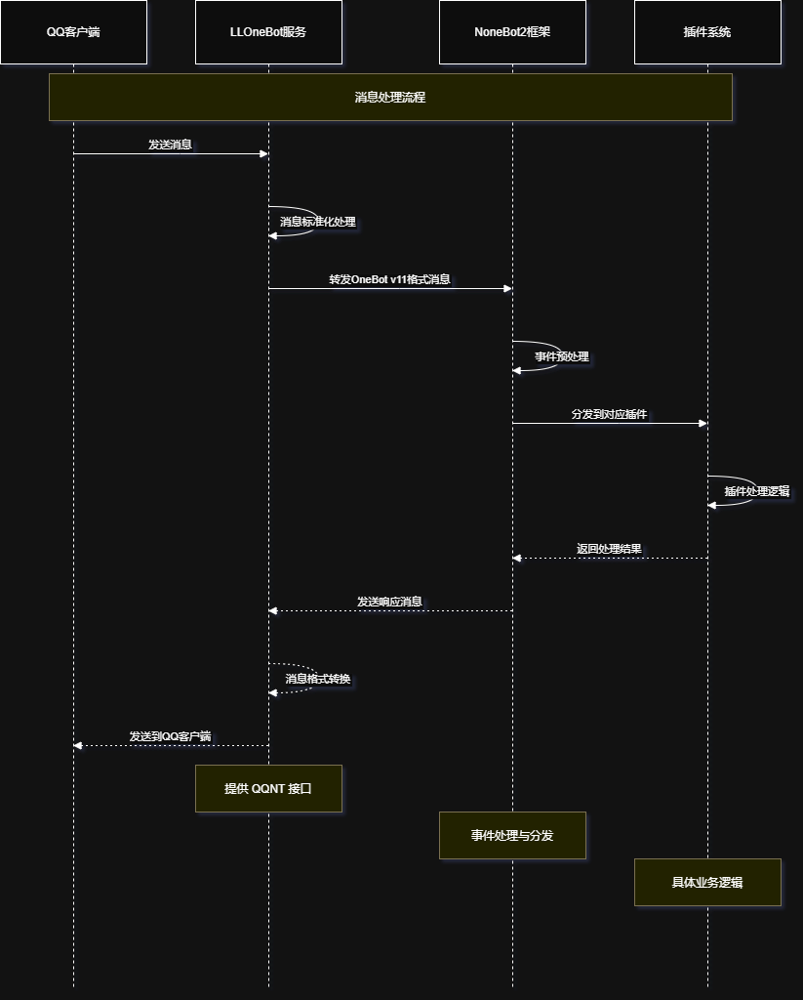
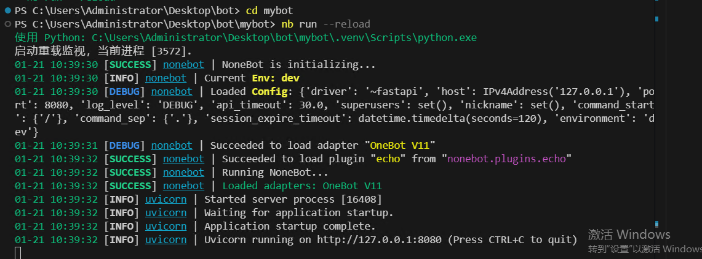
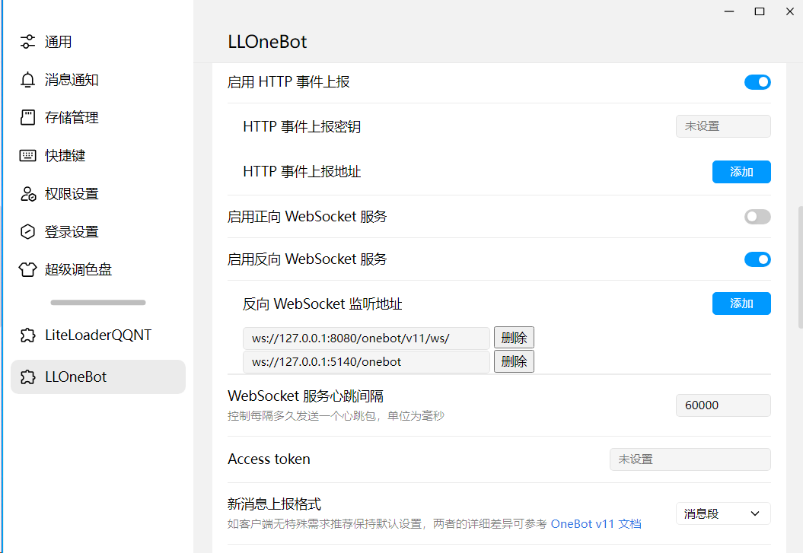
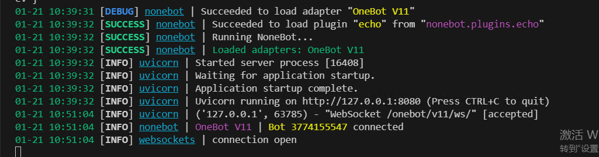

# QQ机器人搭建教程：基于 Nonebot2 框架

> 随着QQ机器人技术的发展，我们现在有了更好的选择。本教程将介绍如何使用最新的 QQNT 框架搭建你的机器人。


## 环境准备

### Python环境
- 推荐使用 Python 3.10 版本
- ⚠️ 注意：暂不建议使用 Python 3.12，可能存在兼容性问题

### 框架选择
目前主流的 QQ 机器人框架有：
- LLOneBot（推荐）：新一代 QQNT 框架
- NapcatBot：基于 QQNT 的另一个选择
- ~~go-cqhttp（已过时）~~：不再推荐使用

为了更好的理解和搭建Nonebot2，我们先来看一下Nonebot2的消息处理流程图：


## 项目创建与配置

### 1. 安装项目管理工具
首先，我们需要安装 pipx。它是一个专门用于安装和运行 Python 应用的工具，能够避免全局依赖冲突。

```bash
# 安装 pipx
python -m pip install --user pipx

# 将 pipx 添加到环境变量
python -m pipx ensurepath
```

> 💡 小贴士：使用 pipx 安装工具可以避免污染全局 Python 环境

### 2. 安装 Nonebot2 脚手架
nb-cli 是 Nonebot2 官方提供的命令行工具，它能帮助我们：
- 快速创建项目
- 管理项目配置
- 安装和管理插件
- 启动和调试机器人

```bash
pipx install nb-cli
```

> ⚠️ 安装完成后，可以使用 `nb --version` 检查是否安装成功

### 3. 创建 Nonebot2 项目
使用 nb-cli 创建新项目：
```bash
nb create
```

在创建过程中，你需要回答一系列配置问题。以下是每个选项的详细说明：

```bash
[?] 项目名称: mybot
    # 设置你的项目名称，建议使用小写字母

[?] 要使用哪些适配器? OneBot V11 (OneBot V11 协议)
    # OneBot V11 是最常用的协议，支持 LLOneBot

[?] 要使用哪些驱动器? FastAPI (FastAPI 驱动器)
    # FastAPI 提供高性能的异步支持

[?] 请输入插件存储位置: 2) 在 "src" 文件夹中
    # 推荐选择 src 目录，便于管理

[?] 立即安装依赖? y
    # 自动安装必要的依赖包

[?] 创建虚拟环境? y
    # 创建独立的项目环境

[?] 要使用哪些内置插件? echo
    # echo 插件用于测试机器人是否正常工作
```

创建完成后，你会看到以下提示：
```bash
在 mybot\.venv 中创建虚拟环境...
完成!

使用 poetry 或 pdm 等依赖管理工具添加以下包:
  nonebot-adapter-onebot nonebot2[fastapi]

运行以下命令来启动你的机器人:
  cd mybot
  nb run --reload
```

### 4. 项目目录结构
创建完成后，你的项目结构应该是这样的：
```
mybot/
├── .env                # 环境配置文件
├── .gitignore         # Git 忽略文件
├── bot.py             # 机器人入口文件
├── pyproject.toml     # 项目依赖配置
└── src/               # 源代码目录
    └── plugins/       # 插件目录
```

### 5. 启动项目
```bash
# 进入项目目录
cd mybot

# 启动机器人（开发模式）
nb run --reload
```

当你看到如下界面，说明 Nonebot2 已经成功启动：


> 🔍 启动参数说明：
> - `--reload`：开发模式，代码修改后自动重载
> - `--port 8080`：指定端口（默认 8080）
> - `--host 0.0.0.0`：允许外部访问

### 6. 常见问题
1. 如果遇到依赖安装失败：
```bash
# 手动安装核心依赖
pip install nonebot2[fastapi]
pip install nonebot-adapter-onebot
```

2. 端口被占用：
```bash
# 修改 .env 文件中的端口配置
DRIVER=fastapi
HOST=127.0.0.1
PORT=8081  # 改为其他未被占用的端口
```

3. 找不到 nb 命令：
```bash
# 检查 PATH 环境变量
echo $PATH

# 重新安装 nb-cli
pipx reinstall nb-cli
```

> 🌟 提示：创建项目后，建议先测试 echo 插件，确保基础功能正常，再进行后续配置。

### 7. 配置 LLOneBot
LLOneBot 是一个 LiteLoaderQQNT 插件，它实现了 OneBot V11 协议，让我们能够通过 Nonebot2 开发 QQ 机器人。
::github{repo="LLOneBot/LLOneBot"}

安装步骤：
1. 下载并安装 QQNT 客户端
2. 使用一键安装脚本安装 LLOneBot：
   - 访问 [LLOneBot 安装脚本](https://github.com/super1207/install_llob)
   - 按照说明进行安装
   - 运行配置向导

配置 LLOneBot：
1. 登录 QQ 后，打开 QQNT 左下角的设置
2. 找到 LLOneBot 设置选项
3. 配置反向 WebSocket：
   
   - 第一个地址用于连接 Nonebot2（默认端口 8080）
   - 第二个地址可用于其他服务（如 Koishi）

当你看到以下日志时，说明连接成功：
```
[INFO] nonebot | OneBot V11 | Bot XXXXXXXXXX connected
```


### 8. 测试机器人
让我们来测试内置的 echo 插件：
1. 在 QQ 中发送：`@机器人 echo 你好`
2. 机器人会回复：`你好`


> 🎉 恭喜！如果机器人正确回复了消息，说明你的 QQ 机器人已经搭建成功了！

接下来，你可以开始开发自己的插件，让机器人拥有更多有趣的功能。


