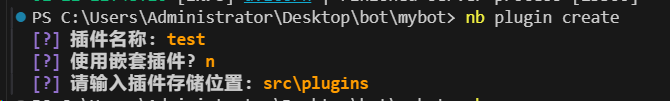
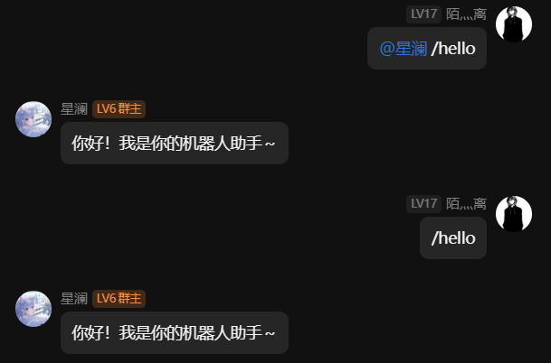

# Nonebot2 插件开发教程 - 零基础入门

## 一、创建你的第一个插件

让我们从最简单的开始 - 创建一个能说"你好"的插件。

首先使用 nb-cli 创建插件:

```bash
nb plugin create
```



这会在 `plugins` 目录下创建如下结构:
```
plugins/
└── hello/              # 插件目录
    ├── __init__.py    # 插件主文件 
    └── config.py      # 配置文件
```

让我们来看看这个最基础的插件代码:

```python
from nonebot import on_command                        # 导入命令处理器
from nonebot.adapters.onebot.v11 import Bot, Event   # 导入机器人和事件对象
from nonebot.plugin import PluginMetadata            # 导入插件元数据

# 定义插件元信息
__plugin_meta__ = PluginMetadata(
    name="示例插件",           # 插件名称
    description="这是一个示例插件", # 插件描述
    usage="@机器人 hello"      # 使用方法
)

# 注册一个命令处理器
hello = on_command(
    "hello",           # 命令名称
    priority=10        # 优先级(数字越小优先级越高)
)

# 编写命令处理函数
@hello.handle()  # 使用装饰器注册处理函数
async def hello_handler(bot: Bot, event: Event):
    await hello.finish("你好！我是你的机器人助手～")
```

运行效果:


### 代码解析

1. **导入必要模块**
   - `on_command`: 用于注册命令
   - `Bot`: 机器人对象,用于调用QQ API
   - `Event`: 事件对象,包含消息内容等信息
   - `PluginMetadata`: 用于定义插件信息

2. **定义插件元数据**
   ```python
   __plugin_meta__ = PluginMetadata(
       name="示例插件",          # 插件名称
       description="示例描述",    # 插件描述
       usage="使用说明"          # 使用方法
   )
   ```
   这些信息会在帮助系统中显示

3. **注册命令处理器**
   ```python
   hello = on_command("hello")
   ```
   - 当用户发送 `/hello` 时会触发这个命令
   - 默认命令前缀是 `/`
   - 可以通过配置更改前缀

4. **编写处理函数**
   ```python
   @hello.handle()
   async def hello_handler(bot: Bot, event: Event):
       await hello.finish("回复消息")
   ```
   - 使用 `@handle()` 装饰器注册处理函数
   - 函数必须是异步的(async)
   - `finish()` 会发送消息并结束处理

> 💡 小贴士:
> - 命令名称对大小写敏感
> - 可以设置多个命令别名
> - 处理函数可以获取更多信息(如发送者QQ号)
> - 可以发送更复杂的消息(如图片)

通过这个简单的例子,我们了解了插件的基本结构。接下来,让我们看看如何开发更实用的功能...

## 二、模块导入与配置系统

### 2.1 常用模块导入

```python
# 1. 核心功能模块
from nonebot import on_command, on_shell_command  # 命令注册
from nonebot.plugin import PluginMetadata, require  # 插件元数据和依赖
from nonebot.rule import ArgumentParser  # 命令参数解析
from nonebot.log import logger  # 日志记录

# 2. 适配器模块
from nonebot.adapters.onebot.v11 import (
    Bot,                # 机器人对象
    Event,             # 事件基类
    MessageEvent,      # 消息事件
    GroupMessageEvent, # 群消息事件
    PrivateMessageEvent,# 私聊消息事件
    Message,           # 消息类
    MessageSegment,    # 消息段
)

# 3. 权限控制模块
from nonebot.permission import (
    SUPERUSER,         # 超级用户
    GROUP_ADMIN,       # 群管理员
    GROUP_OWNER,       # 群主
)

# 组合权限
ADMIN = SUPERUSER | GROUP_ADMIN | GROUP_OWNER  # 超管或群管理或群主
```

> 💡 提示：
> - 按功能分类导入模块,便于管理
> - 使用 `from xxx import (...)` 可以一次导入多个内容
> - 权限可以用 `|` 组合

### 2.2 配置系统详解

Nonebot2 提供了两种配置方式,让我们详细了解一下:

#### 2.2.1 全局配置

全局配置适用于整个机器人的通用设置:

```python
from nonebot import get_driver

# 1. 获取全局配置（.env文件）
global_config = get_driver().config

# 2. 使用全局配置
HOST = global_config.host        # 机器人服务器地址
PORT = global_config.port        # 服务器端口
SUPERUSERS = global_config.superusers  # 超级用户列表
COMMAND_START = global_config.command_start  # 命令前缀
```

> 💡 全局配置说明:
> 1. 通过 `get_driver().config` 获取
> 2. 适合存放机器人级别的配置
> 3. 所有插件都可以访问
> 4. 通常在 `.env` 文件中设置

#### 2.2.2 插件配置

插件配置用于单个插件的专属设置:

1. **定义配置类** (config.py)
```python
from pydantic import BaseModel, Extra

class Config(BaseModel, extra=Extra.ignore):
    """AI绘图插件配置"""
    # API设置
    api_key: str         # API密钥(必填,无默认值)
    api_url: str = ""    # API地址(选填,有默认值)
    
    # 功能设置
    daily_limit: int = 10      # 每日使用次数
    save_image: bool = False   # 是否保存图片
    
    # 高级设置
    proxy: str = None    # 代理地址
    timeout: int = 60    # 超时时间(秒)
```

2. **使用插件配置** (__init__.py)
```python
from nonebot import get_plugin_config
from .config import Config  # 从同目录导入

# 获取插件配置
plugin_config = get_plugin_config(Config)

# 使用配置
if not plugin_config.api_key:
    logger.error("未设置API密钥!")
    
daily_limit = plugin_config.daily_limit
save_image = plugin_config.save_image
```

#### 2.2.3 配置优先级机制

当同一个配置项在多个地方定义时,会按照优先级从高到低加载:

```python
# 1. 最高优先级: 环境变量
# 在系统中设置
export API_KEY="env_key_123"

# 2. 次高优先级: .env文件
# .env
API_KEY=env_file_key_456
DAILY_LIMIT=20

# 3. 最低优先级: 配置类默认值
class Config(BaseModel):
    api_key: str = "default_key_789"
    daily_limit: int = 10
```

实际运行时:
```python
from nonebot import get_plugin_config
from .config import Config

plugin_config = get_plugin_config(Config)

# 如果环境变量存在,使用环境变量的值
print(plugin_config.api_key)  # 输出: env_key_123

# 如果环境变量不存在,但.env文件有配置,使用.env的值
print(plugin_config.daily_limit)  # 输出: 20

# 如果环境变量和.env都没有,使用默认值
print(plugin_config.timeout)  # 输出: 60(默认值)
```

> 💡 优先级说明:
> 1. 环境变量 > .env文件 > 默认值
> 2. 高优先级的值会覆盖低优先级的值
> 3. 如果高优先级没有设置,会继续查找低优先级
> 4. 如果都没有设置且没有默认值,会报错

这种机制的好处:
1. 可以在不修改代码的情况下覆盖配置
2. 敏感信息可以通过环境变量注入
3. .env文件便于管理常用配置
4. 默认值保证基础功能可用

## 三、事件处理系统

### 3.1 注册事件处理器

Nonebot2 提供了多种事件处理器:

```python
# 1. 命令处理器(最常用)
cmd = on_command(
    "命令名",                # 命令名称
    aliases={"别名1", "别名2"},  # 命令别名
    priority=10,            # 优先级(数字越小优先级越高)
    block=True,             # 是否阻止事件传递
    permission=ADMIN        # 权限控制
)

# 2. shell命令处理器(适合复杂参数)
draw = on_shell_command(
    "draw",                # 命令名
    parser=draw_parser,    # 参数解析器
    priority=10
)

# 3. 关键词处理器
kw = on_keyword({"你好", "hello"})  # 触发关键词

# 4. 正则处理器
rex = on_regex(r"\d+")             # 匹配数字
```

### 3.2 命令参数解析

在使用 `on_shell_command` 时,我们常常需要处理复杂的命令参数。这时就需要用到 `ArgumentParser`:

```python
from nonebot.rule import ArgumentParser

# 创建命令解析器
draw_parser = ArgumentParser(description="AI绘图命令")

# 1. 添加位置参数(必填)
draw_parser.add_argument(
    "prompt",           # 参数名
    nargs="*",         # 参数个数(*表示任意多个)
    help="绘图提示词",   # 参数说明
    type=str           # 参数类型
)

# 2. 添加可选参数
draw_parser.add_argument(
    "-n", "--negative",  # 参数别名
    nargs="*",          # 参数个数
    help="负面提示词",    # 参数说明
    type=str,           # 参数类型
    dest="negative"      # 存储变量名
)

# 3. 添加开关参数
draw_parser.add_argument(
    "--r18",           # 参数名
    action="store_true", # 存在即为True
    help="是否开启R18"   # 参数说明
)
```

参数类型说明:
1. **位置参数**
   - 不带 `-` 的参数
   - 按位置顺序填写
   - 不指定 `default` 时为必填
   - 例: `/draw 猫娘`

2. **可选参数**
   - 以 `-` 或 `--` 开头
   - 可以不按顺序
   - 可以设置默认值
   - 例: `/draw 猫娘 -n 低画质`

3. **开关参数**
   - 不需要值的参数
   - 存在即为True
   - 例: `/draw 猫娘 --r18`

使用示例:
```python
@draw.handle()
async def handle_draw(bot: Bot, event: MessageEvent, args: Namespace):
    # 获取参数值
    prompt = " ".join(args.prompt) if args.prompt else ""  # 提示词
    negative = " ".join(args.negative) if args.negative else ""  # 负面词
    is_r18 = args.r18  # 是否R18
    
    await draw.send(
        f"收到绘图请求:\n"
        f"提示词: {prompt}\n"
        f"负面词: {negative}\n"
        f"R18: {'是' if is_r18 else '否'}"
    )
```

命令示例:
```bash
/draw 猫娘 可爱                  # 基础用法
/draw 猫娘 -n 低画质 --r18       # 完整参数
/draw                          # 无参数(会报错)
```

> 💡 提示:
> 1. `nargs="*"` 表示参数可以有多个值
> 2. `type=str` 指定参数类型(str/int/float等)
> 3. `dest` 指定参数在 `Namespace` 中的变量名
> 4. 必填参数没有默认值时,不填会报错
> 5. 使用 `help` 说明参数用途

### 3.3 消息发送

Nonebot2 提供了多种消息发送方式:

```python
# 1. 基础消息发送
await cmd.send("普通文本")                     # 发送文本
await cmd.send("你好!", at_sender=True)       # @发送者
await cmd.finish("结束处理")                   # 发送并结束处理

# 2. 复杂消息发送
from nonebot.adapters.onebot.v11 import MessageSegment

# 发送图片
await cmd.send(MessageSegment.image("图片路径"))

# 发送表情
await cmd.send(MessageSegment.face(1))

# 发送@
await cmd.send(MessageSegment.at(user_id))

# 组合消息
msg = (
    MessageSegment.text("结果：\n") +  
    MessageSegment.image("result.png") + 
    MessageSegment.at(user_id)
)
await cmd.send(msg)

# 3. 合并转发消息(群聊)
msgs = []
for text in message_list:
    msgs.append({
        "type": "node",
        "data": {
            "name": "机器人",
            "uin": bot.self_id,
            "content": text
        }
    })
await bot.call_api(
    "send_group_forward_msg",
    group_id=event.group_id,
    messages=msgs
)
```

### 3.4 权限控制

```python
# 1. 基础权限
SUPERUSER         # 超级用户
GROUP_ADMIN       # 群管理员
GROUP_OWNER       # 群主

# 2. 组合权限
ADMIN = SUPERUSER | GROUP_ADMIN | GROUP_OWNER  # 超管或群管理

# 3. 使用权限
cmd = on_command("admin", permission=ADMIN)

# 4. 手动检查权限
if event.get_user_id() in bot.config.superusers:
    await cmd.finish("您是超级用户!")
    
if isinstance(event, GroupMessageEvent):
    if event.sender.role in ["admin", "owner"]:
        await cmd.finish("您是群管理!")
```

### 3.5 异常处理

```python
@cmd.handle()
async def handler(bot: Bot, event: MessageEvent):
    try:
        # 处理逻辑...
        result = await some_api()
        
    except NetworkError:
        # 网络错误
        logger.error("网络错误")
        await cmd.finish("网络错误,请稍后再试!")
        
    except ApiError as e:
        # API错误
        logger.error(f"API错误: {e}")
        await cmd.finish("处理失败,请检查参数!")
        
    except Exception as e:
        # 其他错误
        logger.exception(f"未知错误: {e}")
        await cmd.finish("发生未知错误!")
```

> 💡 提示:
> 1. 合理使用日志记录错误
> 2. 给用户友好的错误提示
> 3. 避免直接暴露错误细节
> 4. 重要操作要有异常处理

通过以上内容,我们掌握了:
- 如何注册各类事件处理器
- 如何获取事件信息
- 如何发送各种消息
- 如何进行权限控制
- 如何处理异常

接下来让我们通过实战案例来运用这些知识...

## 四、实战示例 - AI绘图插件

让我们通过开发一个 AI 绘图插件,来实践前面学到的知识。这个插件可以:
- 通过命令生成 AI 图片
- 支持自定义提示词
- 有冷却和次数限制
- 支持黑名单管理

### 4.1 插件结构

首先创建插件目录:
```
plugins/
└── nonebot_plugin_nai3/
    ├── __init__.py    # 主要逻辑
    ├── config.py      # 配置文件
    └── utils.py       # 工具函数
```

### 4.2 定义配置

在 `config.py` 中设置插件配置:

```python
from pydantic import BaseModel
from nonebot import get_plugin_config

class Config(BaseModel):
    """插件配置类"""
    # API设置
    nai3_token: str = ""        # API密钥
    nai3_proxy: str = None      # 代理地址
    
    # 使用限制
    nai3_limit: int = 10        # 每人每天次数
    nai3_cd_group: int = 30     # 群冷却时间(秒)
    nai3_cd_user: int = 300     # 用户冷却时间(秒)
    
    # 其他设置
    nai3_r18: bool = False      # 是否允许R18
    nai3_save: bool = False     # 是否保存图片

# 获取配置
plugin_config = get_plugin_config(Config)
```

> 💡 知识点:
> 1. 使用 `BaseModel` 定义配置类
> 2. 给配置项添加类型注解
> 3. 设置合理的默认值
> 4. 用 `get_plugin_config` 获取配置

### 4.3 注册命令

在 `__init__.py` 中注册命令:

```python
from nonebot import on_shell_command
from nonebot.rule import ArgumentParser
from nonebot.permission import SUPERUSER, GROUP_ADMIN, GROUP_OWNER

# 1. 创建命令解析器
parser = ArgumentParser(description='AI绘图')
parser.add_argument("prompt", help="提示词")     # 必填参数
parser.add_argument("-n", "--negative", help="负面词")  # 可选参数

# 2. 注册命令
draw = on_shell_command(
    "draw",              # 命令名
    parser=parser,       # 参数解析器
    priority=10          # 优先级
)

# 3. 注册管理命令
ADMIN = SUPERUSER | GROUP_ADMIN | GROUP_OWNER  # 组合权限
```

> 💡 知识点:
> 1. `on_shell_command` 支持复杂参数
> 2. `ArgumentParser` 用于解析参数
> 3. 可以组合多个权限
> 4. 优先级越小越优先处理

### 4.4 命令处理机制

在 Nonebot2 中,命令处理是最核心的功能之一。让我们详细了解如何处理不同类型的命令:

#### 4.4.1 基础命令处理

```python
# 1. 简单命令处理
help_cmd = on_command("帮助")

@help_cmd.handle()
async def _(event: MessageEvent):
    await help_cmd.finish("这是帮助信息")
```

> 💡 知识点:
> 1. `on_command` 用于注册简单命令
> 2. 通过装饰器处理命令
> 3. 使用 `finish` 发送消息并结束处理

#### 4.4.2 可选参数处理

在 ArgumentParser 中,可选参数(Optional Arguments)的处理方式如下:

```python
# 1. 注册可选参数
parser = ArgumentParser(description='AI绘图')
parser.add_argument(
    "-n", "--negative",     # 短格式和长格式
    nargs="*",             # 参数个数(*表示任意多个)
    help="负面提示词",      # 参数说明
    type=str,             # 参数类型
    default=None,         # 默认值
    dest="negative"       # 存储的变量名
)

parser.add_argument(
    "-r", "--resolution",  # 分辨率参数
    choices=["pc", "mb", "sq"],  # 限制可选值
    default="mb",         # 默认值
    help="画布比例"        # 参数说明
)

# 2. 处理参数
@draw.handle()
async def handle_draw(args: Namespace):
    # 获取参数值
    negative = args.negative  # 通过dest指定的名称访问
    resolution = args.resolution
    
    # 处理分辨率
    if resolution == "mb":
        width, height = 832, 1216  # 手机比例
    elif resolution == "pc":
        width, height = 1216, 832  # 电脑比例
    else:
        width = height = 1024      # 正方形
```

> 💡 可选参数说明:
> 1. 参数格式:
>    - 短格式: `-n`, `-r` (单个横杠)
>    - 长格式: `--negative`, `--resolution` (双横杠)
> 2. 参数配置:
>    - `nargs="*"`: 可以接收多个值
>    - `choices`: 限制可选值范围
>    - `default`: 设置默认值
>    - `dest`: 指定存储变量名
> 3. 使用示例:
>    ```bash
>    /draw 猫娘 -n 低画质 模糊     # negative=["低画质", "模糊"]
>    /draw 猫娘 --negative 低画质  # 同上,使用长格式
>    /draw 猫娘 -r pc            # resolution="pc"
>    /draw 猫娘                  # 使用默认值
>    ```

### 4.4.3 参数处理最佳实践

1. **设置默认值**
```python
parser.add_argument("-n", default="bad quality")  # 不填时使用默认值
```

2. **限制参数范围**
```python
parser.add_argument("-s", type=float, choices=[1.0, 2.0, 3.0])  # 限制可选值
```

3. **参数验证**
```python
@draw.handle()
async def _(args: Namespace):
    if args.scale < 1.0 or args.scale > 10.0:
        await draw.finish("参数范围错误!")
```

> 🌟 开发建议:
> 1. 合理设置默认值,避免None判断
> 2. 使用choices限制参数范围
> 3. 添加参数验证保证安全
> 4. 给出友好的错误提示
> 5. 文档说明参数用法

### 4.5 使用示例

有了上面的处理机制,我们的插件就可以支持以下命令格式:

1. **基础命令**
```bash
/draw 猫娘 可爱          # 空格分隔的多个提示词
/draw 猫娘 -n 低画质     # 指定负面词
/draw 猫娘 -r pc        # 指定图片比例
```

2. **管理命令**
```bash
/draw_black 添加用户123   # 不带空格也可以
/draw_black 添加 用户 123 # 带空格也可以
```

> 🌟 开发建议:
> 1. 简单命令用 `on_command`
> 2. 复杂参数用 `ArgumentParser`
> 3. 灵活命令用字符串处理
> 4. 根据需求选择合适方式
> 5. 做好参数验证和异常处理

## 五、常见问题

1. 命令不触发
- 检查命令前缀(默认 `/`)
- 检查权限设置
- 检查优先级是否被其他插件覆盖

2. 发送消息失败
- 检查是否触发风控
- 确认消息格式正确
- 路径使用绝对路径

3. 配置不生效
- 检查配置文件格式
- 确认配置加载正确
- 重启机器人

> 🌟 进阶提示:
> - 合理使用日志记录问题
> - 善用调试工具
> - 查看官方文档获取更多信息

## 总结

编写 Nonebot2 插件的主要步骤和关键知识点:

### 1. 创建插件目录
```
plugins/
└── nonebot_plugin_nai3/
    ├── __init__.py    # 主要逻辑
    ├── config.py      # 配置文件
    └── utils.py       # 工具函数
```
> 💡 知识点:
> - 插件命名规范: `nonebot_plugin_xxx`
> - 目录结构划分
> - 模块化组织代码

### 2. 定义配置
```python
class Config(BaseModel):
    api_key: str
    daily_limit: int = 10
```
> 💡 知识点:
> - 使用 BaseModel 定义配置类
> - 全局配置 vs 插件配置
> - 配置优先级机制
> - 环境变量加载
> - 配置命名规范

### 3. 注册命令
```python
draw = on_shell_command("draw", parser=parser)
admin = on_command("admin", permission=ADMIN)
```
> 💡 知识点:
> - 命令注册方式
> - 参数解析器使用
> - 命令别名设置
> - 优先级控制
> - 权限设置

### 4. 处理事件
```python
@draw.handle()
async def handle_draw(event: MessageEvent):
    user_id = event.user_id
    message = event.get_message()
```
> 💡 知识点:
> - 事件处理装饰器
> - 事件类型判断
> - 消息内容获取
> - 参数解析处理
> - 异步处理机制

### 5. 发送消息
```python
await bot.send(event, "文本消息")
await bot.send(event, MessageSegment.image(path))
```
> 💡 知识点:
> - 消息发送方式
> - MessageSegment 使用
> - 合并转发消息
> - 消息构建方法
> - 定时发送消息

### 6. 权限控制
```python
ADMIN = SUPERUSER | GROUP_ADMIN | GROUP_OWNER
```
> 💡 知识点:
> - 权限等级设置
> - 权限组合使用
> - 权限检查方法
> - 自定义权限
> - 权限继承关系

### 7. 异常处理
```python
try:
    await process()
except NetworkError:
    await bot.send("网络错误")
```
> 💡 知识点:
> - 异常类型定义
> - 错误日志记录
> - 异常捕获处理
> - 用户友好提示
> - 错误恢复机制

> 🌟 开发建议:
> 1. 先规划好功能再动手
> 2. 做好配置的规范定义
> 3. 合理组织代码结构
> 4. 加强异常处理
> 5. 编写清晰的文档
> 6. 注意代码复用
> 7. 保持良好的注释

参考资料:
- [Nonebot2 官方文档](https://v2.nonebot.dev/)
- [事件处理](https://v2.nonebot.dev/docs/tutorial/event-handler)
- [权限控制](https://v2.nonebot.dev/docs/tutorial/permission)
- [消息处理](https://v2.nonebot.dev/docs/tutorial/message)

