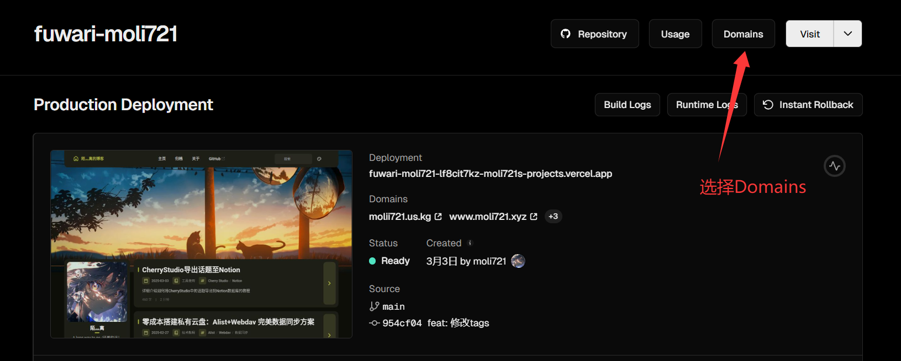

# Spaceship域名购买与Cloudflare托管完全指南

在建立个人网站或项目时，选择合适的域名注册商和DNS托管服务至关重要。本文将详细介绍如何在Spaceship购买域名，并将其托管到Cloudflare的完整流程。

## 为什么选择Spaceship？

在众多域名注册商中，Spaceship具有以下明显优势：

1. 价格便宜，相比其他知名域名注册商更具性价比
2. 不需要经过域名备案，节省了大量时间和繁琐流程
3. 可以通过国内的支付宝支付，交易更加便捷安全

## 为什么选择Cloudflare托管？

将域名托管到Cloudflare有诸多好处：

1. 免费的DNS管理服务，操作界面简洁直观
2. 提供免费的CDN加速和DDoS防护，提升网站访问速度和安全性
3. 灵活的DNS记录管理，支持各种记录类型
4. 提供SSL证书，让您的网站支持HTTPS
5. 强大的缓存功能和页面规则，优化网站性能

## Spaceship域名购买流程

### 第一步：搜索并选择域名

首先我们前往Spaceship官网登录后，点击Domains选项，在搜索框中输入你想要的域名。

### 第二步：完成支付

在选择好域名后，进入支付环节。我选择的是使用支付宝支付，只需按照提示填写好支付信息并绑定支付宝即可。绑定成功后，就可以直接完成支付流程。

### 第三步：确认购买成功

购买完成后，我们可以前往Domain Manager查看已购买的域名状态和信息。

## Cloudflare域名托管流程

### 第一步：添加域名到Cloudflare

下一步是将域名托管到Cloudflare。首先，前往Cloudflare主页，点击"添加站点"或"添加域"按钮。

### 第二步：输入域名信息

在弹出的页面中输入你刚刚在Spaceship购买的域名，然后按照Cloudflare的指引完成初始设置。

### 第三步：更换名称服务器

Cloudflare会提供其名称服务器信息，你需要将Spaceship中的默认名称服务器替换为Cloudflare提供的名称服务器。

### 第四步：在Spaceship中更新DNS设置

回到Spaceship的控制面板，找到你的域名管理页面，更新名称服务器设置。

### 第五步：等待DNS生效

更新名称服务器后，需要等待一段时间让DNS变更生效。通常这个过程需要几分钟到几小时不等。你可以在Cloudflare控制面板查看状态，直到显示域名已成功激活。

## 将域名绑定到Vercel

完成Cloudflare托管设置后，如果你使用Vercel部署你的网站或应用，还需要将域名绑定到Vercel项目。这样，访问者就可以通过你的自定义域名访问Vercel上托管的内容。

### 第一步：进入Vercel项目设置

首先，登录Vercel账户并进入你的项目仪表板。在左侧导航栏中找到并点击"Domains"选项。

### 第二步：添加自定义域名

在Domains页面中，点击"Add"按钮开始添加你的自定义域名。

### 第三步：配置Vercel授权

按照Vercel的指引，输入你的域名并完成验证步骤。Vercel会提供必要的DNS记录，你需要确保这些记录已在Cloudflare中正确配置。

### 第四步：验证域名绑定

添加完成后，Vercel会自动检查DNS配置是否正确。这个过程可能需要几分钟到几小时不等。一旦验证成功，你的域名就会显示为"Valid"状态，此时访问者就可以通过你的自定义域名访问你的Vercel项目了。

通过以上步骤，你已经成功完成了从Spaceship购买域名，到Cloudflare托管，再到Vercel绑定的全流程配置。现在，你的网站已经拥有了专业的自定义域名，并且同时享受着Cloudflare的安全保护和Vercel的高性能托管服务。

