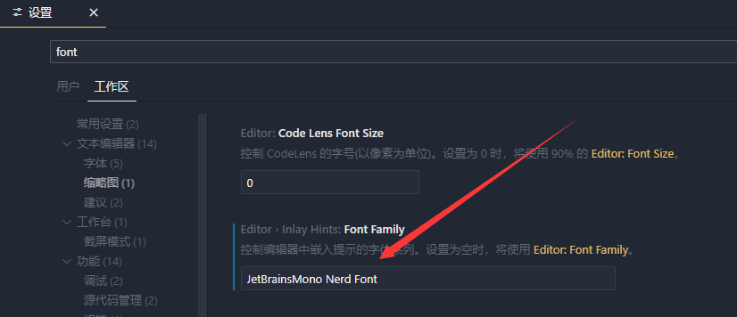

# ohmyposh+clink终端美化教程
配置过程可参考[开源免费软件分享0031——oh-my-posh+clink](https://www.bilibili.com/video/BV1dntWe9Eub/?spm_id_from=333.337.search-card.all.click&vd_source=e03b7d988550b29e55118b7d8e6cab3c)
<iframe width="100%" height="468" src="//player.bilibili.com/player.html?bvid=BV1dntWe9Eub&p=1" scrolling="no" border="0" frameborder="no" framespacing="0" allowfullscreen="true"> </iframe>

详细对于终端的配置可以查看[官方文档](https://ohmyposh.dev/docs/installation/prompt)

> 针对在cmd中'oh-my-posh' 不是内部或外部命令,也不是可运行的程序 或批处理文件。

可以使用绝对路径的配置
```bash
-- 初始化 oh-my-posh 并指定主题
local oh_my_posh = io.popen([[H:/workspaces/terminalbeauty/oh-my-posh/bin/oh-my-posh.exe init cmd --config "H:/workspaces/terminalbeauty/oh-my-posh/themes/atomic.omp.json"]]):read("*a")
load(oh_my_posh)()
```
后面的`--config`是主题配置，详细路径在`H:\workspaces\terminalbeauty\oh-my-posh\themes`，在官方文档里面也同时有效果预览：https://ohmyposh.dev/docs/themes

使用的字体：`JetBrainsMonoNerdFont-Italic`
在我计算机位置：`"H:\workspaces\terminalbeauty\JetBrainsMono\JetBrainsMonoNerdFont-Italic.ttf"`

同时可以修改cursor/vscode中的终端配置
1. 首先ctrl + shift + p打开命令面板，搜索工作区


2. 有两种修改方式，一种是修改terminal下面的setting.jsons


3. 也可以修改font

