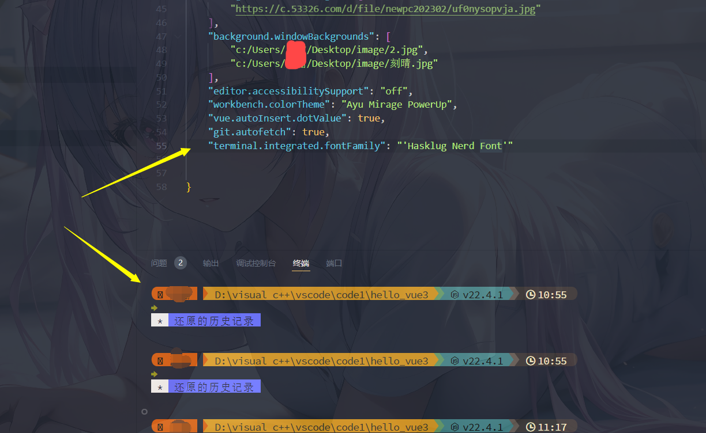
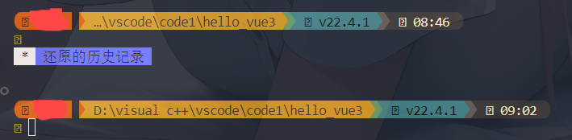
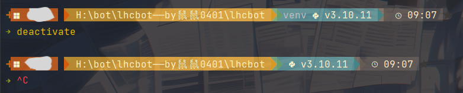

# 初识starship及clink

Starship和Clink是两个工具，常用于提升Windows命令提示符（cmd.exe）的用户体验和功能。

### Starship

Starship是一个跨平台的命令行提示符，旨在提供快速、可定制的提示信息。它支持多种shell，包括Bash、Zsh、Fish、PowerShell等。Starship的特点包括：

- **快速和轻量**: Starship设计为快速启动，并且不会显著影响命令行的响应时间。
- **美观的提示**: 它可以显示Git状态、Python虚拟环境、Node.js版本等信息，帮助开发者更好地了解当前环境。
- **高度可定制**: 用户可以通过配置文件（通常是TOML格式）自定义提示符的外观和行为。

### Clink

Clink是一个增强Windows命令提示符的工具，它通过添加GNU Readline库的功能，提供更丰富的命令行编辑、自动补全和历史记录功能。Clink的特点包括：

- **命令行增强**: Clink使得cmd.exe具有更强大的命令行编辑功能，例如行编辑、历史搜索和命令补全。
- **脚本支持**: Clink支持Lua脚本，可以让用户自定义命令提示符和其他功能。
- **与Starship结合使用**: Clink可以与Starship集成，使得用户能够在cmd.exe中使用Starship的美观提示符。

### 如何结合使用Starship和Clink

1. **安装Clink**: 首先，需要通过包管理器（如Scoop或Winget）安装Clink。
  
2. **配置Starship**: 创建一个名为`starship.lua`的文件，并将Starship的初始化代码添加到该文件中。这个文件需要放在Clink的脚本目录中。

3. **启动Clink**: 启动cmd.exe时，Clink会加载这个Lua脚本，从而使Starship的提示符在cmd.exe中生效。

通过结合使用Starship和Clink，用户可以在Windows命令提示符中获得一个更加美观和功能丰富的命令行体验。

# 在windows下安装软件及其环境

##  步骤 1. 安装 Starship

`scoop install starship`直接利用scoop包管理工具安装starship

## 步骤 2. 设置您的 shell 以使用 Starship

配置你的终端来初始化 starship。 请从下面列表选择你的终端：

1. Cmd

   您需要使用 [Clink](https://chrisant996.github.io/clink/clink.html) (v1.2.30+) 与 Cmd. 在路径 `%LocalAppData%\clink\starship.lua` 下创建文件，输入以下内容
   ```shell
   load(io.popen('starship init cmd'):read("*a"))()
   ```

   安装Clink，我下载到了`H:\workspaces\clink`,运行 `clink.bat` 文件以安装Clink。

2. PowerShell

   将以下内容添加到您 PowerShell 配置文件的末尾（通过运行 `$PROFILE` 来获取配置文件的路径）

   ```shell
   Invoke-Expression (&starship init powershell)
   ```

#### 配置

在`~/.config`路径下新建`starship.toml`配置文件即可。

### 问题

#### **找不到%LocalAppData%\clink\starship.lua**

创建 Starship 配置文件

1. **打开文件资源管理器**:在Windows文件资源管理器的地址栏中输入 `%LocalAppData%` 并按 `Enter`。这将打开 `C:\Users\<你的用户名>\AppData\Local` 目录。

2. **查找或创建 `clink` 文件夹**:在 `Local` 目录中，查找 `clink` 文件夹。如果它不存在，你可以手动创建一个：右键单击空白区域，选择“新建” -> “文件夹”，命名为 `clink`。

3. **创建 `starship.lua` 文件**:在 `clink` 文件夹中，右键单击并选择“新建” -> “文本文档”，然后将其重命名为 `starship.lua`。确保文件扩展名为 `.lua`，而不是 `.txt`。

4. 

   **编辑 `starship.lua` 文件**:

   

   - 使用文本编辑器（如记事本或 Visual Studio Code）打开 `starship.lua` 文件。

   - 输入以下内容：

     

     ```
     load(io.popen('starship init cmd'):read("*a"))()
     ```
     
      
     
- 保存并关闭文件。


#### PS C:\Users\xxx> $PROFILE C:\Users\xxx\Documents\WindowsPowerShell\Microsoft.PowerShell_profile.ps1 但是实际我电脑上找不到这个路径是怎么回事

如果你在运行 `$PROFILE` 命令后发现路径 `C:\Users\xxx\Documents\WindowsPowerShell\Microsoft.PowerShell_profile.ps1` 不存在，这可能是因为该文件尚未创建。PowerShell的配置文件并不会自动存在，你需要手动创建它。以下是详细的步骤：

### 创建 PowerShell 配置文件

1. **打开 PowerShell**:
   - 在开始菜单中搜索 "PowerShell"，然后打开 Windows PowerShell。

2. **查看 `$PROFILE` 路径**:
   - 输入以下命令以确认 `$PROFILE` 的路径：
     ```powershell
     $PROFILE
     ```

3. **创建文件夹**:
   - 如果路径中提到的 `WindowsPowerShell` 文件夹不存在，你需要手动创建它。使用以下命令创建文件夹：
     ```powershell
     New-Item -ItemType Directory -Path "$HOME\Documents\WindowsPowerShell" -Force
     ```

4. **创建配置文件**:
   - 使用以下命令创建配置文件：
     ```powershell
     New-Item -ItemType File -Path $PROFILE -Force
     ```

5. **编辑配置文件**:
   - 使用文本编辑器（如 Notepad）打开配置文件：
     ```powershell
     notepad $PROFILE
     ```
   - 在打开的 Notepad 中，你可以添加你希望在每次启动 PowerShell 时执行的命令，例如：
     ```powershell
     # 示例: 初始化 Starship 提示符
     Invoke-Expression (&starship init powershell)
     ```

6. **保存并关闭 Notepad**:
   - 保存更改并关闭 Notepad。

### 验证配置

1. **重新启动 PowerShell**:
   - 关闭并重新打开 PowerShell。

2. **检查 Starship 是否正常工作**:
   - 如果你在配置文件中添加了 Starship 的初始化命令，你应该能看到 Starship 提示符。

### 注意事项

- **文件和文件夹的创建**: 如果你在创建文件或文件夹时遇到任何权限问题，确保你以管理员身份运行 PowerShell。
- **PowerShell 版本**: 确保你使用的是 Windows PowerShell，而不是 PowerShell Core（7.x）。两者的配置文件路径可能不同。

通过这些步骤，你应该能够成功创建和配置 PowerShell 的配置文件，并在每次启动 PowerShell 时自动运行你指定的命令。

**以后可以在everything中输入`starship.toml`找到该文件**

### 在vscode不显示图标的问题

[starship doesn't show icons in vscode terminal #2818](https://github.com/starship/starship/issues/2818#)

最后通过下载Hask font字体基本得到解决，参考[Windows 11和vscode终端美化](https://blog.csdn.net/Maisucsdn/article/details/125925011?spm=1001.2101.3001.6650.2&utm_medium=distribute.pc_relevant.none-task-blog-2~default~baidujs_baidulandingword~Ctr-2-125925011-blog-114262312.235%5Ev43%5Epc_blog_bottom_relevance_base5&depth_1-utm_source=distribute.pc_relevant.none-task-blog-2~default~baidujs_baidulandingword~Ctr-2-125925011-blog-114262312.235%5Ev43%5Epc_blog_bottom_relevance_base5&utm_relevant_index=5)




可能是nerdfont版本不太对，改下icon即可，

这里我修改的是windows中的e70f这个图标

### 在Cursor显示问题

下载Cursor后，由于没有配置文件，字体还是使用的是默认字体，此时我们可以输入`ctrl + shift + p`打开命令界面，继续输入`settings`，选择打开工作区设置（JSON）在此JSON文件中，配置字体，如：`"terminal.integrated.fontFamily": "'Hasklug Nerd Font'",`

保存即可正常显示图标。

### 模板

这里我使用的是官网的**Gruvbox Rainbow Preset**配置

同时我对一下几个地方进行修改

1. 修改`truncation_length = 100`将截断长度改为100，否则如果你文件夹名称长度太长，前面会看不到

   


2. 修改python版本显示格式

   `format = '[$virtualenv]($style)[[ $symbol( $version) ](fg:color_fg0 bg:color_blue)]($style)'`

   使其有显示虚拟环境的功能

   


相关网址：

[在所有终端中使用相同界面，Starship 帮助你自定义命令行](https://sspai.com/post/72888)

[windows下powershell与linux下bash美化教程(使用starship)](https://blog.csdn.net/weixin_45696455/article/details/137061836?ops_request_misc=%257B%2522request%255Fid%2522%253A%2522172451756516800227479092%2522%252C%2522scm%2522%253A%252220140713.130102334..%2522%257D&request_id=172451756516800227479092&biz_id=0&utm_medium=distribute.pc_search_result.none-task-blog-2~all~sobaiduend~default-2-137061836-null-null.142^v100^pc_search_result_base5&utm_term=starship%E4%B8%BB%E9%A2%98%E9%85%8D%E7%BD%AE&spm=1018.2226.3001.4187)
