## 前言

Cloudflare作为一个强大的云平台，不仅可以帮助我们部署网站，还能实现很多有趣的功能。今天，我将介绍如何在Cloudflare上部署两个实用的项目：
1. Cookie-share：一个支持跨设备账号切换的工具
2. LibreTV：一个私人影视站

让我们一起来看看如何快速部署这两个项目！

## 第一部分：Cookie共享服务部署

### 准备工作

在开始部署之前，我们需要：
1. 一个 Cloudflare 账号
2. 浏览器安装油猴插件（Tampermonkey）
3. 项目源码：[cookie-share](https://github.com/fangyuan99/cookie-share/blob/main/README_CN.md)

### 部署步骤

#### 1. 创建 Cloudflare Worker

首先，我们需要在 Cloudflare 上创建一个 Worker 来运行我们的服务：

1. 登录 Cloudflare，进入 Workers 和 Pages 界面
2. 点击创建应用程序
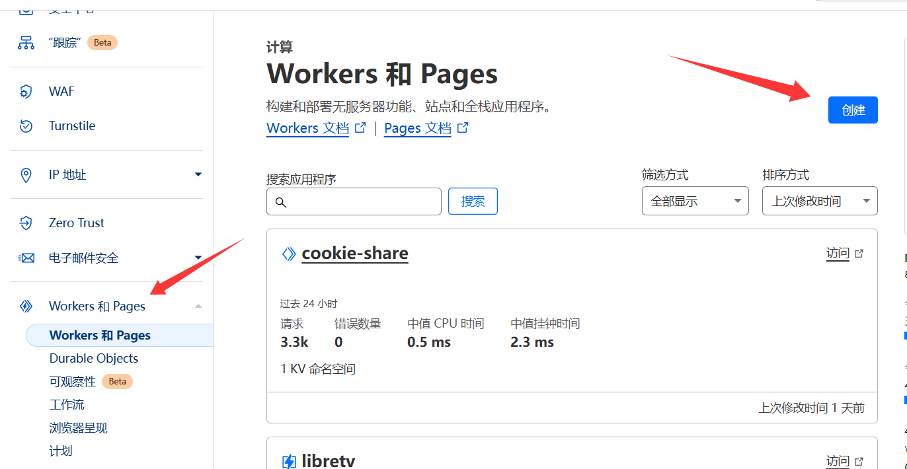

3. 选择 "Hello World" 模板，为你的 Worker 取一个名字（这里我们使用 cookie-share）
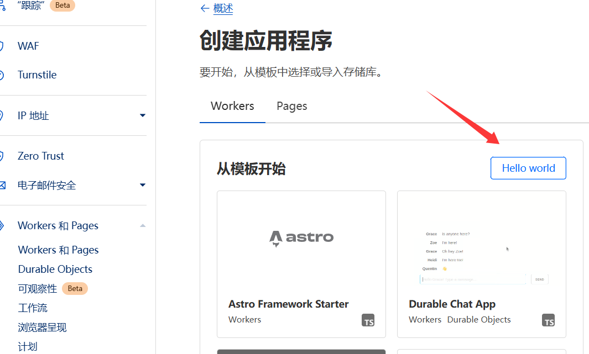

#### 2. 配置环境变量和 KV 存储

为了确保服务正常运行，我们需要设置以下配置：

1. 创建 KV 命名空间
   - 在 Cloudflare Workers 界面找到 KV 选项
   - 创建一个新的命名空间（例如：cookie-share-kv）
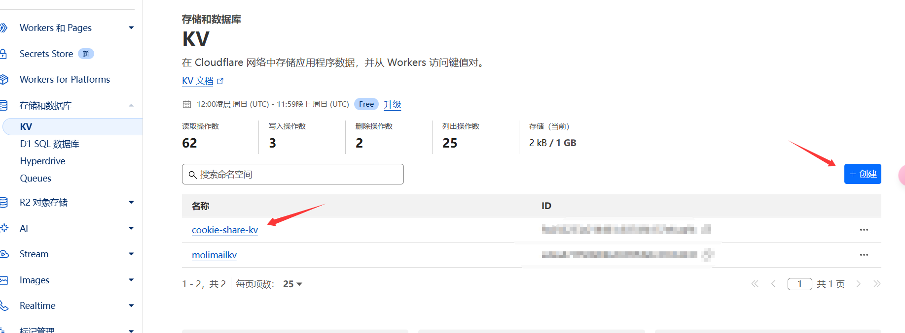

2. 设置环境变量
   - ADMIN_PASSWORD：管理员密码，用于访问管理接口
   - PATH_SECRET：安全密钥，用于防止暴力破解
   - COOKIE_STORE：绑定 KV 命名空间
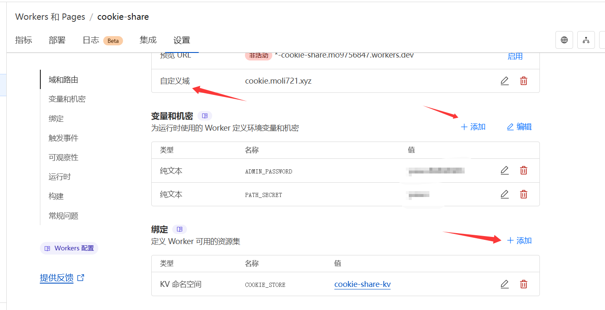

#### 3. 部署 Worker 代码

1. 复制 [worker.js](https://github.com/fangyuan99/cookie-share/blob/main/_worker.js) 的内容
2. 在 Worker 编辑界面中粘贴代码
3. 点击"部署"按钮

> 注意：请确保在部署代码之前已经正确配置了环境变量和 KV 存储，否则会报错！

#### 4. 配置油猴脚本

为了使 cookie-share 正常工作，我们需要正确配置油猴脚本的权限：

1. 将配置模式改为高级：
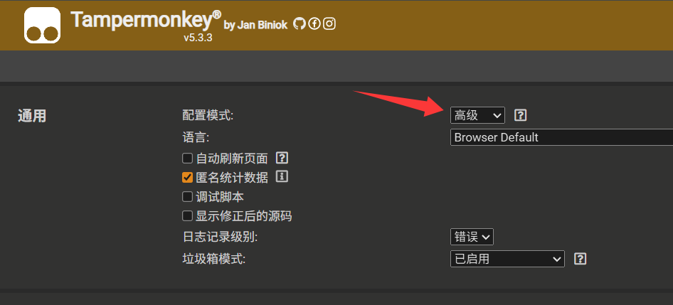

2. 添加 cookie 权限并保存：
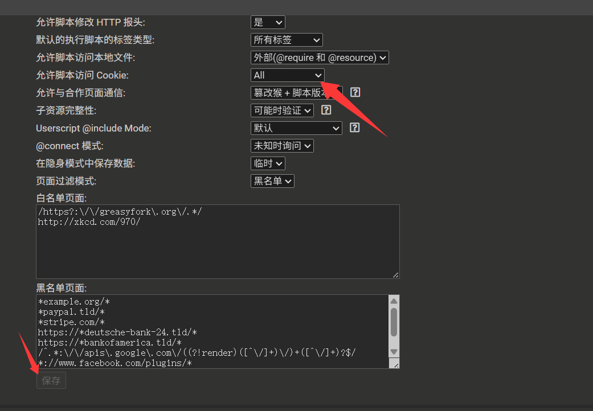

### 使用示例：ChatGPT 账号切换

让我们以 ChatGPT 为例，演示如何使用 cookie-share：

1. 配置服务地址和密钥：
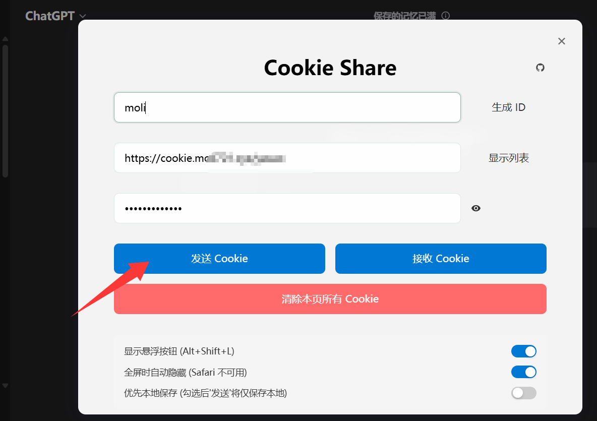

   - Worker URL 格式：`https://你的域名/PATH_SECRET`
   - 例如：如果你的 PATH_SECRET 是 "abcdef"，则填写 `https://cookie.moli721.xyz/abcdef`

2. 切换账号：
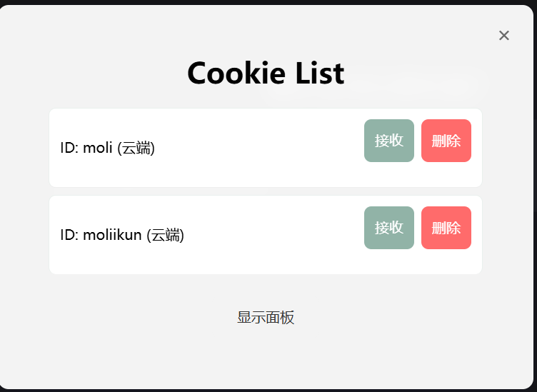

### Cookie共享安全提示

为了确保你的账号安全，请注意：
1. 设置足够复杂的 ADMIN_PASSWORD 和 PATH_SECRET
2. 不要将这些密钥分享给不信任的人
3. 定期更换密钥
4. 及时清理不需要的 cookie 数据

## 第二部分：LibreTV 私人影视站部署

相比Cookie共享服务，LibreTV的部署过程要简单得多。让我们来看看如何快速搭建一个私人影视站。

### 部署步骤

1. Fork项目
首先前往[LibreTV项目地址](https://github.com/bestZwei/LibreTV)，将项目fork到自己的GitHub账号下：
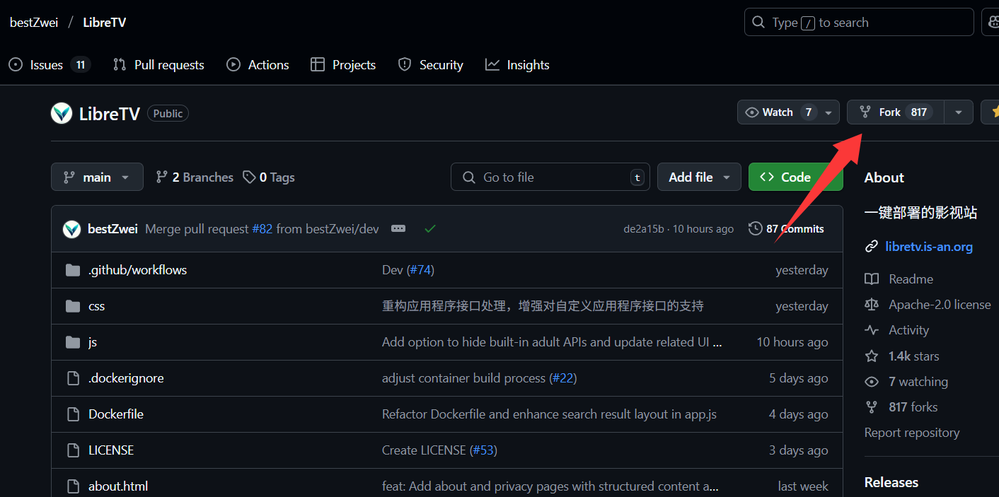

2. 使用Cloudflare Pages部署
   - 进入Cloudflare的Workers和Pages界面
   - 选择Pages选项，点击"连接到Git"
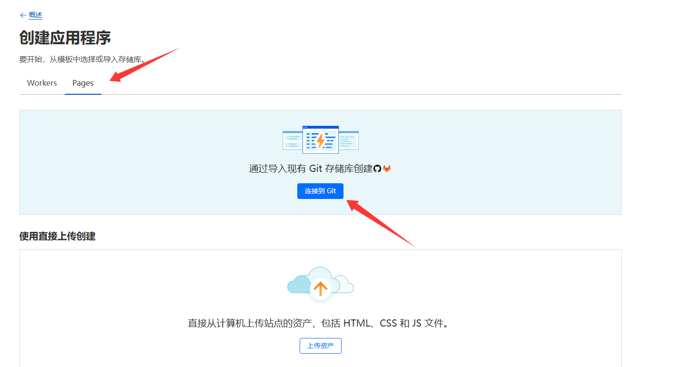

3. 选择仓库并完成部署
   - 选择刚刚fork的LibreTV仓库
   - Cloudflare会自动完成部署过程
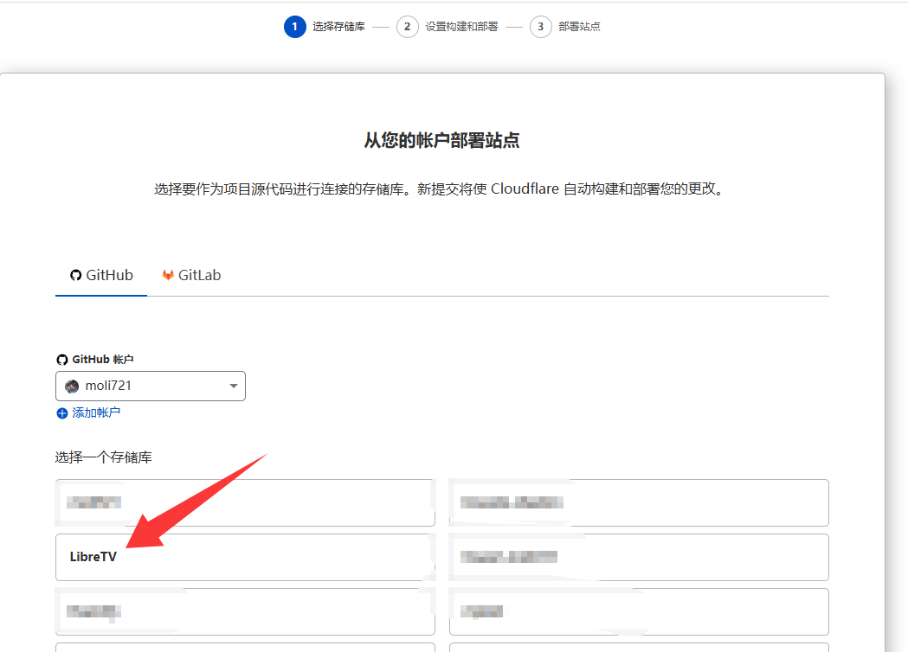

部署完成后，你就可以访问自己的私人影视站了：
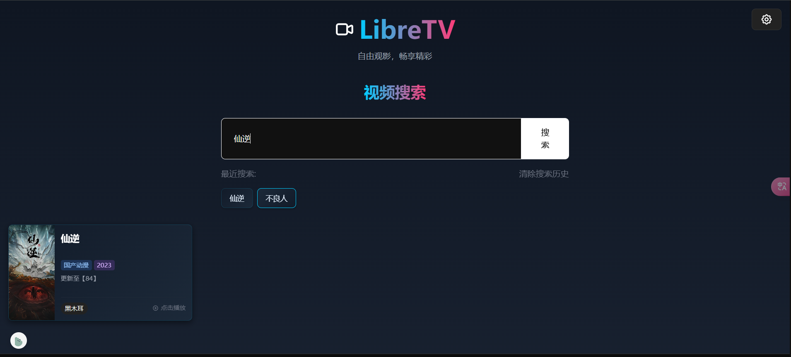

## 结语

通过本教程，我们成功在Cloudflare上部署了两个实用的项目：
1. Cookie共享服务：帮助你在不同设备间轻松切换账号
2. 私人影视站：随时随地观看你喜欢的影视内容

这两个项目都充分利用了Cloudflare的免费资源，不需要额外的服务器成本。希望这个教程对你有帮助！