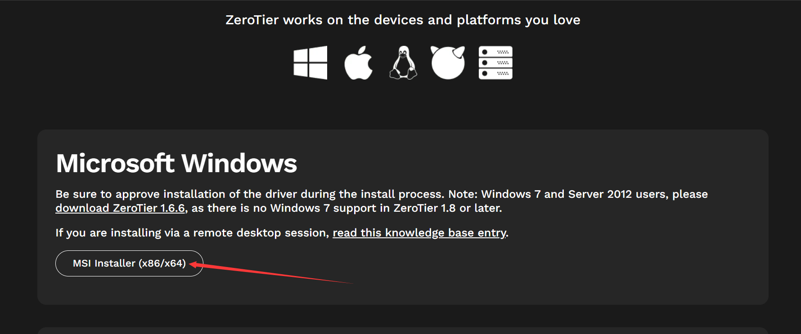
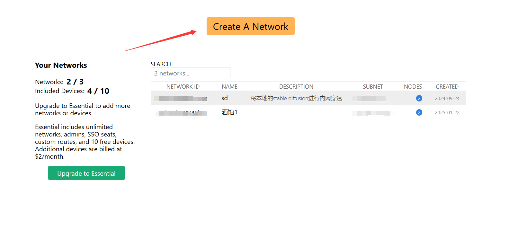
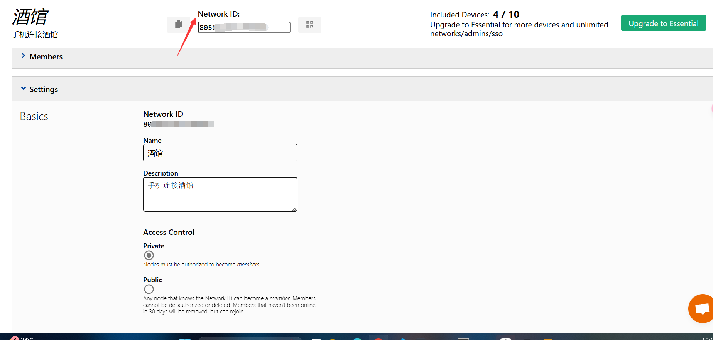
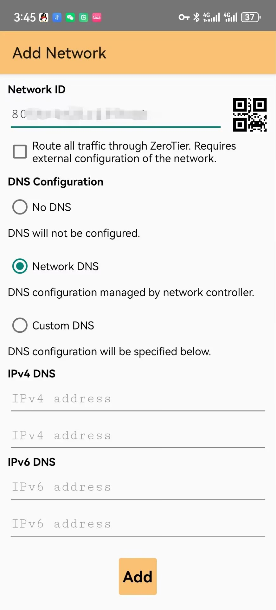
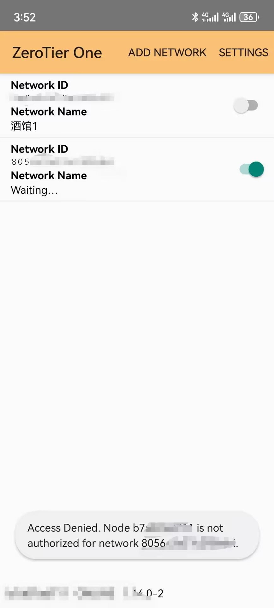
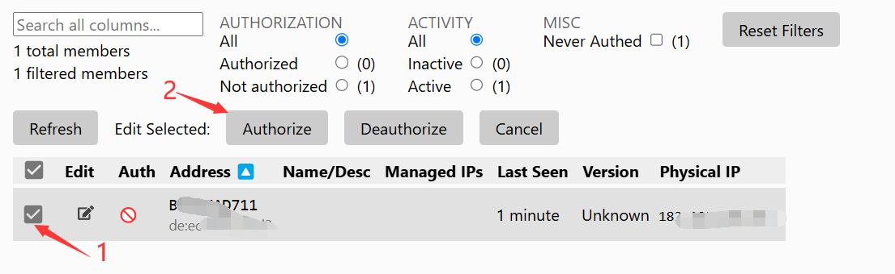
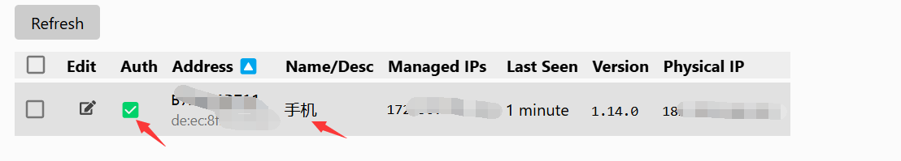
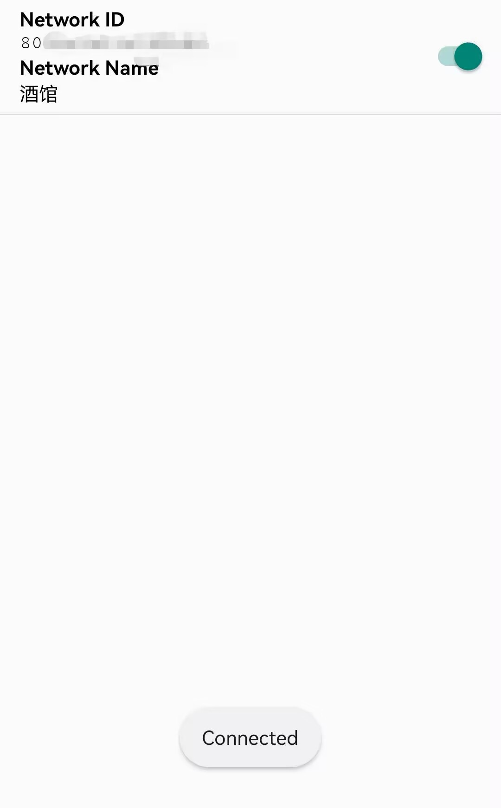
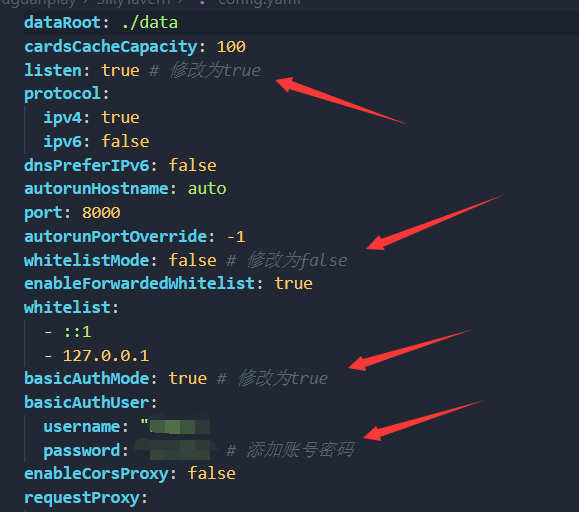

## 前言

想在外面也能用手机访问电脑上的酒馆(Silly Tavern)吗?今天我们就来介绍一个简单好用的解决方案 - ZeroTier。

### ZeroTier是什么?

ZeroTier 是一个强大的虚拟局域网工具,它可以让不同地方的设备组成一个虚拟局域网,就像这些设备都在同一个网络中一样。它的优点包括:

- 🚀 无需公网IP
- 🔧 无需复杂的路由器设置
- 🛡️ 安全可靠的连接
- 🌐 跨平台支持
- 💻 简单易用

## 具体操作步骤

### 1. 下载安装

首先我们需要在电脑和手机上都安装 ZeroTier:

**电脑端:**
1. 访问 [ZeroTier官网](https://www.zerotier.com/download/)
2. 下载对应系统的版本(Windows用户选择Microsoft Windows)


**手机端:**
1. 访问 [Android下载链接](https://zerotier-one.cn.uptodown.com/android)
2. 安装后打开设置(Settings)
3. 开启移动数据权限(Allow mobile data),否则可能无法正常连接

### 2. 创建网络

1. 注册并登录 ZeroTier 官网后,点击 "Create A Network" 创建新网络:


2. 进入新创建的网络后:
   - 复制网络ID(后面要用)
   - 在Settings中修改name(网络名称)和description(描述)
   - 将网络类型设为private(私有网络)


### 3. 手机端配置

1. 打开手机上的ZeroTier应用,点击"Add Network",输入刚才复制的网络ID:


2. 添加完成后,点击右侧的开关启动连接:


3. 此时设备会显示等待认证状态,我们需要去官网进行认证:


4. 在官网找到新加入的设备,点击勾选进行认证。认证成功后会显示绿色的勾:


5. 这时候可以点击"Edit"给设备起个好记的名字,比如"我的手机"

6. 回到手机,重新连接网络,当状态显示"Connected"时就表示连接成功了:


> 💡 小贴士:
> - 每张图都展示了具体的操作界面,建议对照着图片操作
> - 注意保存好网络ID,这是连接的重要凭证
> - 设备名称建议设置得容易识别,方便后续管理

### 4. 电脑端配置

1. 右键点击任务栏的ZeroTier图标
2. 选择"Join Network"
3. 输入网络ID并确认

### 5. 配置酒馆

1. 找到Silly Tavern的配置文件(config.yaml)
2. 修改相关网络设置


### 6. 开始使用

现在,你可以在手机浏览器中输入:
```
http://[ZeroTier分配的IP]:8000
```
就能访问电脑上的酒馆了!

> 🌟 小贴士:
> - 确保两个设备都连接到了同一个ZeroTier网络
> - 记得保存好网络ID
> - 如果连接不上,检查一下设备是否已通过认证
> - 建议给设备起个容易识别的名字

现在,你可以在外面也能随时访问自己的酒馆了,是不是很方便呢? 😊
