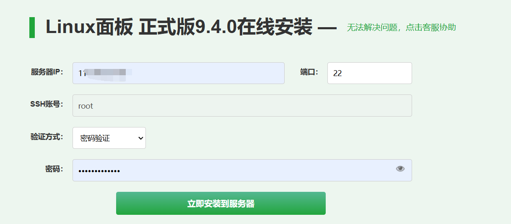

宝塔面板是一款简单好用的服务器运维管理工具，它提供了可视化的界面来管理服务器，大大简化了服务器运维的难度。本文将详细介绍如何在宝塔面板中配置和使用Docker，帮助你轻松部署各种应用。

如果你想要更直观地了解配置过程，可以参考这个视频教程：
https://www.bilibili.com/video/BV1JT421y7pS/?spm_id_from=333.1007.top_right_bar_window_history.content.click&vd_source=e03b7d988550b29e55118b7d8e6cab3c
<iframe width="100%" height="468" src="https://www.bilibili.com/video/BV1JT421y7pS/?spm_id_from=333.1007.top_right_bar_window_history.content.click&vd_source=e03b7d988550b29e55118b7d8e6cab3c" scrolling="no" border="0" frameborder="no" framespacing="0" allowfullscreen="true"> </iframe>

## 安装宝塔面板

1. 首先访问宝塔面板的官方下载页面：https://www.bt.cn/new/download.html
2. 在安装界面填写相关信息：

3. 点击"立即安装"，等待5~10分钟左右完成安装

安装完成后，你会看到如下界面：


复制面板访问地址，输入用户名和密码即可登录管理界面。

**重要提示**：在使用宝塔面板之前，请确保已经在服务器安全组或防火墙中放行了面板访问端口。本文后续提到的所有端口同样需要确保已放行，否则将无法正常访问相关服务。

## 配置Docker环境

1. 在宝塔面板左侧边栏找到Docker选项并安装（如果未安装，系统会提示你进行安装）

2. 为了提升镜像下载速度，建议配置国内镜像源。参考[这篇文章](https://blog.csdn.net/weixin_50160384/article/details/139861337)，在终端执行以下命令：
```bash
sudo mkdir -p /etc/docker
sudo tee /etc/docker/daemon.json <<-'EOF'
{
    "registry-mirrors": [
        "https://do.nark.eu.org",
        "https://dc.j8.work",
        "https://docker.m.daocloud.io",
        "https://dockerproxy.com",
        "https://docker.mirrors.ustc.edu.cn",
        "https://docker.nju.edu.cn"
    ]
}
EOF
sudo systemctl daemon-reload
sudo systemctl restart docker
```

配置完成后，你可以看到镜像源已经添加成功：


## 创建Docker容器

在Docker管理界面中，你可以通过命令行方式创建容器：


只需将Docker运行命令复制到命令输入框，点击"执行命令"即可完成容器创建。

## 推荐应用

以下是一些实用的Docker应用推荐，其中前两个可以直接在宝塔面板的Docker应用商店中下载安装：

1. [newapi](https://github.com/Calcium-Ion/new-api):AI模型接口管理与分发系统，支持将多种大模型转为OpenAI格式调用
    ```bash
    # 使用 SQLite 的部署命令：
    docker run --name new-api -d --restart always -p 3000:3000 -e TZ=Asia/Shanghai -v /home/ubuntu/data/new-api:/data calciumion/new-api:latest
    # 使用 MySQL 的部署命令，在上面的基础上添加 `-e SQL_DSN="root:123456@tcp(localhost:3306)/oneapi"`，请自行修改数据库连接参数。
    # 例如：
    docker run --name new-api -d --restart always -p 3000:3000 -e SQL_DSN="root:123456@tcp(localhost:3306)/oneapi" -e TZ=Asia/Shanghai -v /home/ubuntu/data/new-api:/data calciumion/new-api:latest
    ```
2. [Alist](https://alist.nn.ci/zh/guide/install/docker.html): 一个支持多种存储的文件列表程序(主要用来整合网盘)，使用 Gin 和 Solidjs。
    ```bash
    ```
3. [Napcat](https://github.com/NapNeko/NapCat-Docker):NapCatQQ 是现代化的基于 NTQQ 的 Bot 协议端实现    
    ```bash
    docker run -d \
    -e NAPCAT_GID=$(id -g) \
    -e NAPCAT_UID=$(id -u) \
    -p 3000:3000 \
    -p 3001:3001 \
    -p 6099:6099 \
    --name napcat \
    --restart=always \
    mlikiowa/napcat-docker:latest
    ```
4. [Cursor To OpenAI](https://github.com/JiuZ-Chn/Cursor-To-OpenAI):将 Cursor 编辑器转换为 OpenAI 兼容的 API 接口服务。 
    ```bash
    docker run -d --name cursor-to-openai -p 3010:3010 ghcr.io/jiuz-chn/cursor-to-openai:latest
    ```
