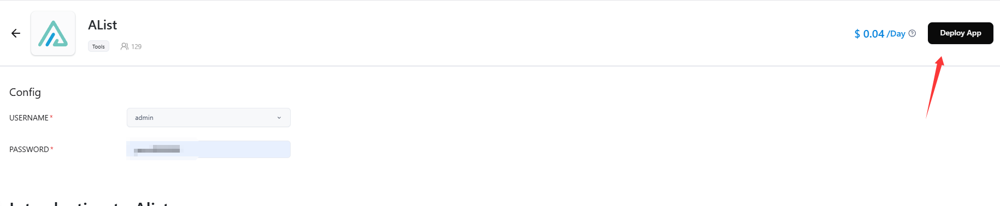

## 前言

在这个云服务遍地开花的时代，找到一个真正适合个人使用的免费云平台着实不易。最近我发现了 Clawcloud 这个宝藏平台，不仅提供了慷慨的免费额度，更难得的是无需信用卡即可使用 —— 这对于我们这些热衷于探索新技术却预算有限的开发者来说，简直是最好的礼物。

作为一名经常需要管理各种文件的开发者，我一直在寻找一个可以稳定运行 AList 的平台。通过深入研究和实践，我发现 Clawcloud 完美符合这个需求。它不仅提供了新用户 5 美元的初始额度，对于拥有超过半年历史的 GitHub 用户，更有每月持续的 5 美元赠送额度，这让长期运行变得非常经济实惠。

在这篇文章中，我将详细分享我的部署经验，包括平台特性、资源定价、部署流程以及一些常见的坑。无论你是想搭建个人网盘，还是在寻找免费的容器部署方案，相信这篇教程都能给你带来启发。

> 💡 小贴士：虽然 Clawcloud 采用按量计费模式，但通过合理配置，完全可以在免费额度内稳定运行你的服务！

## 平台介绍与准备工作

### Clawcloud 平台特点
- 新用户注册即赠送 5 美元额度（当月有效）
- 绑定 GitHub 账号（注册超过 180 天）可每月获得 5 美元赠额
- 免费计划无需绑定信用卡
- 采用按量计费模式（Pay as you go）

### 资源定价表
| 资源类型 | 按月计费 | 按小时计费 | 其他计费方式 |
|---------|---------|------------|-------------|
| CPU | $4/vCPU/月 | $0.005556/vCPU/小时 | - |
| RAM | $2/GB/月 | $0.002778/GB/小时 | - |
| Storage | $0.12/GB/月 | $0.000352/GB/小时 | - |
| Network | $0.05/GB | - | $0.00005/MB 或 $0.05/GB |

### 部署前准备
1. 注册时间超过 180 天的 GitHub 账号（用于登录 Clawcloud Run）
2. Cloudflare 账号（用于创建隧道）

## 部署原理

在开始具体的部署步骤之前，让我们先了解整个系统的工作原理，这将帮助你更好地理解配置过程。

### 为什么需要 Cloudflare 隧道？
Clawcloud 上部署的 AList 是一个内网服务，外部网络无法直接访问。为了使服务能够被外部访问，我们需要使用 Cloudflare 隧道来建立一个安全的连接通道。

### 工作流程
1. **内网服务**
   - AList 部署在 Clawcloud 内部
   - 获得内网地址：`alist-xxx.ns-xxx.svc.cluster.local:5244`

2. **隧道建立**
   - 在 Cloudflare 创建隧道并获取 Token
   - 配置 CNAME 记录（如：`alist-cf.moli721.xyz`）作为隧道入口
   - 在 Clawcloud 部署 cloudflared 客户端维持隧道连接
   - 设置公共主机名（如：`alist.moli721.xyz`）作为访问入口

3. **请求流程**
   ```
   用户访问 alist.moli721.xyz
          ↓
   Cloudflare 处理请求
          ↓
   通过已建立的隧道转发
          ↓
   cloudflared 客户端接收请求
          ↓
   转发至 AList 内网服务
   ```

### 关键组件说明
- **cloudflared 客户端**：运行在 Clawcloud 上的隧道客户端，负责维持隧道连接和请求转发
- **CNAME 记录**：用于注册隧道连接点，使 Cloudflare 能够找到正确的隧道
- **公共主机名**：用户实际访问的域名，通过隧道将请求转发到内部服务

## AList 部署步骤

### 1. 创建 AList 应用
1. 访问 [Clawcloud 官网](https://ap-northeast-1.run.claw.cloud/signin) 并注册账号
2. 进入控制台，找到 App Store 中的 AList


3. 配置管理员账号
   - 选择 USERNAME 为 admin
   - 设置你的管理员密码
   - 点击右上角 Deploy App 并确认


> ⚠️ 注意：请务必记住设置的管理员密码，这将用于后续登录 AList 管理面板

4. 应用配置优化
   - 点击 Details 后进入 Update 界面
   - 取消勾选 Enable Internet Access
   - 将 /opt/alist/data 存储容量调整至 10G
   - 点击右上角 Update 并确认


### 2. 配置 Cloudflare 隧道

#### 2.1 创建隧道应用
1. 在 AppLauchpad 中点击 Create App
2. 填写基本信息：
   - Application Name: cloudflare
   - Image Name: cloudflare/cloudflared:latest
   - Usage: 0.1CPU 64M
   - Network: 勾选 Enable Internet Access


#### 2.2 配置域名解析
1. 点击 custom domain，复制 CNAME 值
2. 在 Cloudflare 添加 CNAME 记录
   - 名称：自定义（如：alist-cf）
   - 目标：粘贴刚才复制的 CNAME 值


> 💡 CNAME 的作用：CNAME（Canonical Name）记录是一种 DNS 记录，它能够将一个域名指向另一个域名。在这里，我们使用 CNAME 将我们自定义的域名（如：alist-cf.你的域名.com）指向 Cloudflare 的隧道服务器，这样就能通过我们自己的域名访问 AList 服务了。

#### 2.3 获取隧道 Token
1. 进入 Cloudflare Zero Trust 概述
2. 导航至：网络 -> Tunnels
3. 创建新隧道


4. 复制隧道 Token


#### 2.4 完成隧道配置
1. 配置隧道命令
   - 在 Command 输入框中填写：`cloudflared tunnel --no-autoupdate run --token 你的token`
   - 点击右上角 Deploy Application 
   - 确认后点击 Yes 完成创建

2. 配置公共主机名
   - 进入隧道详情页面
   - 选择"公共主机名"选项
   - 点击编辑按钮


3. 配置内网地址
   - 在 URL 字段中填写 AList 的内网地址
   - 内网地址格式：`alist-[随机字符].ns-[随机字符].svc.cluster.local:5244`
   - 注意：需要删除地址前面的 `http://` 或 `https://` 前缀
   - 参考下图进行配置：


> ⚠️ 重要提示：
> 1. 确保填写的是 AList 的内网地址，而不是 Cloudflare 的地址
> 2. Token 示例：如果你看到类似 `cloudflared.exe service install eyJhIjoiODY3Y2JlZWMzNWNkNWRmMzZhYTJlMjhmYzgxxxxxxxxxxxxx` 的内容，只需提取 token 部分即可
> 3. 完整的命令格式应该是：`cloudflared tunnel --no-autoupdate run --token eyJhIjoiODY3Y2JlZWMzNWNkNWRmMzZhYTJlMjhmYzgxxxxxxxxxxxxx`
> 4. 内网地址示例：如果你看到 `http://alist-wwfvezps.ns-d9vkx1tq.svc.cluster.local:5244`，请只保留 `alist-wwfvezps.ns-d9vkx1tq.svc.cluster.local:5244` 部分

至此，AList 的部署和配置就全部完成了！你现在可以通过配置的域名访问你的 AList 服务了。

## 补充说明

### 应用卸载方法
如需卸载应用，可在 App Store 的 My Apps 标签中找到对应应用，点击右上角 Uninstall 即可。

### 常见问题解答
1. CNAME 记录的作用：用于将你的自定义域名指向 Cloudflare 的隧道服务
2. 内网地址注意事项：配置时请使用 AList 的内网地址，而非 Cloudflare 的地址

> 原教程参考：https://linux.do/t/topic/557711