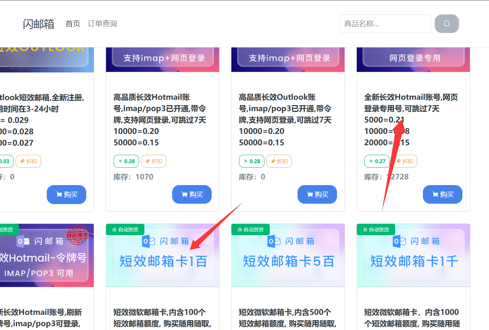
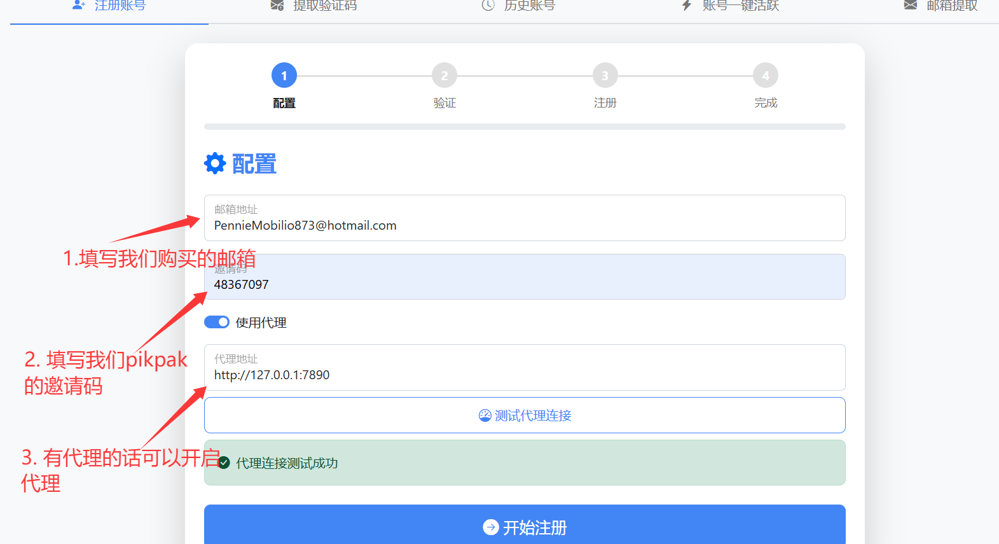
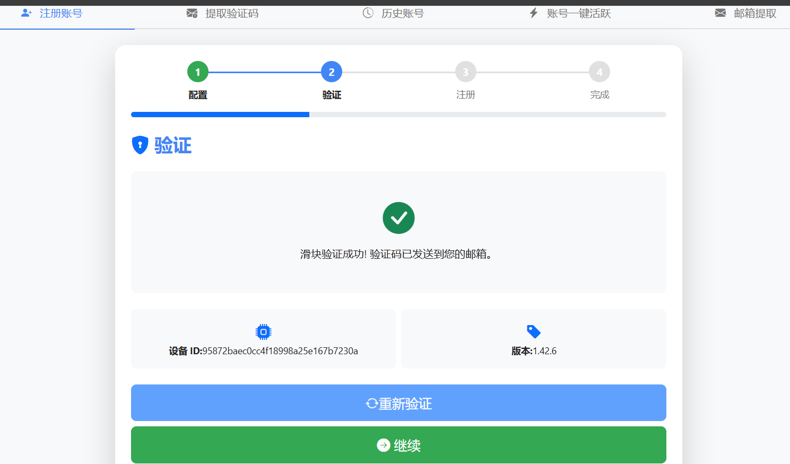
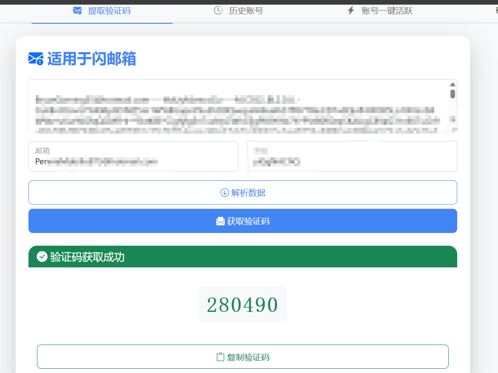
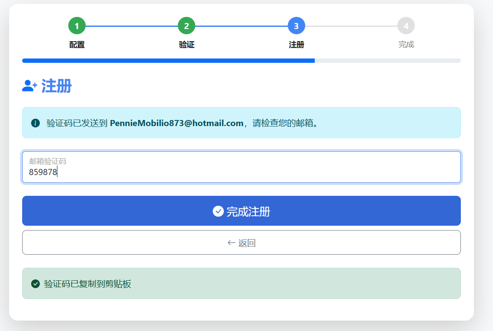
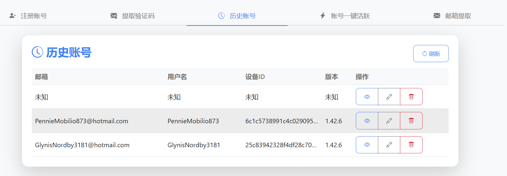
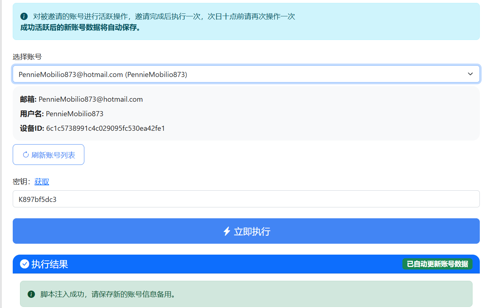
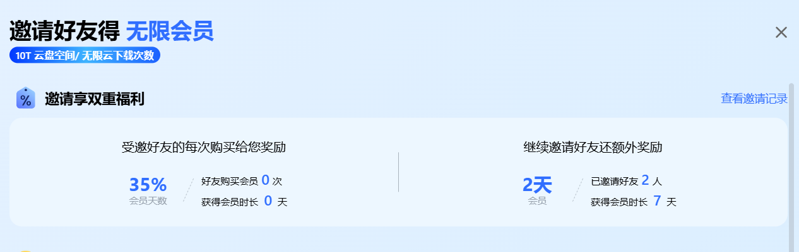

# 免费获取PikPak会员的完整教程

本教程将带您一步步实现免费获取PikPak会员资格。整个过程简单易懂，即使是技术小白也能轻松完成。

## 一、准备工作

首先，我们需要获取一个开源项目来帮助我们实现自动邀请功能。前往GitHub上的这个项目：
https://github.com/Bear-biscuit/Pikpak-Auto-Invitation

将项目克隆到本地后，安装相关依赖并运行：
```python
git clone https://github.com/Bear-biscuit/Pikpak-Auto-Invitation
pip install -r requirements.txt
python run.py
```

这里我就不详细演示了。

## 二、获取临时邮箱

为了完成邀请注册流程，我们需要使用临时邮箱。这里推荐使用闪邮箱：
https://shanyouxiang.com/



进入网站后，您可以选择购买登录账号或邮箱卡。邮箱卡支持API调用，而我选择的是直接购买账号。购买完成后，我们就可以开始下一步操作了。

## 三、注册PikPak账号

现在，前往我们刚才运行的项目页面，找到注册账号的界面：

1. 首先需要填写您刚购买的邮箱和PikPak邀请码
2. PikPak邀请码获取方法：打开PikPak应用，点击左下角的"引荐奖励计划"


进入后点击"邀请码"即可复制您的专属邀请码。

3. 填写完成后点击"注册"按钮



注意：如果滑块验证码验证失败，可以多尝试几次，直到成功为止。



## 四、获取验证码并完成注册

点击"获取验证码"后，我们需要查看邮箱获取验证码。有两种方式：

1. 前往Outlook官网登录查看
2. 使用项目提供的第二个页面（推荐）：输入您的邮箱账号和密码



获取验证码后，将其复制到注册页面，点击"完成注册"：



注册成功后，系统会自动生成一个JSON文件，并将账号信息保存在"历史账号"中：



## 五、激活会员资格

最后一步，我们需要激活刚注册的账号：

1. 前往"账号一键活跃"界面
2. 选择您刚才使用的账号
3. 从纸鸢佬的导航页获取密钥
4. 执行激活操作



完成以上步骤后，您就成功获得了7天的PikPak会员时长！



## 参考资源

更多详细信息可参考：https://linux.do/t/topic/528654
