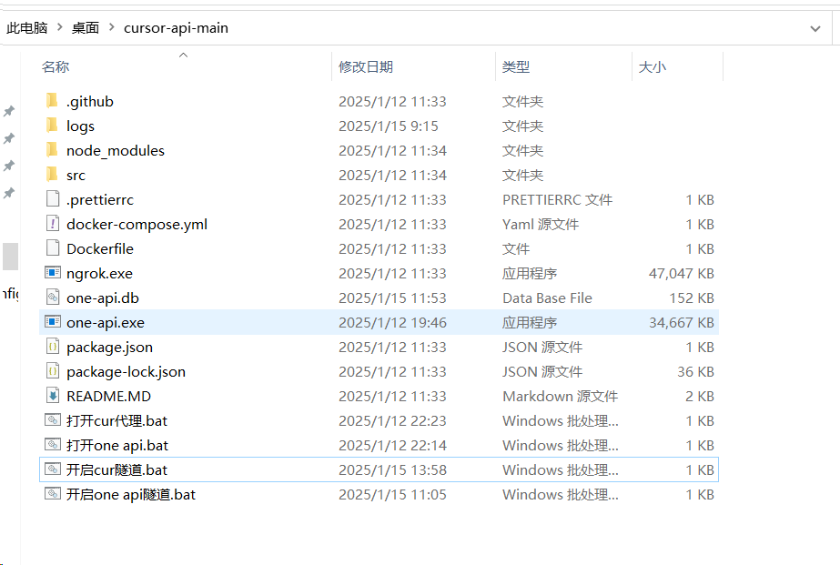
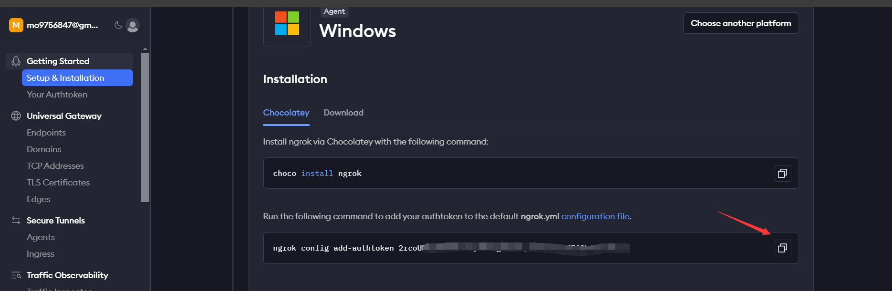
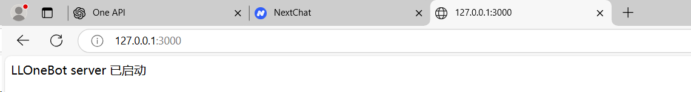
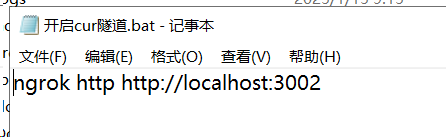

# 从零开始：搭建个人 API 代理服务完全指南

> 本文结合理论知识和实战经验，详细介绍如何搭建一个稳定可用的 API 代理服务，包含完整的故障排除指南。

本教程提供两种部署方案：
1. **One API 模式**（推荐）
   - 适合批量管理多个账号
   - 支持令牌分发和使用统计
   - 可以作为"收菜模式"使用
   - 提供完整的管理界面

2. **直连模式**
   - 直接使用 Cursor 隧道
   - 填写 Cookie 即可使用
   - 配置步骤相对简单
   - 适合个人轻量使用

> 💡 **选择建议**：
> - 如果你打算搭建公益站点或需要管理多个账号，建议使用 One API 模式
> - 如果只是个人使用或临时测试，可以选择直连模式
> - 本教程将以 One API 模式为主进行详细讲解，直连模式的配置步骤与之类似

接下来，让我们开始详细的配置过程...


## 前期准备

在开始动手之前，请确保已准备以下工具：
1. Cursor API 程序包：[下载地址](https://raw.githubusercontent.com/damoshen123/curapi/refs/heads/main/cursor-api-main4.rar)
2. ngrok 内网穿透工具：用于创建网络隧道
3. One API 管理程序：用于统一管理 API 接口

## 核心概念详解

在开始实操之前，让我们先理解几个关键概念，这将帮助你更好地理解整个搭建过程：

### 1. Cursor API 代理服务
- **本质**：一个将 Cursor 编辑器 AI 能力转换为标准 OpenAI API 格式的接口服务
- **工作原理**：
  - 在本地端口运行（默认3000端口）
  - 接收标准 OpenAI API 格式的请求
  - 转换并调用 Cursor AI 能力
  - 返回处理结果
- **应用价值**：让 Cursor 的 AI 能力可以被更多应用程序调用，极大扩展了使用场景

### 2. 网络隧道服务
- **本质**：创建一个安全的网络通道，将本地服务暴露到公网
- **实现方式**：主要通过 ngrok 工具实现
- **核心功能**：
  - 内网穿透实现远程访问
  - 提供临时公网域名
  - 支持 HTTPS 加密
  - 实时流量监控

### 3. One API 管理平台
- **定位**：API 接口的统一管理和分发平台
- **主要功能**：
  - 集中管理多个 API 端点
  - 令牌管理和访问控制
  - 使用量统计和监控
  - 负载均衡和故障转移

## 实操步骤

### 第一步：配置网络环境

1. **配置 ngrok**
   首先访问 [ngrok官网](https://dashboard.ngrok.com/) 获取配置信息:
   

2. **设置 Authtoken**
   ```bash
   # 在命令行中执行
   ngrok config add-authtoken <你的token>
   ```
   > 💡 提示：Authtoken 的作用是将 ngrok 账户与本地配置绑定，获取更多功能权限（如自定义域名、流量统计等）

### 第二步：配置 Cursor API 服务

1. **启动基础服务**
   - 运行 `cur代理.bat`
   - 默认使用 3000 端口

2. **处理端口冲突**（如需要）
   ```javascript
   // 修改 src/index.js 文件中的端口配置
   const port = 3002  // 选择一个未被占用的端口
   ```
   

   > ⚠️ 注意事项：
   > - 建议使用 3000-5000 之间的端口
   > - 记录修改后的端口号
   > - 确保新端口未被其他服务占用

### 第三步：配置 One API 服务

1. **基础配置**
   - 运行 `打开Oneapi.bat`（默认端口 3333）
   - 根据需要修改配置文件中的端口设置

2. **创建网络隧道**
   ```bash
   ngrok http <你的Cursor API端口>  # 例如：ngrok http 3002
   ```
   

   这里直接点击`开启one api隧道.bat`即可

### 第四步：获取账号信息并完成配置

#### 1. 获取 WorkosCursorSession
1. **自动创建账号**
   - 访问 [CursorRegister](https://github.com/JiuZ-Chn/CursorRegister) 项目
   - 运行项目工作流
   - 等待自动创建 Cursor 账号
   - 获取生成的 WorkosCursorSession 信息

2. **保存账号信息**
   > ⚠️ 注意：请安全保存 WorkosCursorSession，这是配置 API 的重要凭证

#### 2. 配置 API 渠道
在酒馆中添加新的 API 渠道：

1. **基本信息配置**
   - 隧道地址：`你的隧道地址/v1`
   - API密钥：填入上一步获取的 WorkosCursorSession 值
   - 选择适合的模型

2. **验证配置**
   - 点击测试按钮
   - 确认返回状态码为 200
   - 测试发送和接收消息

> 🌟 成功标准：
> - 测试消息返回 200 状态码
> - 服务状态显示正常（绿灯）
> - 可以正常发送和接收消息
> - 如果显示 `Status check bypassed` 但测试返回 200，也属于正常状态

#### 3. 批量账号管理（可选）
如果需要管理多个账号：
1. 使用 CursorRegister 批量创建多个账号
2. 收集所有账号的 WorkosCursorSession
3. 通过 One API 统一管理这些账号
4. 设置负载均衡和故障转移策略

## 常见问题与解决方案

### 1. 连接问题
- **状态检查提示**：遇到 `Status check bypassed` 不用担心，只要测试返回 200 就是正常的
- **404错误**：检查端口配置和服务运行状态
- **空回复**：确保 cookie 格式正确（使用 `%3A` 而非双冒号）

### 2. 进阶功能：批量账号配置
1. 使用 [CursorRegister](https://github.com/JiuZ-Chn/CursorRegister) 自动创建账号
2. 批量获取 WorkosCursorSession
3. 通过 One API 统一管理

## 参考资源
- [详细教程](https://gxcgf4l6b2y.feishu.cn/docx/GIjidWbiyoSblfxLZ3Fcbc3Wnqg)
- [Cookie Editor](https://chromewebstore.google.com/detail/cookie-editor/hlkenndednhfkekhgcdicdfddnkalmdm)
- [技术讨论](https://discord.com/channels/1134557553011998840/1327109779310510110)