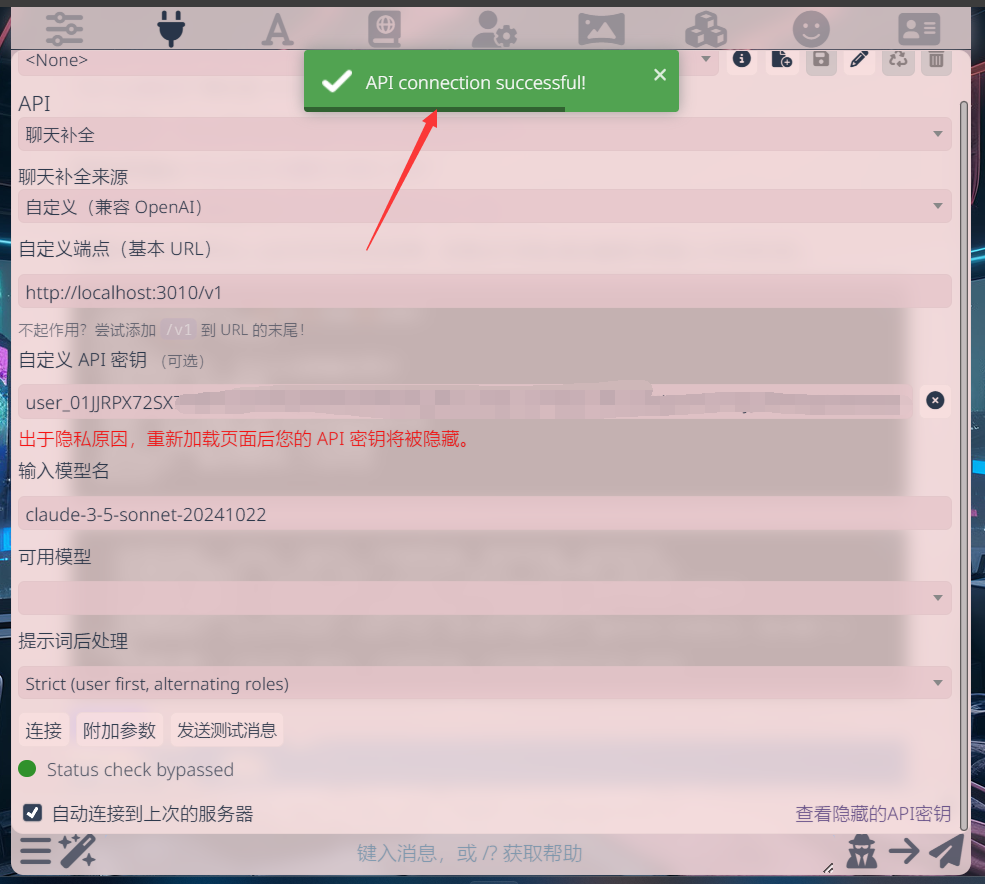

# 从零开始：搭建个人 API 代理服务完全指南

> 本文结合理论知识和实战经验，详细介绍如何搭建一个稳定可用的 API 代理服务，包含完整的故障排除指南。

## 方案概述

本教程提供两种部署方案，分别适合不同的使用场景：

1. **直连模式**
   - 特点：配置简单，快速部署
   - 适用：个人使用或临时测试
   - 原理：直接使用 Cursor 隧道，填写 Cookie 即可

2. **One API 模式**（推荐）
   - 特点：功能完整，管理便捷
   - 适用：公益站点或多账号管理
   - 优势：
     - 支持批量管理多个账号
     - 提供令牌分发和使用统计
     - 可用作"收菜模式"
     - 带有完整的管理界面

> 💡 **选择建议**：
> - 个人临时使用 → 选择直连模式
> - 长期运营或多人使用 → 选择 One API 模式
> - 本教程会详细介绍这两种模式的配置方法，你可以根据实际需求选择合适的方案


## 前期准备

在开始动手之前，请确保已准备以下工具：
1. Cursor API 程序包：[下载地址](https://raw.githubusercontent.com/damoshen123/curapi/refs/heads/main/cursor-api-main4.rar)
2. ngrok 内网穿透工具：用于创建网络隧道
3. One API 管理程序：用于统一管理 API 接口

## 核心概念详解

在开始实操之前，让我们先理解几个关键概念，这将帮助你更好地理解整个搭建过程：

### 1. Cursor API 代理服务
- **本质**：一个将 Cursor 编辑器 AI 能力转换为标准 OpenAI API 格式的接口服务
- **工作原理**：
  - 在本地端口运行（默认3000端口）
  - 接收标准 OpenAI API 格式的请求
  - 转换并调用 Cursor AI 能力
  - 返回处理结果
- **应用价值**：让 Cursor 的 AI 能力可以被更多应用程序调用，极大扩展了使用场景

### 2. 网络隧道服务
- **本质**：创建一个安全的网络通道，将本地服务暴露到公网
- **实现方式**：主要通过 ngrok 工具实现
- **核心功能**：
  - 内网穿透实现远程访问
  - 提供临时公网域名
  - 支持 HTTPS 加密
  - 实时流量监控

### 3. One API 管理平台
- **定位**：API 接口的统一管理和分发平台
- **主要功能**：
  - 集中管理多个 API 端点
  - 令牌管理和访问控制
  - 使用量统计和监控
  - 负载均衡和故障转移

## 方案一：直连模式配置

### 第一步：配置网络环境

1. **配置 ngrok**
   首先访问 [ngrok官网](https://dashboard.ngrok.com/) 获取配置信息:
   

2. **设置 Authtoken**
   ```bash
   # 在命令行中执行
   ngrok config add-authtoken <你的token>
   ```
   

   
   > 💡 提示：Authtoken 的作用是将 ngrok 账户与本地配置绑定，获取更多功能权限（如自定义域名、流量统计等）

### 第二步：配置 Cursor API 服务

1. 运行 `cur代理.bat`（默认使用 3000 端口）

2. 如遇端口冲突，可修改端口：
   ```javascript
   // 在 src/index.js 中修改
   const port = 3002  // 换成未被占用的端口
   ```
   

   > ⚠️ 注意：
   > - 建议使用 3000-5000 范围内的端口
   > - 记得保存修改后的端口号
   > - 确保新端口未被占用

   示例：我这里使用 3002 端口（因为 3000 端口已被占用）
   


### 第三步：配置访问凭证

1. 获取 Cursor 中的 WorkosCursorSessionToken：
   

2. 填写配置信息：
   

   看到 `API connection successful!` 提示就表示配置成功了！

   > 注意：示例中的端点 http://localhost:3010/v1 是本地测试地址，实际使用时要换成你的 Cursor API 端口


### 第四步：启用远程访问

1. 运行 `开启cur隧道.bat` 启动 ngrok 隧道：
   

2. 使用生成的公网地址作为端点（如果无法访问，可以尝试在地址后添加 /v1）

## 方案二：One API 模式配置

前两步的配置与直连模式相同（配置 ngrok 和启动 Cursor API），从第三步开始有所不同。


### 第三步：配置 One API 服务

1. 运行 `打开Oneapi.bat`（默认端口 3333）
2. 启动 One API 隧道
3. 访问管理界面（本地访问 3333 端口）：
   
   
   > 默认登录信息：
   > - 账号：root
   > - 密码：123456

### 第四步：填写OneAPI信息并完成配置

### 第四步：完成 One API 配置

1. 获取 WorkosCursorSession：
   - 可以手动获取
   - 也可以使用 [CursorRegister](https://github.com/JiuZ-Chn/CursorRegister) 自动创建账号

2. 配置 API 渠道：
   

3. 测试渠道连接：
   

4. 启用远程访问：
   - 运行 `开启one api隧道.bat`
   - 使用生成的公网地址作为端点
   - 在令牌管理中创建并使用 API 密钥：
   

> 🌟 配置成功的标志：
> - 测试返回 200 状态码
> - 服务状态显示正常
> - 可以正常收发消息
> - 提示 `Status check bypassed` 但测试返回 200 也是正常的

### 批量账号管理（可选）
如果需要管理多个账号：
1. 使用 CursorRegister 批量创建多个账号
2. 收集所有账号的 WorkosCursorSession
3. 通过 One API 统一管理这些账号
4. 设置负载均衡和故障转移策略

## 常见问题与解决方案

### 1. 连接问题
- **状态检查提示**：遇到 `Status check bypassed` 不用担心，只要测试返回 200 就是正常的
- **404错误**：检查端口配置和服务运行状态
- **空回复**：确保 cookie 格式正确（使用 `%3A` 而非双冒号）

### 2. 进阶功能：批量账号配置
1. 使用 [CursorRegister](https://github.com/JiuZ-Chn/CursorRegister) 自动创建账号
2. 批量获取 WorkosCursorSession
3. 通过 One API 统一管理

## 参考资源
- [原始教程](https://gxcgf4l6b2y.feishu.cn/docx/GIjidWbiyoSblfxLZ3Fcbc3Wnqg)
- [Cookie Editor](https://chromewebstore.google.com/detail/cookie-editor/hlkenndednhfkekhgcdicdfddnkalmdm)
- [技术讨论](https://discord.com/channels/1134557553011998840/1327109779310510110)