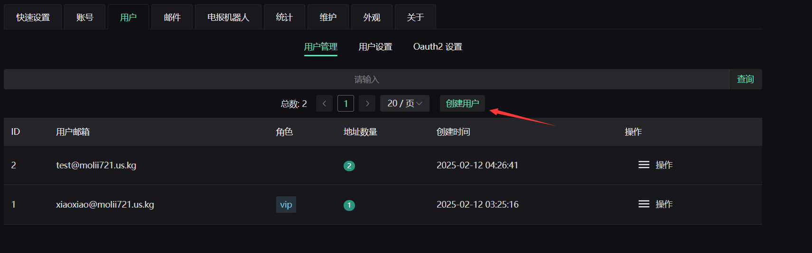

在这个教程中，我将介绍如何使用Cloudflare Workers搭建一个属于自己的临时邮箱服务。本文是基于以下教程的实践总结和知识扩展：
- 原始教程：https://linux.do/t/topic/316819/1
- 官方教程：https://temp-mail-docs.awsl.uk/zh/guide/ui/d1.html

虽然上述教程已经提供了详细的步骤说明，但我想通过这篇文章记录一些重要的知识点和实践经验，以便日后查阅。

## 系统架构概述

在开始之前，让我们先了解一下这个临时邮箱服务的主要组成部分：
1. 后端服务：基于Cloudflare Workers的无服务器函数
2. 数据存储：使用D1数据库和KV存储
3. 前端界面：用于用户交互的Web界面
4. 邮件转发：处理邮件路由的规则配置

## 搭建步骤

### 1. 配置后端服务

首先需要创建D1数据库，它将作为Cloudflare Workers的后端存储。Cloudflare Workers是一个让无服务器函数尽可能接近最终用户运行的平台。当收到特定类型的请求时，这些代码会被自动执行。

### 2. 环境变量配置

需要设置一系列环境变量来控制服务的行为。详细配置说明可以参考：https://temp-mail-docs.awsl.uk/zh/guide/worker-vars

例如用户环境变量包括：
- USER_DEFAULT_ROLE：新用户的默认角色（启用邮件验证时有效）
- ADMIN_USER_ROLE：管理员角色配置
- USER_ROLES：用户角色JSON配置
- DISABLE_ANONYMOUS_USER_CREATE_EMAIL：控制匿名用户创建邮箱的权限
- NO_LIMIT_SEND_ROLE：可以无限制发送邮件的角色（如vip/admin）

### 3. 存储系统配置

在这个系统中，我们需要同时使用D1数据库和KV存储，它们各自有不同的用途：

#### D1数据库
D1是基于SQLite的关系型数据库，主要用于：
- 存储结构化数据（用户信息、邮件内容等）
- 处理需要复杂查询的数据
- 确保数据一致性

#### KV存储
KV提供键值对存储，适用于：
- 缓存和会话管理
- 需要快速访问的临时数据
- 分布式存储场景

两者结合使用的优势：
- 可以根据数据特性选择合适的存储方式
- 优化性能和资源使用
- 提供更灵活的数据处理方案

注意：配置时必须遵守以下命名规则：
- D1 Database的绑定名称必须为"DB"
- KV的绑定名称必须为"KV"

### 4. 域名配置

1. 配置API服务域名（我使用的是`apimail.molii721.us.kg`）
2. 设置邮件转发规则，将发往molii721.us.kg的邮件转发到对应的Workers

### 5. 前端部署

1. 访问 https://temp-mail-docs.awsl.uk/zh/guide/ui/pages 生成前端代码
2. 下载frontend.zip并部署
3. 配置前端访问域名（我使用的是`mail.molii721.us.kg`）

## 系统使用和管理

### 管理员功能
通过访问 https://mail.molii721.us.kg/admin 可以：
- 创建和管理用户

- 设置用户角色

- 配置邮件自动清理

- 设置邮件发送配额

- 管理邮箱地址（如删除nidreiger@molii721.us.kg等地址）

### 用户使用说明
- 支持匿名用户创建临时邮箱（注意：关闭浏览器或清除cookie后会丢失）
- 注册用户可以更好地管理和保存邮箱
- 不同角色的用户有不同的权限和限制

至此，你就拥有了一个功能完整的临时邮箱服务！
