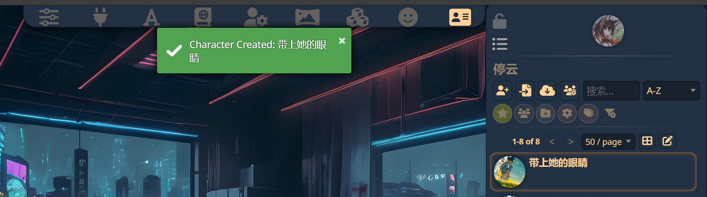

# 酒馆基本知识了解

详细知识可以参考[酒馆入门（必修）](https://sqivg8d05rm.feishu.cn/wiki/J8NDwc06JiuHXmk5cP2csfP6nmd)

本文将按照使用顺序，详细介绍酒馆(Silly Tavern)的基础配置流程和使用技巧。

## 1. API连接配置

API连接是使用酒馆的第一步，位于上方第二个位置（插头图标）。必须正确配置API才能开始对话。

### 配置步骤：
1. 填写代理地址（填写中转商对应的）
2. 填写API密钥（可从中转商令牌位置获得）
3. 选择模型名称
4. 点击连接测试

**常见问题：**
- 连接失败时，检查网络连接和API密钥是否正确
- 确保选择的模型与API密钥匹配
- 如果使用代理，确保代理地址正确


## 2. 预设导入与配置

完成API连接后，需要配置对话预设。预设位于上方第一个位置，用于定制对话风格和内容。

### 配置步骤：
1. 点击预设图标
2. 选择或导入预设文件
3. 调整基础设置
4. 保存配置

**基础设置建议：**
- 推荐开启流式传输
- 其他选项可保持默认
- 根据需要调整其他预设响应设置


## 3. 正则表达式配置

正则表达式用于精确控制AI的响应触发条件。

### 基础正则示例：
```
# 基础匹配
.*关键词.*      - 匹配包含"关键词"的文本
^开头$         - 精确匹配"开头"这个词
[选项1|选项2]   - 匹配多个选项之一
```

**预留位置：**
（此处可添加正则配合预设和世界书的具体使用方法）

## 4. 角色卡导入与配置

完成基础设置后，可以开始配置角色卡。

### 配置步骤：
1. 点击角色管理图标
2. 选择导入角色卡
3. 填写或修改角色信息
4. 保存配置

**角色卡内容：**
1. **角色名称**：角色的名字
2. **背景故事**：角色的历史和经历
3. **性格特征**：个性和行为模式
4. **能力和技能**：特殊能力说明
5. **外貌描述**：外观特征描述


比如我这里导入成功之后，此角色卡将会添加在右侧角色栏里面


点击此角色卡，会弹出提示，点击是导入其世界书


角色卡可以前往类脑角色卡专区自行获取

## 5. 世界书配置

世界书是角色所在世界的设定集，用于构建完整的对话环境。

### 配置步骤：
1. 点击世界书图标
2. 创建或导入世界书
3. 填写世界设定
4. 设置权重和触发条件
5. 保存配置

**基本结构：**
1. **历史背景**：世界观设定
2. **地理信息**：场景描述
3. **文化设定**：风俗习惯
4. **规则系统**：世界运作规则

**绿灯：** 表示只有在触发关键词的时候才会加载这段预设。

**蓝灯：** 表示只有在，然后一般要改变位置也就是@D这个的深度表示权重，0十分重要，一般就填0-4以内的，可以提升ai的注意力（前提是ai已经理解了这部分世界书）
**格式用键值对**：使用这种格式，或者yaml等格式，这种方式由于在训练ai的时候，相比于自然语言，ai能更加理解这种方式，这样能提高ai的注意力


我个人使用的预设以及配套正则
https://sillytavern-stage-girls-dog.readthedocs.io/tool_and_experience/misc/main.html

## 6. 进阶功能

### 文生图功能
提供多种实现方式：

1. **油猴插件方案(推荐)**
   - [详细教程](https://gxcgf4l6b2y.feishu.cn/docx/XDo7dLpvhov6AexuLu3c8mpynSC)
   - 这是我的相关配置
   - 正面提示词：
    ```plain
    best quality, amazing,quality, very aesthetic,absurdres, smea,
    ```
    
   - 负面提示词：
    ```plain
    Blurred genital area, mosaic painted genital area, obstructed genital area,Black stripe,lowres, bad anatomy, bad hands, text, error, missing fingers, extra digit, fewer digits, cropped, worst quality, low quality, normal quality, jpeg artifacts, signature, watermark, username, blurry, bad feet
    ```
    - 文生图世界书以及正则
    https://discord.com/channels/1134557553011998840/1268179293070950501/1331659754229202974
    最终版不需要正则，在前面几个版本，为了适配油猴插件生图还需要添加两个正则，将生图标签《换成###。


1. **本地部署方案**
   - [SD安装教程](https://gxcgf4l6b2y.feishu.cn/docx/SxuGdNWDLoKPQjxcPSvcI2nenfe)
   - [ComfyUI教程](https://dcnn3iaaw23i.feishu.cn/wiki/KjwnwwxZNiRBZ0ko92WciQwPnSg)

3. **其他方案**
   - [DC-小画师](https://discord.com/channels/1134557553011998840/1295923729850962021)


## 7. 使用建议

1. **配置顺序**
   - 先完成API连接
   - 设置基础预设
   - 配置正则规则
   - 导入角色和世界观

2. **优化建议**
   - 定期更新配置
   - 保存成功设置
   - 参考社区经验

3. **注意事项**
   - 定期备份数据
   - 关注版本更新
   - 保持设置统一


详细知识可以参考[酒馆入门（必修）](https://sqivg8d05rm.feishu.cn/wiki/J8NDwc06JiuHXmk5cP2csfP6nmd)