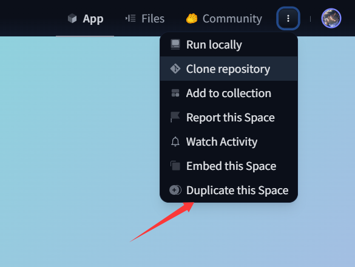
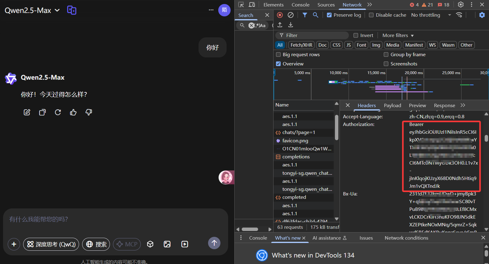
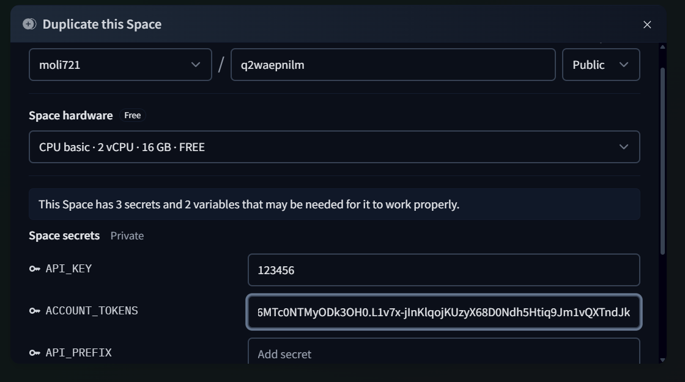
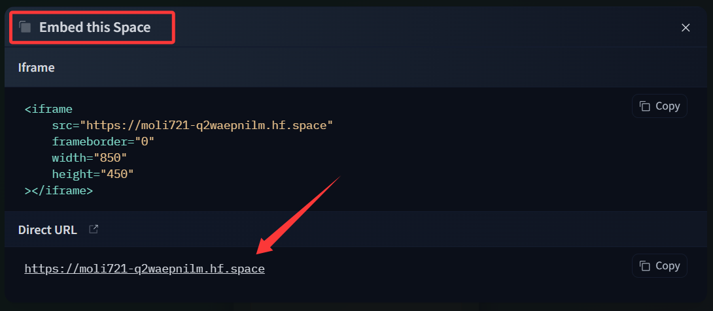
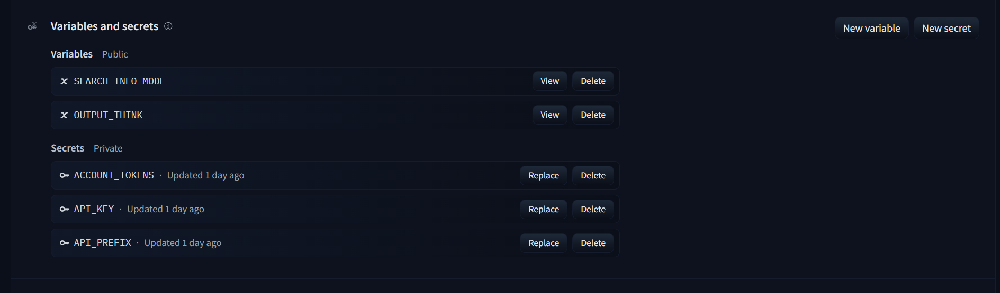

## 引言

在当今的开发环境中，拥有自己的API服务已经成为许多项目的必要条件。然而，传统的API部署往往需要服务器资源和相关费用，对于个人开发者或小型项目来说可能是一笔不小的开支。幸运的是，Hugging Face Spaces提供了一个绝佳的解决方案，让我们能够零成本地部署和管理自己的API服务。

## Hugging Face Spaces的优势

使用Hugging Face Spaces部署API有以下几个显著优势：

1. **完全免费**：无需支付任何服务器或云服务费用
2. **操作简单**：通过图形界面即可完成部署，无需复杂的命令行操作
3. **可靠性高**：由Hugging Face提供的稳定基础设施支持
4. **易于分享**：每个Space都有唯一的URL，方便与他人共享
5. **社区支持**：可以利用Hugging Face庞大的社区资源和已有项目

## 什么是2api？

2api（也称为"逆向API"）是一种通过逆向工程将官方网页版服务转换为API形式的技术。以AI服务为例，官方网页对话通常比直接使用官方API更经济实惠，特别是对于大量对话需求的用户。通过2api，你可以将这些网页服务包装成标准API接口，然后接入到自己的程序或网站中，从而大幅降低使用成本。

简单来说，2api让你能够以更低的成本获得与官方API相似的功能，特别适合那些需要频繁调用API但预算有限的开发者和项目。

## 优秀的2api项目推荐

以下是两个值得参考的2api项目，你可以基于它们快速部署自己的API服务：

- [https://huggingface.co/spaces/dragg2/dddg](https://huggingface.co/spaces/dragg2/dddg)
- [https://huggingface.co/spaces/devme/q2waepnilm](https://huggingface.co/spaces/devme/q2waepnilm)

## 免责声明

本文推荐的项目仅供学习和研究使用。如果项目所有者认为不应公开分享这些链接，请联系我删除。使用这些项目时，请确保遵守相关服务的使用条款和法律法规。

## 部署你自己的2api服务

下面我们将以q2waepnilm为例，详细介绍如何在Hugging Face Spaces上部署自己的2api服务。

### 步骤一：复制现有Space

首先，打开上面推荐的q2waepnilm项目链接，在页面右上角找到"Duplicate this Space"按钮，点击将其复制到你自己的账户下。

### 步骤二：配置基本参数

复制完成后，你需要填写一些基本配置信息：

- **API_KEY**：这是你将来调用API时需要使用的密钥，可以自定义设置
- **ACCOUNT_TOKENS**：你的账户授权令牌，用于身份验证
- **API_PREFIX**：服务的路径前缀

关于API_PREFIX的说明：
- 这是你API的路径前缀
- 不填则为空（例如：http://localhost:3000）
- 如果填写"/api"，则访问地址为：http://localhost:3000/api

### 步骤三：确保Space可公开访问

**重要提示**：确保将你的Space设置为public（公开），否则将无法获取"Embed this space"选项，也就无法获得直接URL进行API调用。

我的配置示例如下图所示：

### 步骤四：获取API访问地址

现在，进入你创建好的Space，点击右上角的"Embed this space"选项：

在弹出的窗口中，你将看到"Direct URL"，这就是你的API服务地址。之后，你可以通过这个URL结合之前设置的API_KEY来调用你的API服务。

## 管理你的Space

为了更好地管理你的API服务，你可以通过点击右上角的"Setting"按钮进入设置页面，在这里你可以找到以下重要选项：

- **Restart this Space**：重启你的服务，当遇到问题时可以尝试
- **Factory rebuild**：根据原作者的更新来更新你的项目，确保你始终使用最新版本，避免因不更新导致服务不可用
- **Change Space visibility**：修改空间的可见性（public或private）。注意：如果改为private，你将无法获得Direct URL，也就无法直接调用API

继续下拉页面，你还能找到"Variables and secrets"选项，这里可以修改之前设置的变量和密钥：

## 总结

通过Hugging Face Spaces，我们可以轻松实现零成本的API部署。整个过程简单直观，即使是技术小白也能快速上手。你只需要：

1. 复制一个现有的2api项目
2. 配置必要的参数
3. 确保设置为public可见性
4. 获取API访问地址
5. 根据需要管理你的Space

这种方式不仅节省了服务器成本，还大大简化了API部署的技术门槛。希望这篇指南能帮助你快速搭建自己的API服务，为你的项目开发提供便利。

如果你在部署过程中遇到任何问题，可以查阅Hugging Face的官方文档或在社区中寻求帮助。祝你API部署顺利！
